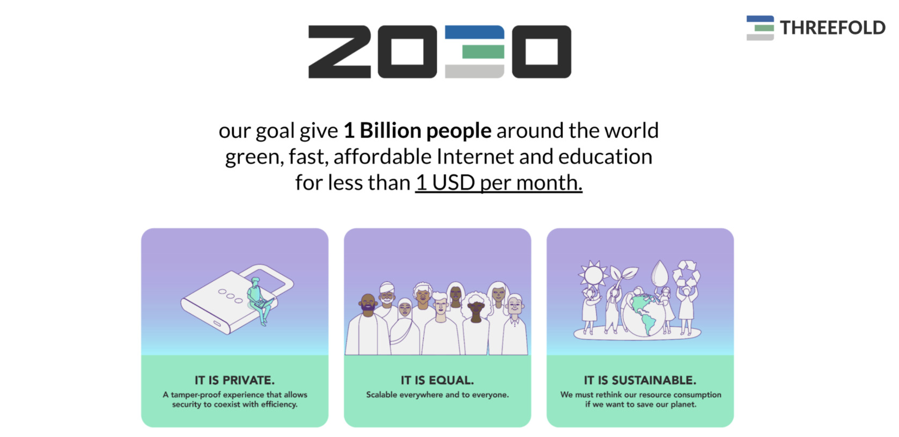

# A new internet Roll Out

## Purpose

### Based on following new operating principles

- based on a 100% trust system
  - everyone starts from a trusted position
  - our reputation is our most important asset
- no lock-in on anything, we are free human beings
- marketing is free
  - find services, products, info free
- interest is not needed

## Web 4.0 Vision

Our vision for a better internet:

We believe in a internet where
- you are in the center of your digital life
- a blockchain is only needed for specific functions (money, identity, smart contracts, ...)
- internet needs to be at least 10x more efficient
- data sovereignity for all
- an internet created by all for all = **be the internet**

**From Client Server to Peer2Peer**

Peer2peer is the most decentralized way to experience our digital life.

> see [our Web 4.0 Vision](rollout_web4)

## Step 1: grow the grid.

Today the internet is being produced from very big datacenters on central locations.

This is not ok for many reasons, [see also why ThreeFold](threefold:why_intro)

> HELP THREEFOLD TO GROW THE GRID TO 100.000 NODES < 1 YEAR

Needs to be super simple, just like a solar panel generates electricity.

Each 3Node is an IT Power generator. The TFGrid is the network of these 3Nodes.

- The 3nodes do for internet what solar panels do for large scale electricity power plants.
- They allow everyone to contribute to a new internet.
- Company or People investing in the 3nodes are called [farmers](farming_home).
- Each farmer receives tokens called TFT for providing this IT capacity.
- IT Capacity is storage, compute and network capacity for this upgraded internet.
- The Twins or IT services providers need TFT to pay for the IT capacity they need on this new internet.)

Lets together invest in required hardware in form of 3nodes to build this upgraded version of the internet.

**More Info**

- [Farming Intro](farming_intro)
- [Farming Rewards](farming_reward)
- [ThreeFold is carbon negative](energy_savings)
- [Farming Business Model](farming_biz_model)

## Step 2: build a local accelerator

We want to help create Accelerators (like incubator) for your region.
This allows local developers and communities to create value on top of this new internet.

Together we can create the alternative to centralized services which are not aligned with our values.

We don't need hundred apps, we need experiences build on top of our own owned digital twin. Experiences re-use the same capabilities. Each capability is unique and doesn't have multiple versions, each capability needs to be good enough.

> in stead of survival of the fittest its about collaboration to keep on improving the capabilities of the digital twins.

This has huge benefits

- 10x less engineering effort needed per experience
- more sustainable (less energy loss)
- easier for user, no duplication
- more simplicy
- more powerful

Our approach is to create a local "accelerator", we execute on a train the trainer program and make sure that enough knowledge is in your region so that beautiful experiences can be created in no time.

Typically per location about 1 to 2 million EUR is needed to make a team operational for 2 years which should be enough to kickstart and make a viable business out of it to allow the region to continue on itself. 

The accelerator has following functions:

- get to know all the insides of the software stack (get training in another accelerator and online)
- contribute to the digital twin core (this makes sure they know everything required)
- do lots of training sessions to people in the region
- help startups to work on top of the digital twin and as such allow them to get their digital freedom back
- help startups find investment (can be from the monther Accelerator).
- some initial business development activities together with TF Foundation.

Each accelerator needs to create value, its super important to find the right HR talent.

Income model for the Accelerator

- 20-60% on revenue on the ThreeFold Grid as enabled by the local accelerator
- shareholdings in the startups which the accelerator helps
- token grants as made available by ThreeFold Foundation (optional and depending situation)
- X nr of digital_twin_for_lifes (each digital twin for life can be sold for 100-200 USD)

## Step 3: business development phase

Together with partners roll out the technical capabilities of the ThreeFold Grid:

- cloud capacity (as alternative to Amazon, Google, ...) but all data sovereign and in your country
- storage use cases (CCTV, Archive, ...)
- telecom workloads (help telecom providers to be more profitable)
- give our capabilities to schools, universities
- digital life capabilities (banks, governments, ...)

> Because of the web4 concept there are endless opportunities.

!!!include:grid_use_