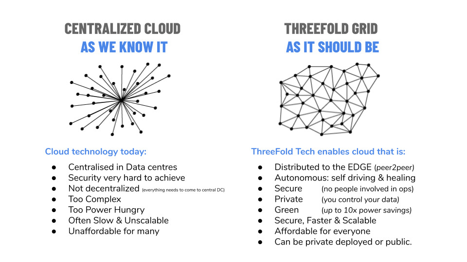

> IT” CAPACITY IS THE OIL THAT FUELS THE DIGITAL ECONOMY

# Capacity Layer

Today, IT capacity is mainly being delivered by means of centralized cloud technology which gets deployed in a private or public context. ThreeFold Tech has created technology to make the cloud 100% decentralized.

 
 Our solution has two components: 
 
 - a 3Node, which is the box which can deliver capacity in a very compute/storage and power efficient manner
 - the 3bot, which is our “digital self” – it is the decentralized component which makes autonomous IT possible and allows the grid to scale forever.

The 3bots are the coordinators which can run 100% autonomously – they are super intelligent digital creatures who know how to protect your data and how to deploy/manage any IT workload on the capacity layer, which is the grid of the 3Nodes.

!!!include:part1_the_3node
!!!include:zos

# Architecture

!!!include:part3_capacity_layer_structure
!!!include:part4_capacity_layer_provisioning_flow
!!!include:part5_jsx_empowered
!!!include:part6_capacity_layer_use_cases
!!!include:part7_3node_example_packaging
!!!include:part8_why_so_efficient

# White Paper Takeaways

1. To deliver the required compute and storage capabilities for the exponential growth in digital services, Information Technology needs to be substantially overhauled so that it can exist everywhere – in datacenters, in homes, in cars, in lamp posts, in mobile masts, without having local or remote administration needs (autonomous).
2. Efficiency gains are mandatory to deliver the exponentially-growing needs. Hardware innovation does not follow Moore’s law anymore and we cannot rely on hardware to fuel the increased needs.
3. A new technology paradigm is needed separating utility (compute and storage) operations from complex application deployments. Compute and Storage need to become the “electricity” that fuels the information age.
