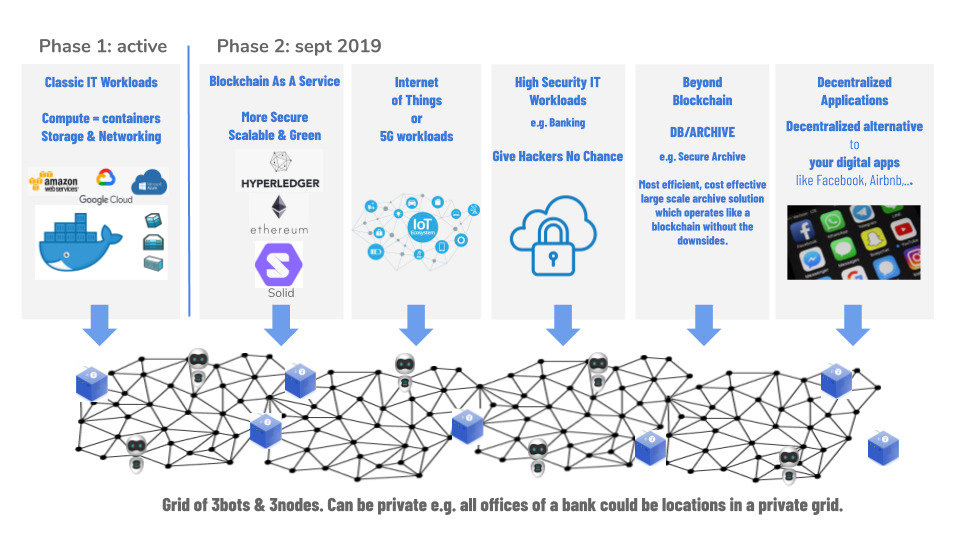

# Example Use Cases

## Blockchain as a service Workloads

ThreeFold has resolved the blockchain dilemma problem (see [the Blockchain Dilemma Whitepaper](blockchain_dilemma_whitepaper).)

We believe in a world of many focussed custom blockchains which all serve a specific purpose. The blockchain as a service will allow any group of people to deploy their own customer blockchain which can be used for digital currencies, digital notary. or other blockchain purposes.

Today the TFT (ThreeFold_Token) is running as a blockchain on top of our TF Grid.

Our platform is ideal to host other blockchain technologies as well. Our platform is like a blockchain to service other blockchains. We have the capability to resolve the blockchain dilemma problem (resulting in a technology that has the best of both worlds – the security of a public blockchain with the performance of a private one) for other blockchain algorithms, not created by us. In other words, we can deliver scale & privacy for 3rd party blockchains.

Our blockchain as a service platform allows anyone to launch a blockchain in minutes while maintaining:

- Privacy (optional)
- Scale
- No people needed to manage

## Hacker-Free Deployment of Apps

Hackers (security breaches) are a very big issue for most operational companies today.

Building fences around sensitive information will never be safe enough (with current methodology) because there are always people having access that might be compromised (knowingly or unknowingly) and people can make mistakes.

What if a system would exist which allows to deploy a workload without involvement of any person? No one, not the IT administrator, or the person who paid for the IT service, or _any_ other person, has the ability to influence the operations of the IT workload.

This sounds probably too good to be true, but in Q4 2019 we will be able to demonstrate this to anyone. This has never been done before.