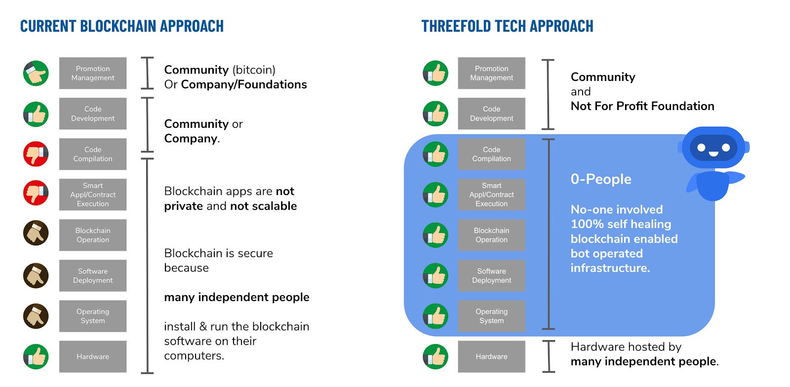

## The Blockchain Dilemma Problem

Public and private blockchains have their specific advantages and disadvantages and are very good for specific use cases - but not all.  If we list the specifics of both we end up with a table like this:

| Public Blockchains                                          | Private Blockchains                                                                        |
| ----------------------------------------------------------- | ------------------------------------------------------------------------------------------ |
| Provided by having a large number of nodes running it.      | Provided by having them in secure controlled places                                        |
| Build, managed and controlled by unknown people             | Build, managed and controlled by known people                                              |
| Slow by design - all data needs to be copied to all of them | Fast(er) and  more efficient by design - a smaller number of copies of the blockchain data |

So what if we want to have a secure, performant and easy to manage blockchain solution?  This is not what can be delivered by either type of blockchains.  We have to create a new type of blockchain that combines the best of both worlds and delivers.

The key element in finding a solution for this problem is to take the human element out of it.  The fact that when you deploy blockchains solutions in locations without human intervention means that you need to create a different deployment mechanism that takes out people touching code, compiling code, deploying code and in the end operating the machine in which the code runs.

A way to get around the trusted people problem is to select a platform on which software can be downloaded, compiled, installed and operated without human intervention.  Such a platform is a unique platform which has not been developed and launched. Such a platform would have to have the following characteristics

To make this system work and solve the blockchain dilemma we need to have three components working together in an orchestrated way.  The three elements are:

*   A (simple) operating system that does not allow local and remote logins - a closed operating system that receives instructions to launch or kill applications.  This operating system  needs to be stateless to keep as simple as possible: ZOS
*   A smart_contract_for_it layer lets you deploy your blockchain with all consensus in mind.
*   The TFGrid binds all of it together.

This system architecture allows for authenticated and trusted virtual system administrators to download, compile and deploy software on a grid of secure Zero-OS nodes with an immutable ledger that records all transactions, operational and financial.   This presents a platform on which a public (permissioned) blockchain can be run securely without requiring trusted people to operate the nodes.   

In such architecture we can build and deploy a high-performance secure blockchain which are the combined benefits of a public and private blockchain.

