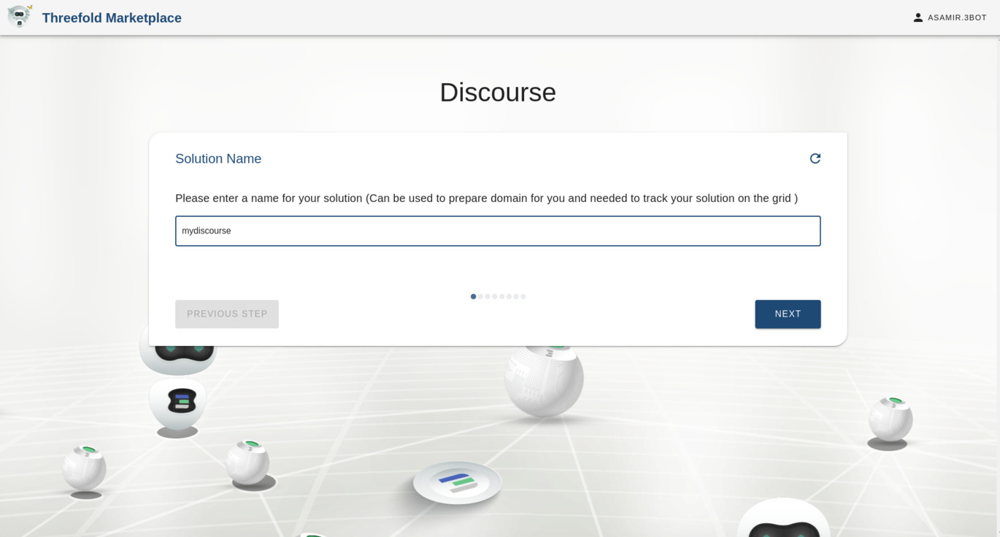
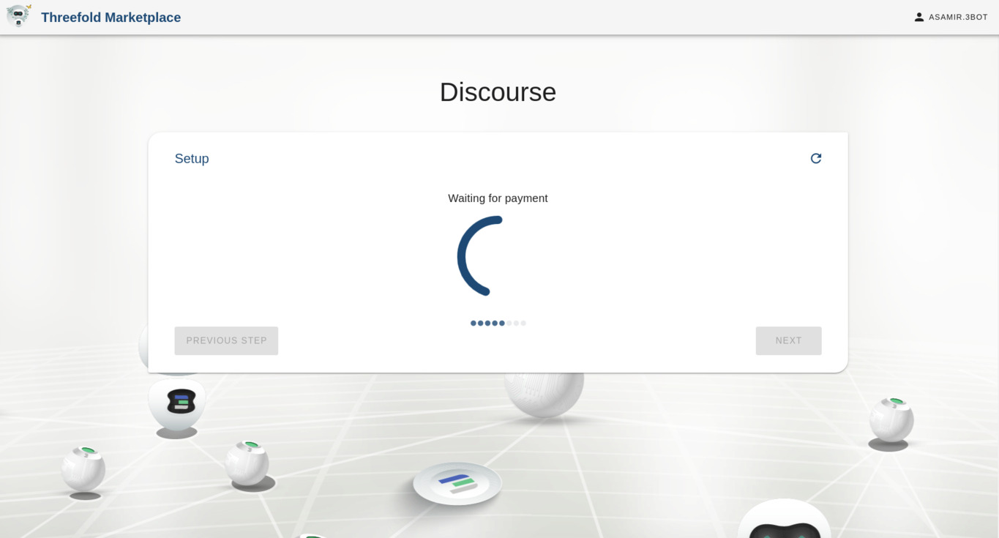
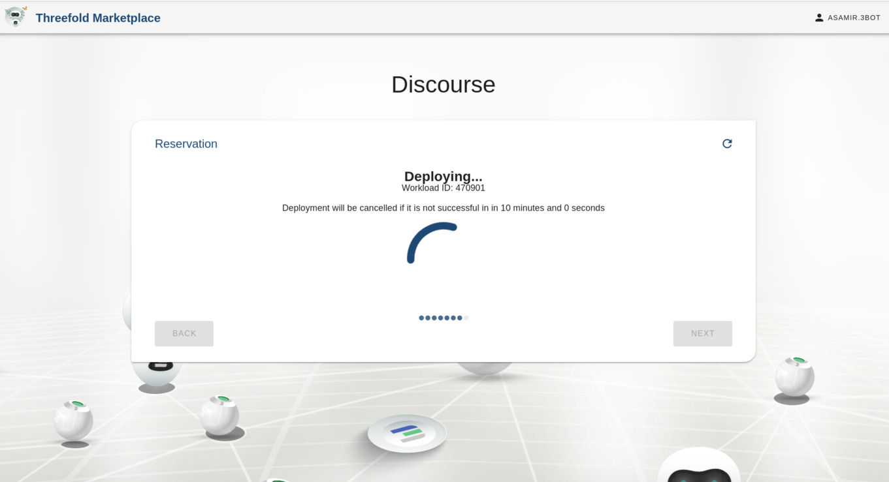

## Discourse
Discourse is an open source Internet forum and mailing list management software application.

# Steps to deploy solution

#### Add the solution name. Keep in mind it will also be the subdomain.
Choosing the name of the solution to be deployed. This allows the user to view the solution's reservation info in the dashboard deployed solutions

#### Enter your SMTP server configuration

### Choose the expiration time

### Select the payment currency

### Payment step for the container using 3Bot staging app.

### Wait until your payment transaction is finished

### Now your solution resources are being prepared

### Summary of your deployment information

### Deploying your solution.

### Deployment successful, you could access your solution now using the domain name.

### Accessing the solution

