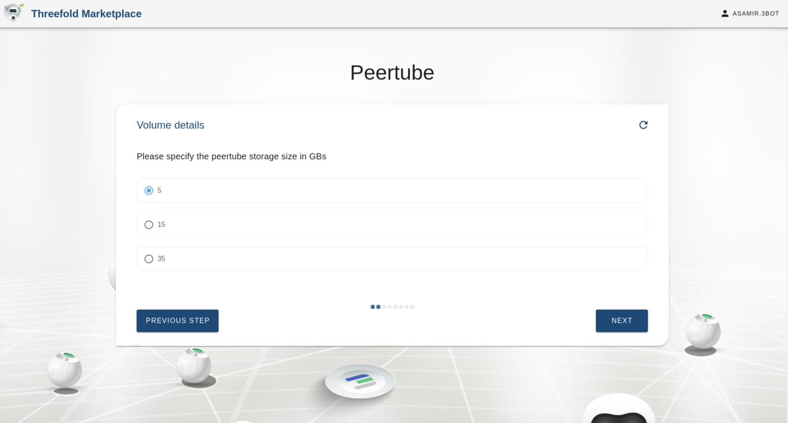
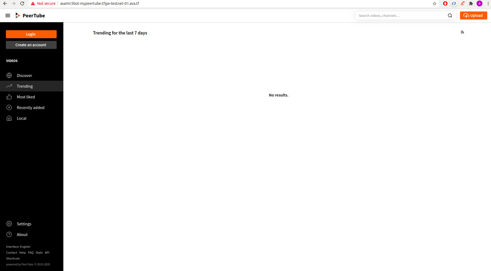

# Peertube
Peertube is a free and open-source, decentralized video platform that uses P2P technology to reduce load on individual servers.

# Steps to deploy solution

#### Add the solution name. Keep in mind it will also be the subdomain.
Choosing the name of the solution to be deployed. This allows the user to view the solution's reservation info in the dashboard deployed solutions

#### Select disk size for storage

### Choose the expiration time

### Select the payment currency

### Payment step for the container using 3Bot staging app.

### Now your solution resources are being prepared

### Summary of your deployment information

### Deploying your solution.

### Deployment successful, you could access your solution now using the domain name.

### Accessing the solution

