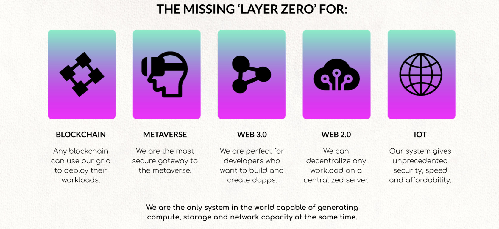
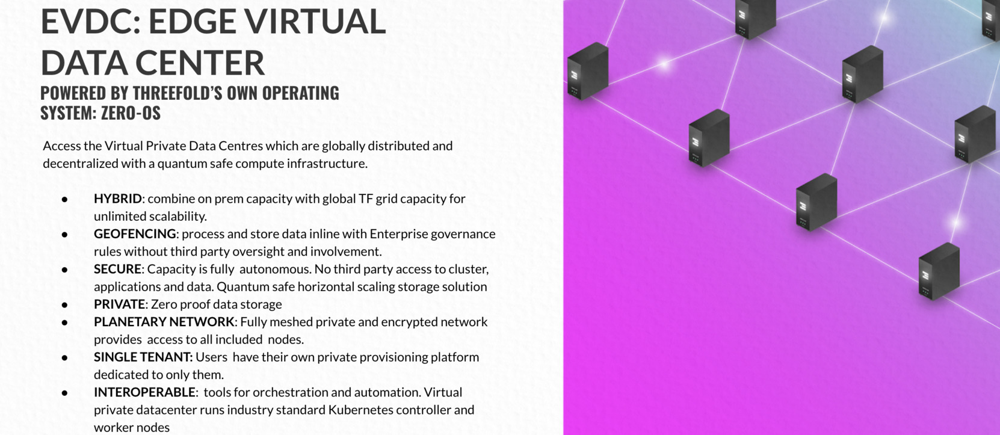
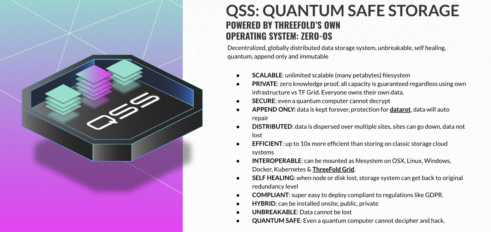
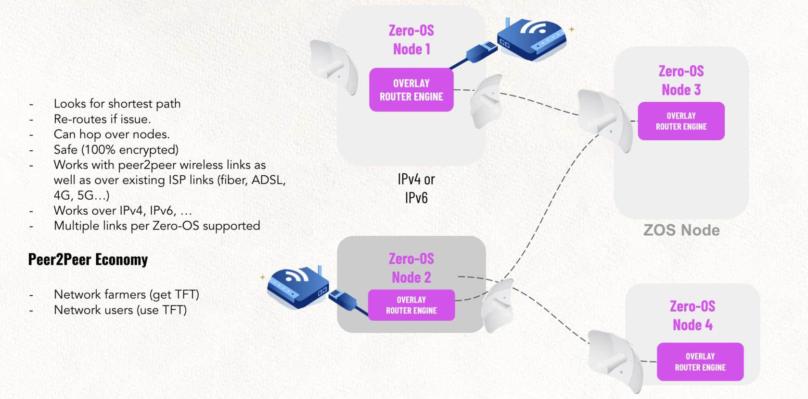

# Compute, Storage, Network

Any application which can run on linux can be deployed on the grid.

We are ideal for any workload as mentioned above.

There are 3 ways how to interact with the ThreeFold Cloud

- IAC = Infrastructure As Code (Terraform, ...)
- SDK, we have clients for TypeScript, Python (soon) and Vlang (soon)
- Weblets = pre-compiled widgets which can be embedded everywhere and provide a UI for people to interact with the TFGrid.

The main 3 services are:

## Compute = Edge Virtual Data Center (eVDC)

eVDC is a peer-to-peer compute solution. It provides the agility to create and deploy containers, vm's and kubernetes environments at the edge and allows for micro-services architectures. An eVDC can be deployed in a matter of a few clicks. 

Any IT developer familiar with IAC can deploy their IT workloads on the ThreeFold P2P Cloud in the format they already use today.

eVDC offers the following compute benefits:

- Any containerized Unix IT applications can be deployed, but with additional benefits.
- Data can be stored on top of qsfs, offering the highest standard of security. 
- Self-healing and self-driving functionalities for your data.
- Competitive prices considering the advanced technology stack

Infrastructure as code is the process of managing and provisioning computer data centers through machine-readable definition files, rather than physical hardware configuration or interactive configuration tools.

IAC offers three main advantages:

- IaC makes things much more efficient by eliminating all manual processes and the slack in the process. A code-based approach makes it easy to get more done in less time. No need to wait on a task to be manually completed before heading to the next one.
- IaC shifts the power into the developer’s hands. As the infrastructure provisioning becomes more reliable and consistent, developers can start focusing on the application development. They can script once and use that code multiple times, saving time and effort while keeping complete control.
- Automation removes the risk associated with human error, like manual misconfiguration; removing this can decrease downtime and increase reliability. 

see [IAC](smartcontract_iac)

## Storage = Quantum Safe Filesystem

A secure storage system that stores data in an immutable way and that is equipped of operational backup and self-healing capabilities. zstor can be used independently as well as integrated to the P2P compute solution - Edge Virtual Data Center. 

qsss uses a dispersed storage algorithm to distribute the data in a smart way and is stored in different locations, such that only part of the information is stored in one place, making it impossible for anyone besides the data owner to gain access to it. 

The data is described in a way such that a person aiming to hack into the low-level data (which is almost impossible in itself), will only find non-relevant information on this storage infrastructure and the other data shards can't be re-created, making it quantum-proof.

qsss offers the following storage benefits:

- Store Petabytes of data at hyper-competitive pricing.
- Quantum-safe security (not even a quantum computer can hack).
- A filesystem interface see qsfs
- Unlimited scalability provided by the ThreeFold P2P infrastructure.
- Self-healing capability of the storage layer ensures your data remains available at all times.
- Competitive pricing.

More info see qsfs.

## Network = Planetary Network

The planetary network is an overlay network which lives on top of the existing internet or other peer2peer networks created. In this network, everyone is connected to everyone. End-to-end encryption between users of an app and the app running behind the network wall.

Each user end network point is strongly authenticated and uniquely identified, independent of the network carrier used. There is no need for a centralized firewall or VPN solutions, as there is a circle based networking security in place.

Benefits :
- It finds shortest possible paths between peers
- There's full security through end-to-end encrypted messaging
- It allows for peer2peer links like meshed wireless
- It can survive broken internet links and re-route when needed
- It resolves the shortage of IPV4 addresses

See [Planetary Network](planetary_network)