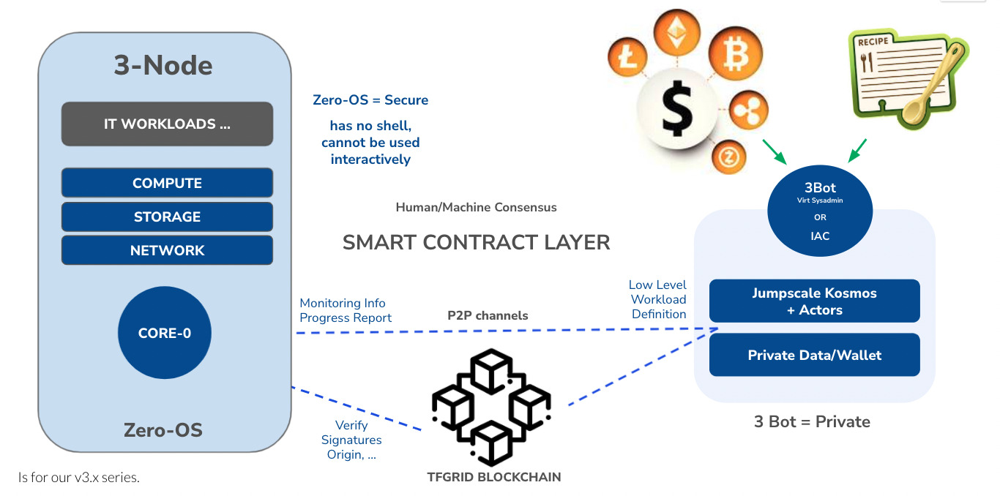

# Autonomous Operations Possible

- The 3Nodes use our operating system Zero-OS which runs autonomous and does not require any intervention from the Farmer.
- The rewards for farming is done automatically.
- The billing is done automatically.
- Smart contract for IT allows secure deployment of any linux compatible workload.
- Our 3Bot (only in beta on TFgrid 2.0 for now) allows the creation of self healing applications on top of the TFGrid.
