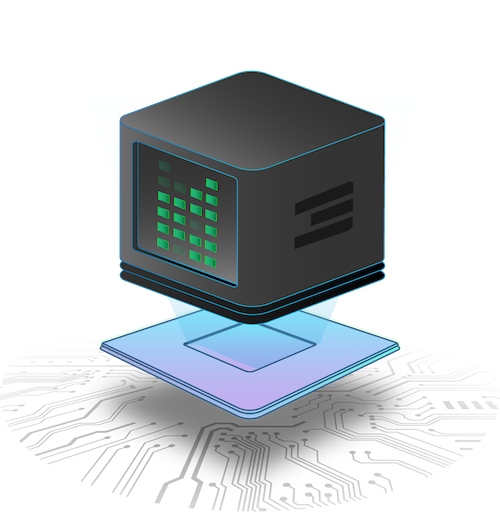

> IMPORTANT NOTICE (05/03/2023): 
The information of this page is outdated. ThreeFold team is in the process of migrating this this manual to its new home on manual.grid.tf. Please go to [manual.grid.tf](https://manual.grid.tf/) to read the latest documentation of ThreeFold.

# Benefits of a Peer2Peer Cloud

|                                                                  | Centralised Cloud | Blockchain Infrastructure Project | ThreeFold Peer To Peer Cloud |
| ---------------------------------------------------------------- | :---------------: | :-------------------------------: | :--------------------------: |
| [storage, compute & network combined](storage_compute_network)   |        YES        |                 -                 |             YES              |
| [deployment & billing blockchain](blockchain_deploy)             |         -         |                YES                |             YES              |
| [no need to re-develop, any web usecase work](no_redevelop)      |        YES        |                 -                 |             YES              |
| [decentralised](decentralised)                                   |         -         |                YES                |             YES              |
| [web scale, can scale to billions](webscale)                     |        YES        |                 -                 |             YES              |
| [carbon neutral, or even carbon removing](carbon_remove)         |         -         |                 -                 |             YES              |
| [glocal = keeps traffic local, faster network](glocal)           |         -         |                 -                 |             YES              |
| [cost effective](cost_effective)                                 |         -         |                YES                |             YES              |
| [sharing economy, we together create the system](sharing_eco)    |         -         |                YES                |             YES              |
| [storage/data can-t be lost nor corrupted](data_safety)          |         -         |                 -                 |             YES              |
| [data is guaranteed private & sovereign](data_privacy)           |         -         |                 -                 |             YES              |
| [compatible with standards, docker, kubernetes, ...](compatible) |        YES        |                 -                 |             YES              |
| [autonomous operation, multisign, self healing](autonomous_ops)  |         -         |                 -                 |             YES              |

### More info

- [Centralized vs Blockchain vs Peer-to-Peer](compare_p2pcloud)

