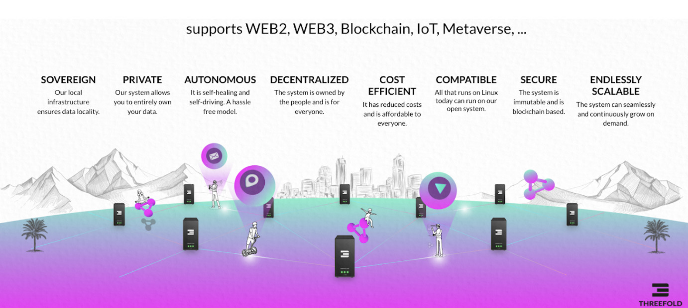

# OURWORLD & THREEFOLD LAYERS

### OURWORLD Layer

A community of like minded companies who have or are building solutions using the features of the cloud and blockchain layer underneath. This approach delivers unlimited scale, sovereignity and privacy. There are already existing apps like alternatives to ZOOM, Facebook, Google Docs, …

### THREEFOLD HUB = THE MASTER BLOCKCHAIN LAYER

Our Internet of Blockchain Layer allows any type of blockchain to be hosted delivering more scale, security and efficiency thanks to the decentralized cloud layer. Our ThreeFold HUB is the blockchain which manages the full ecosystem. Thanks to our Double Carbon win concept, any blockchain becomes carbon negative, which means more Carbon is taken out of the air compared to added.

### THREEFOLD CLOUD & THREEFOLD EXECUTORS

The underlying foundation is our Decentralized Cloud (Grid) system which delivers IT or Internet Capacity (Compute, Storage and Network). A lot of capacity has already been deployed by existing ThreeFold farmers (lowest layer).

## Support for a huge ecosystem

We are trying to be the underlying layer who enabled all above.

## Our 3 layered system provides ultimate scalability.

!!!include:tf_layers_include

Validators play an important role in securing the ThreeFold ecosystem, a validator is a blockchain component run by independent parties who validate transactions happening on the blockchain until consensus has been achieved. 

Validators are rewarded for the work they do. In case you would like to become a validator, registration has started see our forum, make sure you have enough TFT in your ThreeFold wallet. The sooner you acquire your needed TFT the lower your acquisition price will be. Validators will be awarded in order of registration. 

On Layer 0 we also have mining (we call it farming) nodes, the process of farming started many years ago, a lot of Internet Capacity has been farmed already and is ready to be used by the members of our DAO.