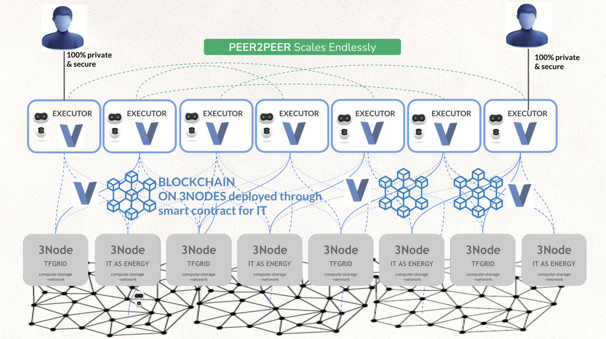

## L0 Validators

!!!include:executor_usecases

You can help ThreeFold to secure our TF Executors, 

A L0 validator node needs 100k TFT to function. L0 validators support delegated staking, which means you can give your tokens to another validator to work on your behalf, if you delegate your stake 10% of the profit goes to the owner of the validator node.

To reward you for your effort, a Validator nodes receives:

* 10% of revenue which goes over the executors of the TFGrid the validator is securing.
* During the first 2 years, there is a minimum yield of 5% foreseen to become a L0 Validator.

> [DETAILS of L0 Validators](validator_l0_details)

### TF Executors

Are an exciting way how to deploy decentralized apps on top of TFGrid.

> [See here for more info about executors](@tfexecutors)