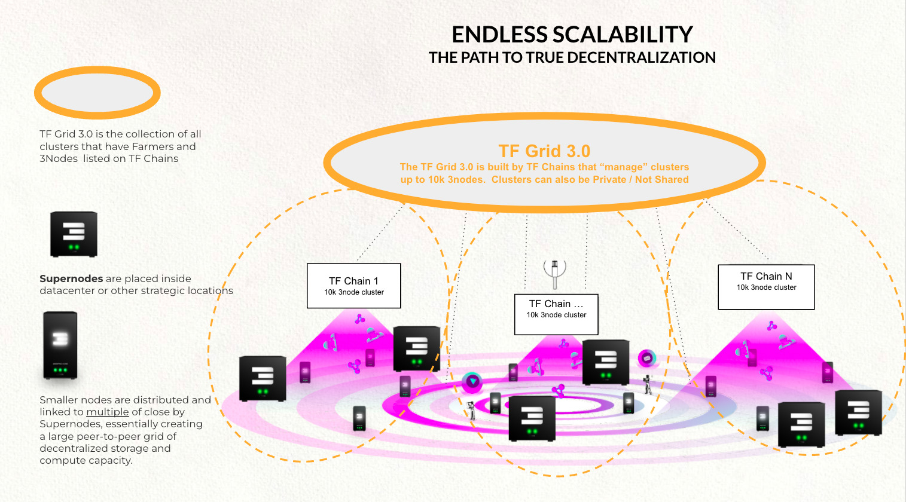

# Validator L2 = ThreeFold HUB

To make the TFGrid scalable we need to deploy multiple side chains.
Each side chain is a L1 Chain which we call TFChain and can deal with 10k (maybe 50k) 3Nodes.

L2 Validators protect all the different side TFchain's (amongst other).

You can help ThreeFold to secure our DAO, Internet of Blockchains and Cloud Platform by becoming a validator.
A L2 validator node needs between 2m and 2.5m TFT to function. We support delegated staking, which means you can give your tokens to another validator to work on your behalf, if you delegate your stake 10% of the profit goes to the owner of the validator node.

The L2 Validator Nodes secure the ThreeFold HUB = our Layer 2 blockchain with following features:

* Money chain TFT
* Minting of TFT
* Securitization of all ThreeFold Capacity Chains = TFChains = secure our layer 1
* Securitization of TFGrid based Cosmos Chains (for any use case) = internet of blockchains = Layer 1
* DAO for ThreeFold = Decentralized Autonomous Organization
* Identity Layer for ThreeFold & Ecosystem + KYC Layer for ThreeFold & Ecosystem
* TFGrid Name System (like DNS)

To reward you for your effort, a Validator nodes receives:

* 5% of revenue of TFGrid
* During the first 2 years, there is a minimum yield of 5% foreseen to become a L2 Validator.
* Transaction fees for all TFT transactions on L2 Blockchain
* Transaction fees for securing TFChain(s), our capacity chains.

> [DETAILS of L2 Validators](validator_l2_details)