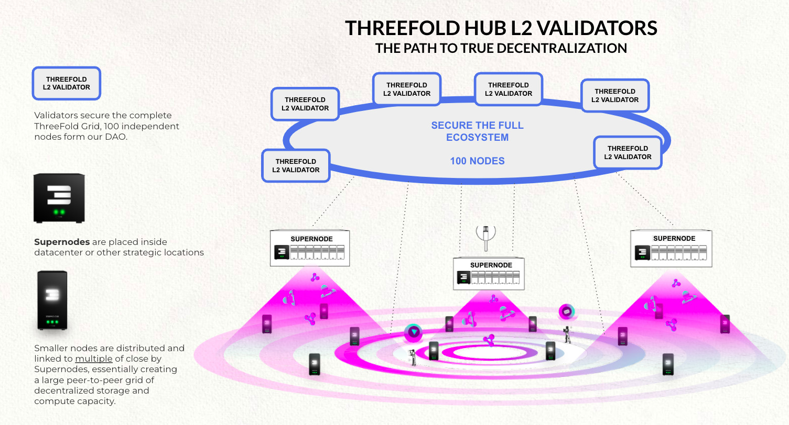

## Details for L2 Validators

A L2 Validator is a validator for ThreeFold Hub,

### Staking Details

- 1m TFT: initial requirement for reservation of a Validator
- 2m TFT: validator will now participate in voting of blocks & rewards
- 3m TFT: is the maximum a of TFT which can be staked with a validator.

> Each TFT staked counts for rewards !!!

### Max nr of validators

- max 100 Validators.
- the initial deployment is 50, make your reservation on forum.

### Delegated Staking

Delegation means you are not deploying a blockchain node yourself but you stake TFT to a node of someone else.

- Everyone can stake to a chose Validator node. 
- If you don't own the validator node yourself then 10% of your reward will be given to the person who owns the validator (is only 1).
- The owner is the original person or company who reserved the validator.

### Reservation

Make your reservation on the ThreeFold forum for you Validator. There is a very simple way to announce your interest in onwing a validator.  Everything is done on the ThreeFold forum. There are two types of validators availabe, here we specifically talk about the L2 Validator. This is the [link](https://forum.threefold.io/t/procedure-to-register-your-l2-validator-node/1864) to the forum where you can do the application.  Once the application is done you will get a verification call from someone from the ThreeFold foundation to check your application.

### Reward

- During first 2 years 5% yield will be rewarded to any staker.
    - this means if you own 1 million staked TFT, you would receive 50.000 TFT as reward during year 1 and year 2 
    - this reward is independent of reward in relation to revenue (its extra).
    - All your TFT staked count (independent if this was for reservation or particpation or delegation)
- 5% of revenue on TFGrid go to people staking on L2 chain.
    - revenue is defined as TFT as used by people to pay for services through our TFChain.
    - reward is given out in relation to % of TFT you own on the total global staking pool, example if you own 1% of the total staking pool you will receive 1% of the reward. 
    - Do note 10% will be deducted if you did delegated staking, in other words you do not own the validator node, this 10% is commission for the owner if the validator.

### what is L2 Blockchain used for

- Is the main chain for ThreeFold Tokens.
- Is the securing blockchain for ThreeFold L1 blockchains (TFChain & Cosmos Chains)
- Identity Management (KYC, AML, …)
- Domain Name Services for TFGrid
- Twin Management (ID, Location, …)
