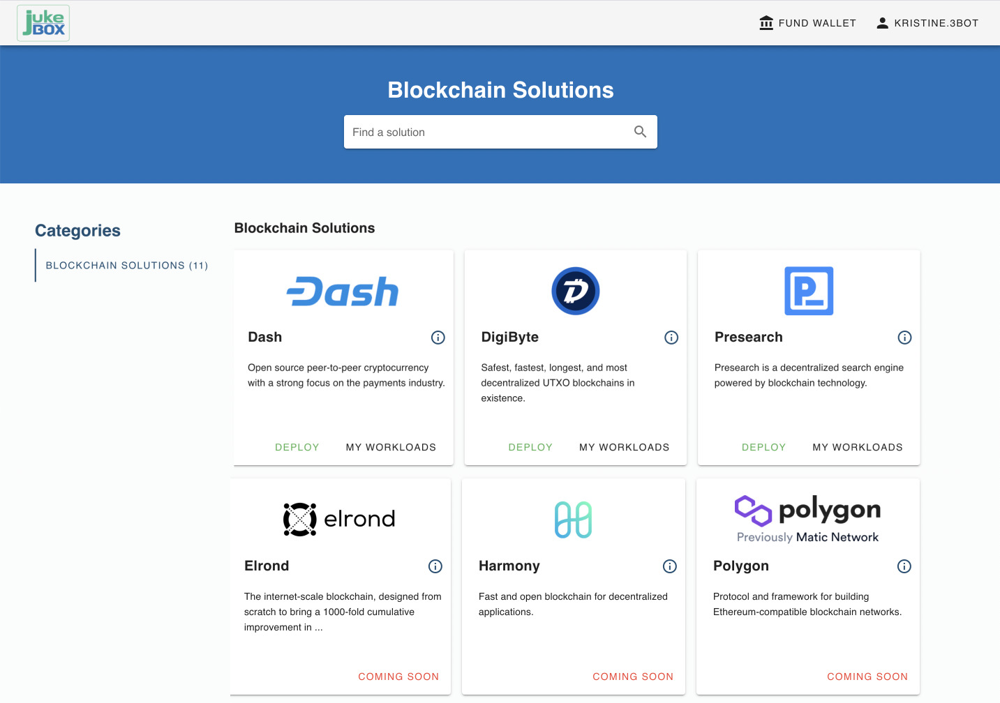

<!--  -->

## What is Blockchain Jukebox?

There are no real decentralised infrastructures for blockchains today. Most blockchains are hosted on centralised clouds, limiting their decentralisation, scaleability and security. 

**Blockchain Jukebox** is the engine to decentralise blockchain.

## How Blockchain Jukebox is different from other decentralized platforms?

By running on top of the `ThreeFold Grid` Blockchain Jukebox provides trully decentralised, sustainable and efficient infrastructure for blockchains to scale infinitely.

**Blockchain Jukebox** is the first blockchain infrastructure in the world that not only reduces the energy consumption of blockchain industry but thanks to `ThreeFold's Carbon Double Win` system actually helps to regenerate our planet.

## What is the cost to use Blockchain Jukebox?

While running on testnet Blockchain Jukebox costs few TFT (< 1$) to deploy and run blockchain nodes in test mode. When moved to Mainnet a calculation of costs will be applied nevertheless it will be at least 10x less than what you would pay to Amazon AWS.

## What is available on Blockchain Jukebox?

Blockhain Jukebox is a blockchain node deployment platform therefore on the platform you will find blockchain projects that are currently available for their node deployment as well as you'll be able to see projects that are coming up next.

**Launching partners:**
- [DigiByte](digibyte)
- [Dash](dash)
- [Presearch](presearch)

 

## How does Blockchain Jukebox work?

With an interface that permits absolutely seemless node deployment all you really need is:

- [Threefold Connect App](threefold_connect)
- [Blockchain Jukebox platform](https://staging.blockchainjukebox.com/jukebox)
- On the Jukebox platform you pick a Blockchain Solution
- Make a payment & Deploy node/-s. Feel free to follow [Get Started](get_started) guide.
- Thats it, You’re up and running! 🙂

<!-- # Properties

- All parties can cancel/stop/extend their node deployments
    - Extra parameters can be added if needed
- Jukebox interface is as simple as it gets
- Secure authentication and payments process via [TF Connect app](threefold_connect)
- Regular update/upgrade notifications via Jukebox -->