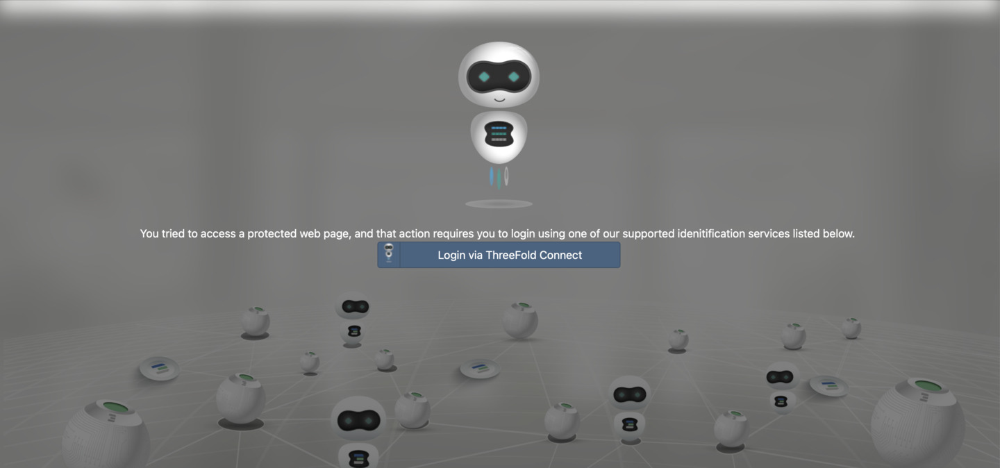
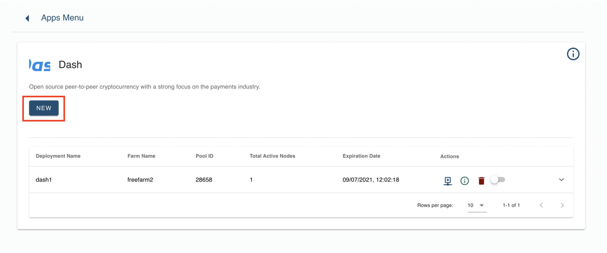
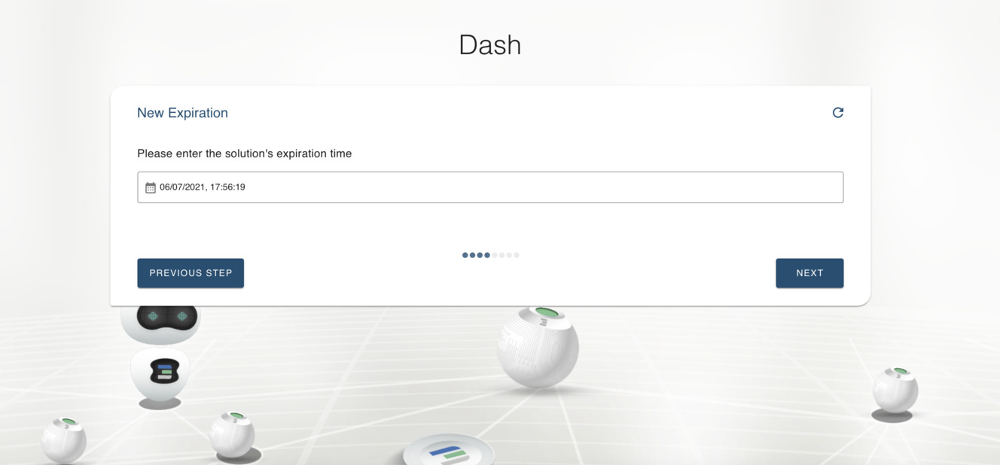
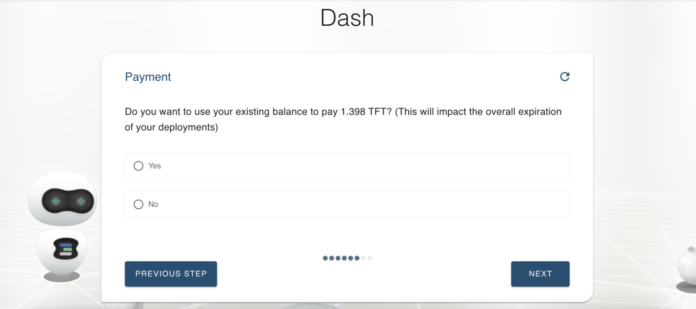

## Steps:

### Authorise yourself via TF Connect app

 
 

### Open Deployer

_*Currently we don't support Safari browser, please choose Chrome or Firefox._
 
You'll see all currently available blockchain solutions as well as those coming soon..

 
 

### My Workloads

Here you see a dashboard with your deployments and their status.

 

> **Note:** You need to deploy at least 1 node to see activity on dashboard.

**Dashboard:**

 
 

###  Deploy

Pick blockchain solution you'd like to deploy a node for and either click **New** button in Workloads view

 

 

or click on **Deploy** button on main view.

 

> **Note:** Only currently availble solutions can be deployed.

 
 

1. Choose a unique name for you deployment.

 

 
 

2. Choose a number of nodes you would like to deploy, then choose to select a farm either automatically (Yes) or manually (No).

- If choosing Automatically (Yes), farm that your node/-s will run on will be selected for you automatically.
- If choosing Manually (No), you will be able to select a farm from dropdown menu at the next step.

 
 

3. Enter expiration date for your deployment.

 

> **Remember:** You will be charged automatically on monthly bases. For that you need to make sure your Fund Wallet is topped up with sufficient amount of TFT to sustain your deployment. In case of unsufficient funds your nodes will be automatically disabled.

> See steps for Topping up Fund Wallet [**HERE**](fund_wallet)

 
 

4. Make a payment 

If you have already deposited TFT in Fund Wallet you will be automatically offered to pay from Fund Wallet.

If Fund Wallet does not hold suffiecient amount of TFT, scan a QR code by opening Wallet in TF Connect app and selecting Scan QR option.

5. Deployment proces is initiated and might take up to few minutes.

**You're all set!**
 
Please go to **My Workloads** to see your currently operating nodes and their status.
 
 

_If facing any issues don't hesitate to click on a blue chat bubble here on the right bottom corner. 
 
Our support team is there to help you!_

