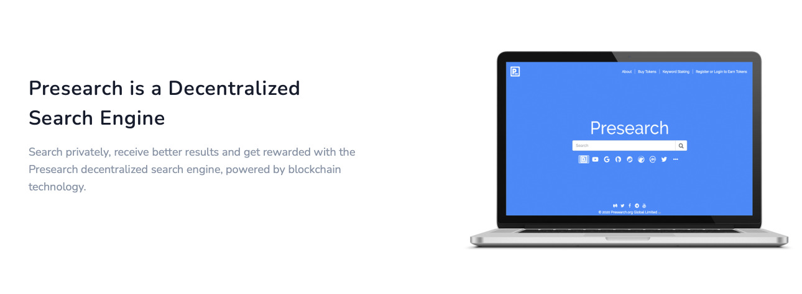

[**Presearch**](https://presearch.io) is an open, decentralized search engine that rewards community members with Presearch Tokens (PRE) for their usage, contribution to, and promotion of the platform.

## About

In a world where one company controls 77% of all searches, influencing trillions of dollars in spending, shaping perceptions and effectively acting as the primary gatekeeper to the Internet, a new, open and community-driven search engine is a necessity. 
 

Presearch has an innovative go-to-market strategy to target the most frequent searchers - web workers - and gain early adoption, on our way to releasing future versions of the open source platform that will utilize a blockchain-based index, curated by the community.
 

Anyone can contribute and build upon the Presearch Blockchain using the **Blockchain Jukebox**. The infrastructure that provide significant advantages over centralized cloud providers.

## Run a Node

Do you support decentralization and an open internet that isn’t dominated by a handful of Big Tech companies? Now you can be part of the solution by operating a Presearch Node and helping to power the Presearch decentralized search engine.
 

Presearch Nodes are used to process user search requests, and node operators earn Presearch PRE tokens for joining and supporting the network.

## It’s easy to get started!

1. Register your node and get a registration code at https://nodes.presearch.org/dashboard
2. Follow [**Get Started**](get_started) guide to deploy Presearch node/-s via Blockchain Jukebox.
2. Run the node start commands.

## Server requirements

Presearch nodes with fast internet and low latency connection to the Presearch Gateway are currently prioritized. 
 

You do not need much disk space, much memory, or much CPU current to run a node, and running a more powerful server does not currently increase node rewards. 
 

We recommend running many lightweight nodes to optimize your reward earnings relative to your server costs.

## Node operator rewards

Rewards are paid to all node operators who stake at least 1,000 PRE to their node.
Each of your staked nodes will qualify for the base reward paid to incentivize participation in the network.
 

Those who stake more than 1,000 PRE to their node are eligible to earn additional rewards.
For complete information on how staking works, please visit [Presearch Rewards](https://nodes.presearch.org/rewards).

## Risks & Cautions

Running a Presearch node is likely not a concern for most node operators, but there are some things we think you should be aware of:
- If you are running a node locally (and not on an outside server), queries routed through your node to external sources (other search engines, databases & APIs) could be associated with your IP address. If you are trying to minimize your personal footprint with Google and other big tech companies for instance, using Presearch as a searcher is what you want, but running a node is probably not.
- This is particularly true if you are in a repressive country, such as Iran, North Korea or China, where the powers that be can use any excuse to attack you.
- The IP address of your node is used to identify your node within the system and will be logged. Again, if you are trying to minimize your personal external footprint, you would be best to either run a node on an outside server you are comfortable exposing, or do not run a node at all.
- Depending on the country in which you are located, node rewards may need to be declared as income for tax purposes. That is up to you to track and report, and we will not be submitting or providing any documentation aside from the logs of your rewards.
- This software is currently not open source and you are relying on our assurances that nothing malicious is happening underneath the hood. We promise that this is true, but the ability to verify it for yourself would currently be limited to packet sniffers and any other means that you have available to you. It is our intention to open source this software in the future, but we’re not there yet.
- This is beta software, and it is possible that there are bugs that we are not yet aware of. We push updates frequently to resolve anything we discover, but as we cannot control which versions of the node software are run on your machine, we can’t ensure that you will always have the latest version.
- Overall, it’s best to assume that any risk on your part is yours alone, and while we will do our best to ensure that only good things come from running a node, there are no guarantees that this will be the case, only best efforts.

 

Thanks for your interest in running a node and for your support!

## It’s easy to get started!

Check out our [**Get Started**](get_started) section and follow [**Deployment Steps**](deployment_steps) to deploy **Presearch** node/-s via Blockchain Jukebox.

!!!include:projects_overview