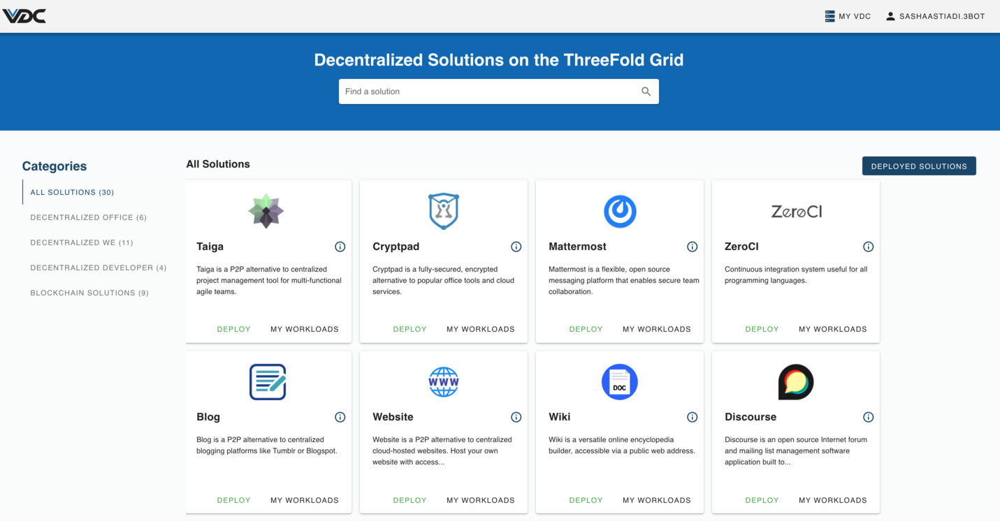

# Get Started with ThreeFold Marketplace

ThreeFold Marketplace allows you to deploy workloads onto your VDC.

Through this panel, you can easily deploy and manage pre-configured applications in your VDC. The deployment of these solutions were made simple for anyone to get started in a few clicks. The list contains both peer-to-peer applications and off-the-shelf tooling to manage your Kubernetes cluster on your eVDC.

## Pre-Requisite

- [Deploy your eVDC](evdc_deploy). 

 If you already have your eVDC deployed, you can skip that step. 

 > Note: To learn the ins and outs of your eVDC, we invite you to go through [eVDC Get Started](evdc_getting_started). 

## How to access the Marketplace

Once you deploy your eVDC, the Marketplace will be your default view on the admin panel.

The applications on ThreeFold Marketplace can be deployed (launched) in a matter of minutes. Just choose your solutions and define the parameters of your network.

<!-- > See [__Getting Started Manual__](threefold_now_getting_started.md). -->

### Start deploying peer-to-peer applications

<!-- - [__3Bot__](3bot.md): A versatile tool to administrate and control processes and activities of your solutions on top of the TF Grid. -->

You will find many ready-to-be-deployed applications on your eVDC admin panel.

Most solutions have simple deployment tutorials. You can find them in this knowledge base. Here's a few:

- [Website](evdc_website): A P2P alternative to hosting your website on a centralized cloud. 
- [Wiki](evdc_wiki): A P2P knowledge base solutions to add your most important information. 
- [Blog](evdc_blog): A P2P alternative to Tumblr or Blogspot. 
- [Video Sharing](evdc_peertube): An open-source video platform that uses peer-to-peer tech to reduce load on individual servers when viewing videos.
- [Team Collaboration](evdc_mattermost): An open source Slack-alternative messaging platform that enables secure team collaboration.
- [Office tools](evdc_cryptpad): A peer-to-peer alternative to popular office tools.
- [Git Service](evdc_gitea): A self-hosted Git service. Similar to GitHub or GitLab.
- [Monitoring Stack](evdc_monitoring_stack): A monitoring stack for Kubernetes clusters.
- [Forum](evdc_discourse): A forum that comes with chat rooms, mailing list and more.

> By using The ThreeFold Marketplace or 3Bot you agree to our [Terms and Conditions](legal:terms_conditions_cloud) and [Policies](legal).