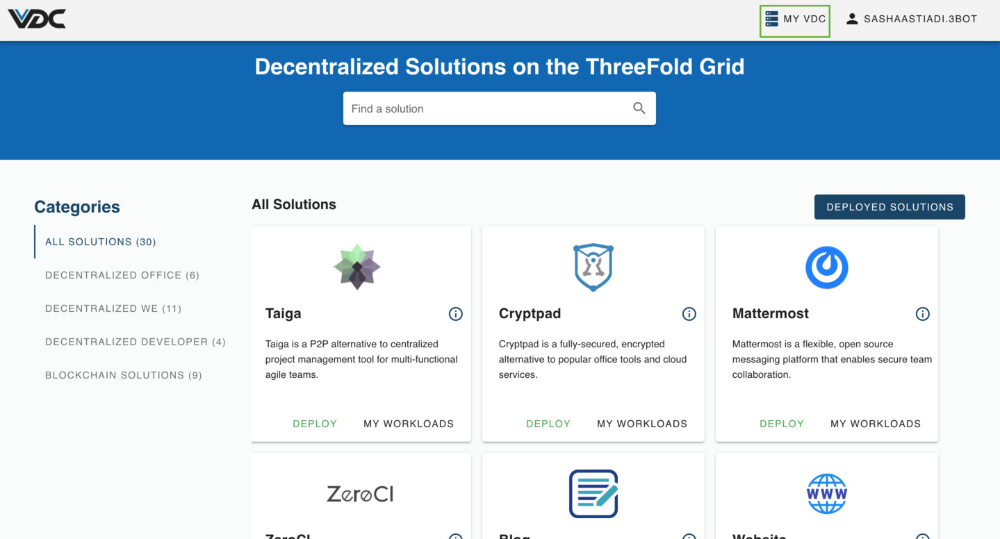
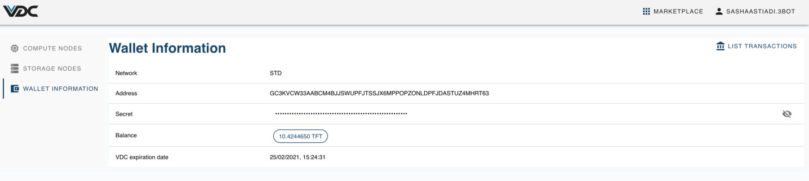
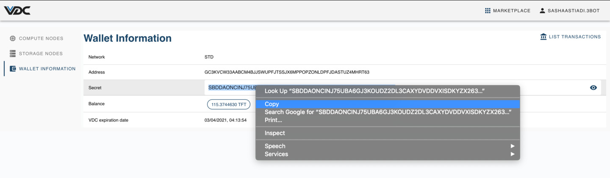
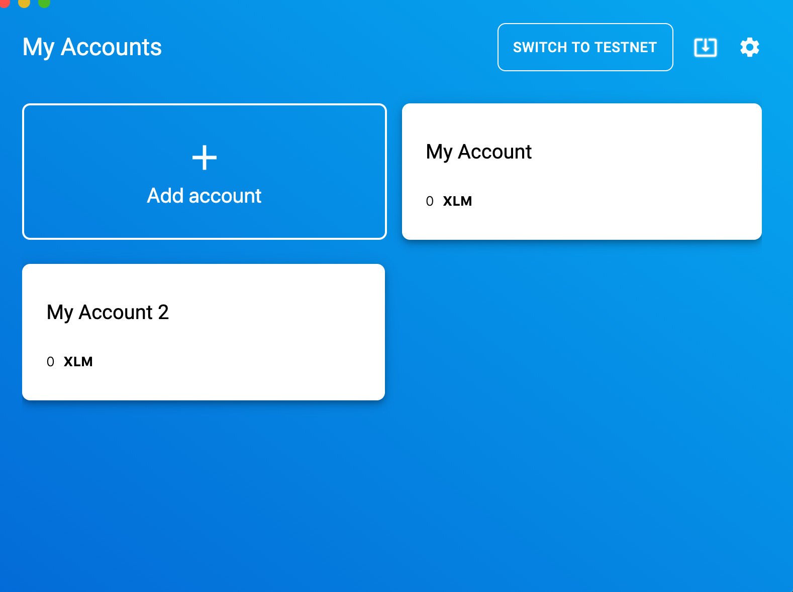
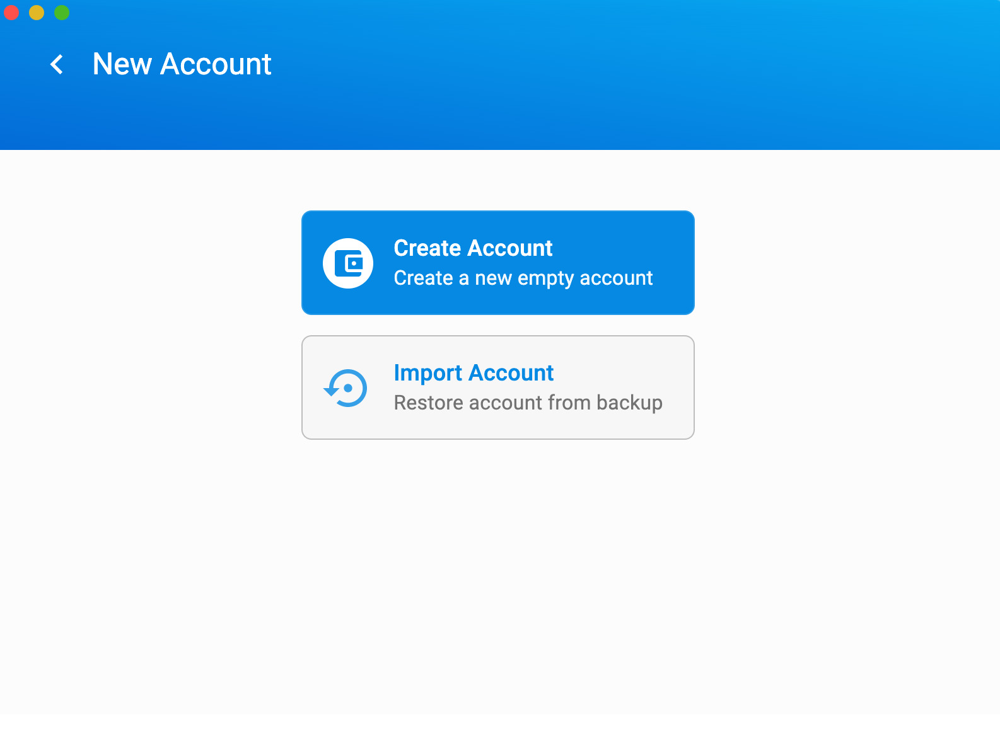
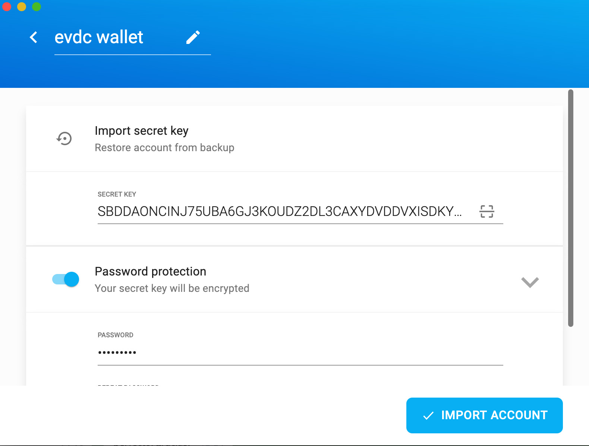
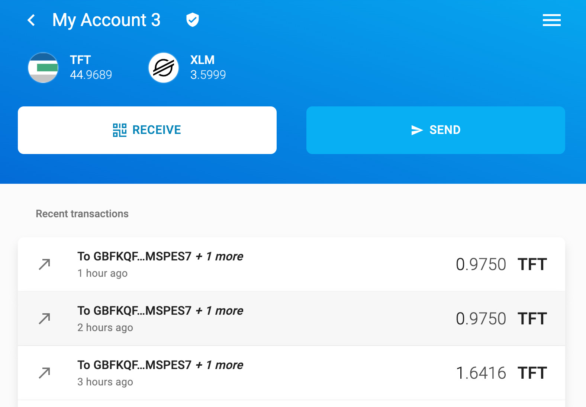

# Import eVDC Wallet to Solar Wallet

You can transfer your TFT from eVDC mainnet or testnet, and import your wallet into a TF Connect Wallet or a third party Stellar wallet (mainnet), like Sollar Wallet or Interstellar Wallet. On this tutorial, we will be transfering TFT from eVDC Wallet to **Solar Wallet (mainnet)** as an example.

## Prerequisites

- An active eVDC on testnet / mainnet, with some TFT funds on its [eVDC Wallet](evdc_wallet)
- A [solar Wallet](https://solarwallet.io) app. Read more on how to get a Solar Wallet [here](sdk:solar_wallet) if you have not downloaded yet.

## Import eVDC Wallet to Solar Wallet (Mainnet)

### Open your eVDC Wallet

Once you logged into your eVDC account, access your eVDC Wallet by clicking '**My VDC**' menu on the top navigation bar.

You will be directed to your eVDC Management page with Compute Nodes page as its default display. Click on 'Wallet Information' page on the left sidebar

You will then redirected to your eVDC Wallet page.

Copy your eVDC Secret Key. _(Please copy secret key, not your wallet address)_

## Open your Solar Wallet App / Account (Mainnet)

On your app home screen, create a new Solar Wallet Account by clicking '**Add Account**'.

Choose the option '**Import Account**' to start importing your eVDC Wallet to this new account.

Paste the copied eVDC wallet secret key onto the form, add a password to your new solar wallet account and click 'Import Account'.

Congratulations! You now have successfully imported your eVDC Wallet into Solar wallet.

