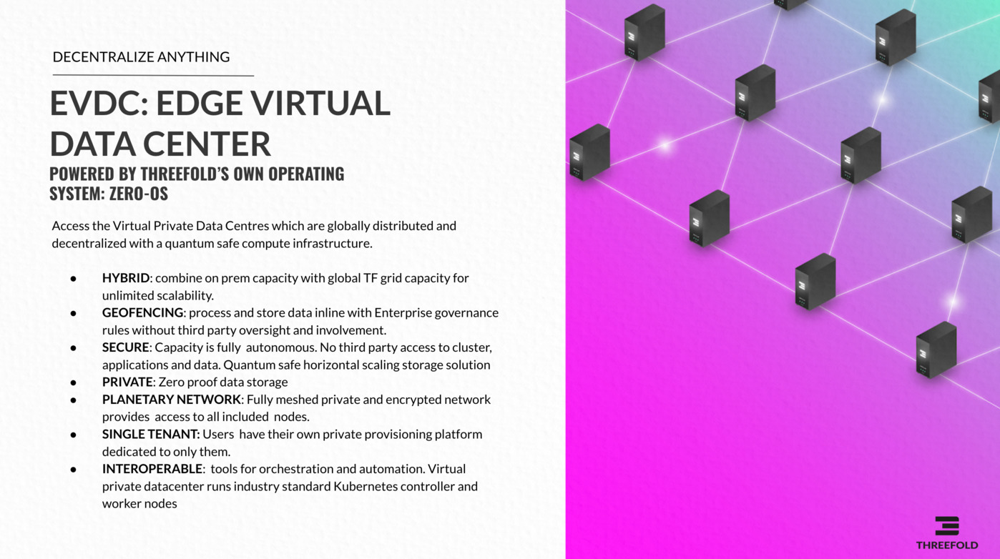

# TFGrid 2.0 Manual

> WE STRONGLY RECOMMEND YOU TO TEST ON TFGRID 3.0 NOW, WE ARE PLANNING TO UPGRADE ALL Q1 2022  

> see [Manual for TFGrid 3](manual:manual3_home_new)

TFGrid is operational for quite a while now, find the manual & tutorials for this release.

- [eVDC](evdc_overview)
- [Kubernetes](kubernetes)
- [zstor filesystem](threefold_filesystem)
- [Marketplace](evdc_marketplace_overview)
- [Release Notes](releasenotes)
- [Support](support)