## Minio deployment
Minio is an object storage server with a nice ui and S3 APIs.
This solution will help create a Minio deployment in a Single or PRimary/secondary mode.

## Steps

#### Choose Name
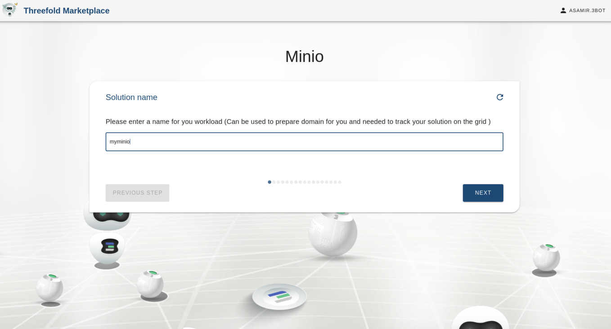

#### Setup Type

#### Choose Storage Type
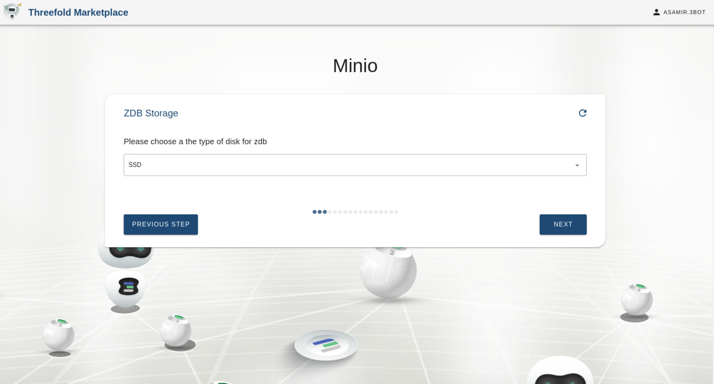

#### Set Container Resources

#### Specify Number of Shards
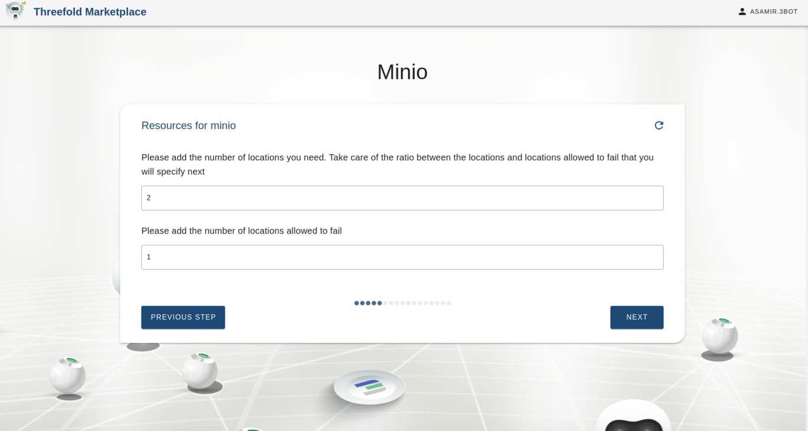

#### Select pool you wish to distribute ZDB workloads on

#### Select pool for Primary
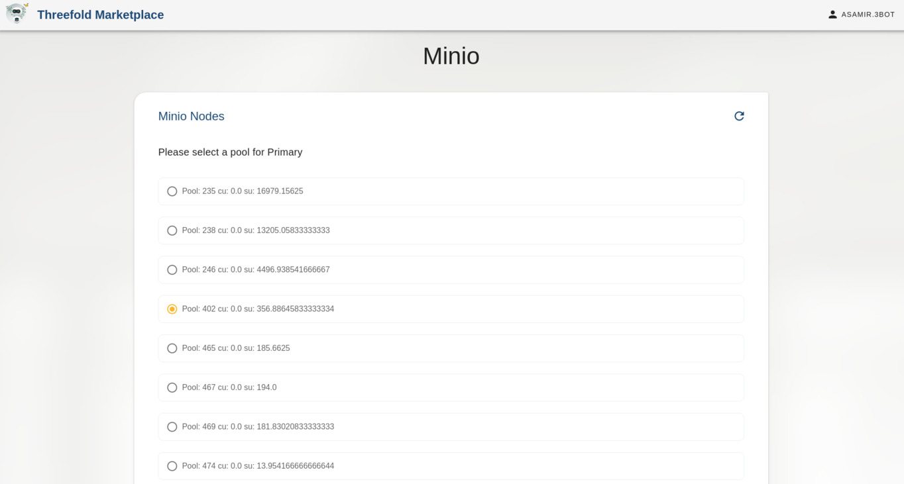

#### Select node for Primary. You can choose to be selected automatically
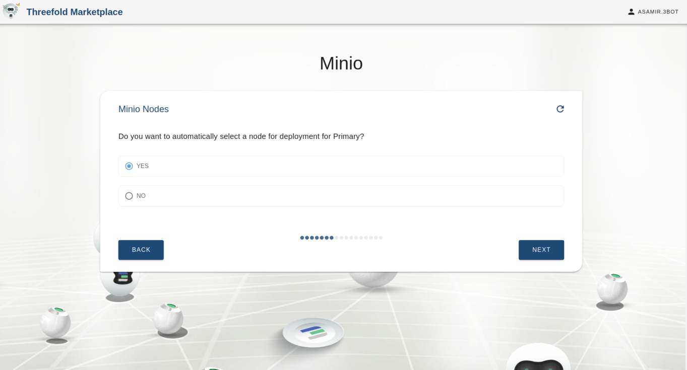

#### Choose Network

#### Set Credentials (AK/SK)
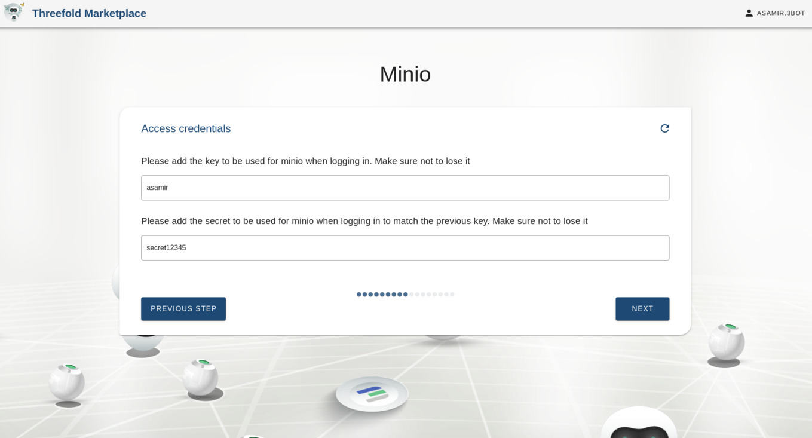

#### Optional Container Logs
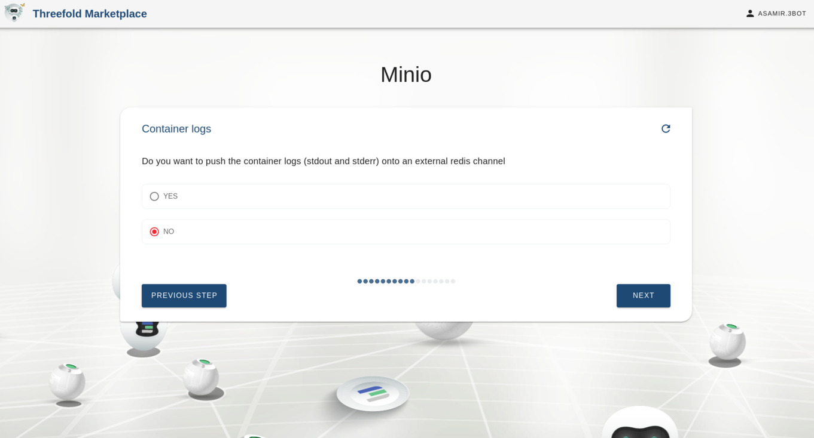

#### Add you SSH Key

### Deploying your solution
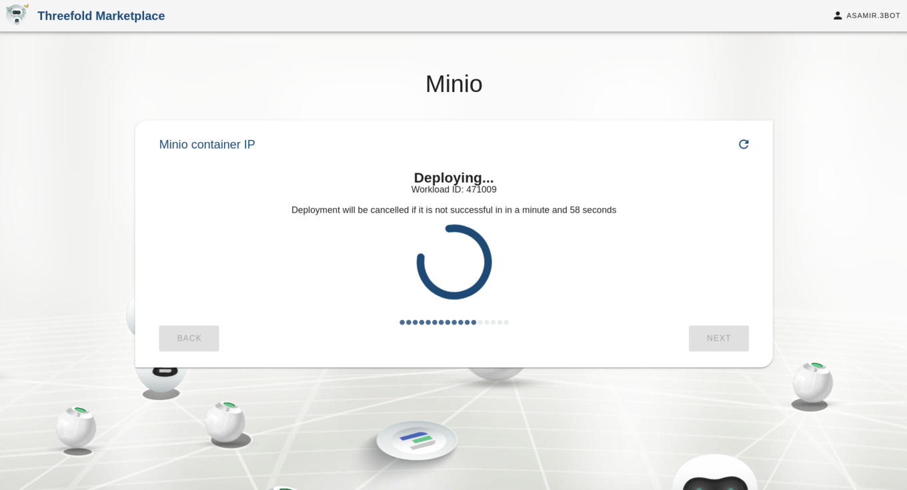

#### Select IP
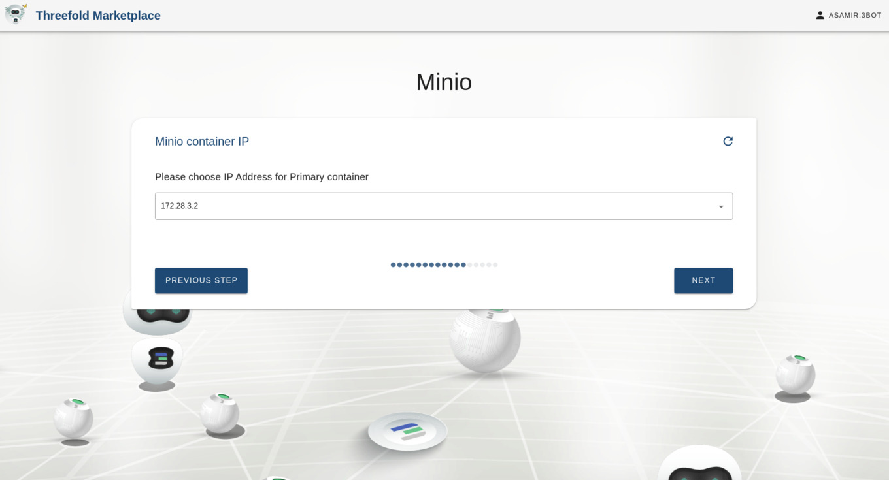

### Choose whether you want to assign a global Ipv6 address for your container or not

#### Confirmation
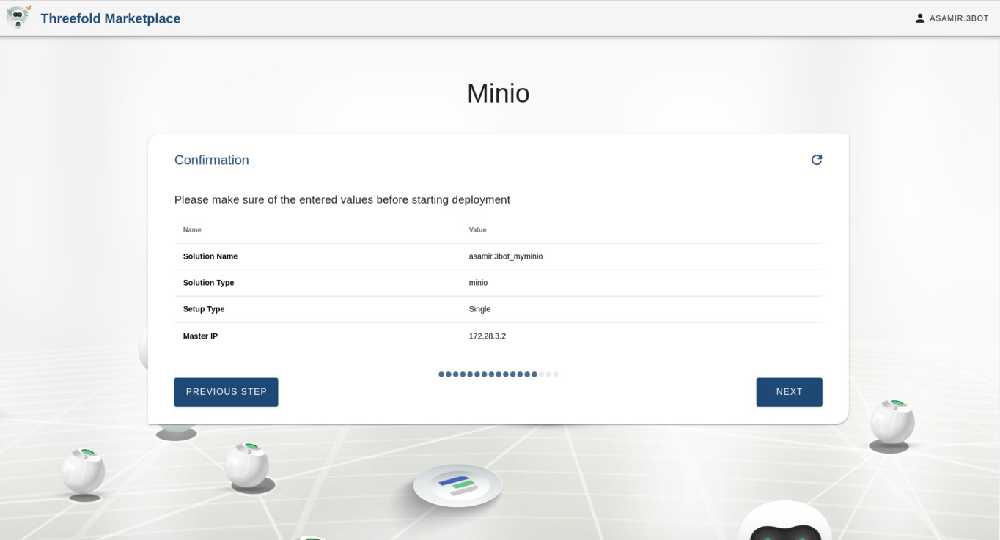

#### ZDB Reservation
The solution does two reservations, one for ZDB which will be used as backend for Minio and the next for Minio containers.
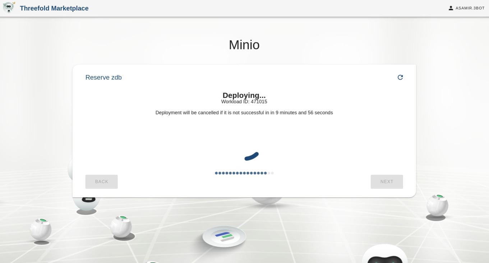

#### Success
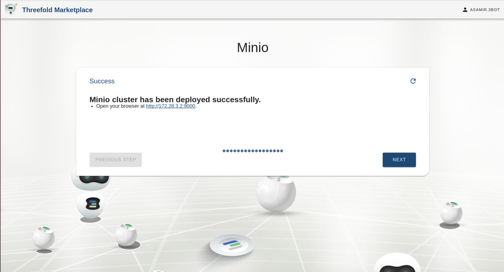

#### Access your Solution

