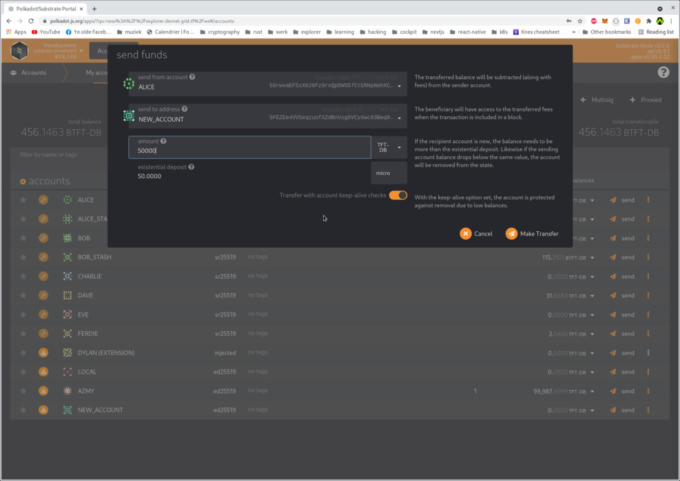

# Creating a Farm on TFChain Devnet

## Step 1: Copy types to clipboard

Open https://raw.githubusercontent.com/threefoldtech/tfgrid-api-client/master/types.json and copy the whole content to your clipboard.

## Step 2: browse to Polkadot UI

Open https://polkadot.js.org/apps/?rpc=wss%3A%2F%2Ftfchain.dev.threefold.io#/settings/developer in your browser.

Paste the types in in the box and hit `save`

## Step 3: Create an account

Open https://polkadot.js.org/apps/?rpc=wss%3A%2F%2Ftfchain.dev.threefold.io#/accounts in your browser, 

click `Add account`, take note of the seed. Click on the `Advanced creation options` arrow, and select keypair crypto type: `Edwards(ed25519, alternative)`

Click `I have saved my mnemonic seed safely` and click next and fill in the required fields.

- Save the JSON file somewhere safe.

### Step 3.b: Install PolkadotJS extension and import your newly created account

Go to: https://polkadot.js.org/extension/ and add this extension to your browser.

Open the extension, click the + sign (on the right top) and select `Restore account from backup JSON file`, drag the saved json file in there and proceed with setup.

Once completed, you can sign any extrinsic to create a twin / farm with your extension.

## Step 4: Fund your account

On the same page, on the left top, hover over `Account` button and click on `Transfer`. First select account `Alice` and secondly select your newly created account from the list. Send any amount to your account (these are just tokens to play around with, they hold no real value).

## Step 5: Create a Twin

Open https://polkadot.js.org/apps/?rpc=wss%3A%2F%2Ftfchain.dev.threefold.io#/extrinsics in your browser 

and select your account from the list. Next, select `tfgridModule` -> `createTwin(ip)` from the list.

Fill in your [Yggdrasil](https://github.com/yggdrasil-network/yggdrasil-go) IPV6. And click on submit transaction and sign it with your account.

## Step 6: Create a Farm

Devnet: 
Open https://polkadot.js.org/apps/?rpc=wss%3A%2F%2Ftfchain.dev.threefold.io#/extrinsics in your browser

and select your account from the list. Next, select `tfgridModule` -> `createFarm(..)` from the list.

Fill in a name, select a certification type and leave `country_id` and `city_id` to 0. You can, if you want, set the country/city id values to a value from the https://tfchain.dev.threefold.io/graphql/graphql explorer. 

To find a country or city you can query all the available countries and cities in graphql.

Optionally you can also provide public ips on your farm.

## Step 7: query twin ID and Farm ID

### Query twin

Open https://polkadot.js.org/apps/?rpc=wss%3A%2F%2Ftfchain.dev.threefold.io#/chainstate

and select `tfgridModule` -> scroll all the way down to `twinIdByAccountID(accountID):u32` and select your account ID from the list. Hit the PLUS symbol and you should see your twin ID.

### Query farm:

Open https://polkadot.js.org/apps/?rpc=wss%3A%2F%2Ftfchain.dev.threefold.io#/chainstate

and select `tfgridModule` -> scroll to `farmIdByName(bytes):u32` and search your farm ID based on your farm name. Hit the PLUS symbol and you should see your farm ID.

## Optional: Add public IP's to your farm

You can add public IP's to your farm as following:

Open https://polkadot.js.org/apps/?rpc=wss%3A%2F%2Ftfchain.dev.threefold.io#/chainstate

and select your account from the list. Next, select `tfgridModule` -> `addFarmIp(..)` from the list.

As farm id you need to specify your farm id.

IP should be in CIDR format.

## Optional: Remove public IP's from your farm

You can remove public IP's from your farm as following:

Open https://polkadot.js.org/apps/?rpc=wss%3A%2F%2Ftfchain.dev.threefold.io#/chainstate

and select your account from the list. Next, select `tfgridModule` -> `removeFarmIp(..)` from the list.

As farm id you need to specify your farm id.

IP should be in CIDR format.

