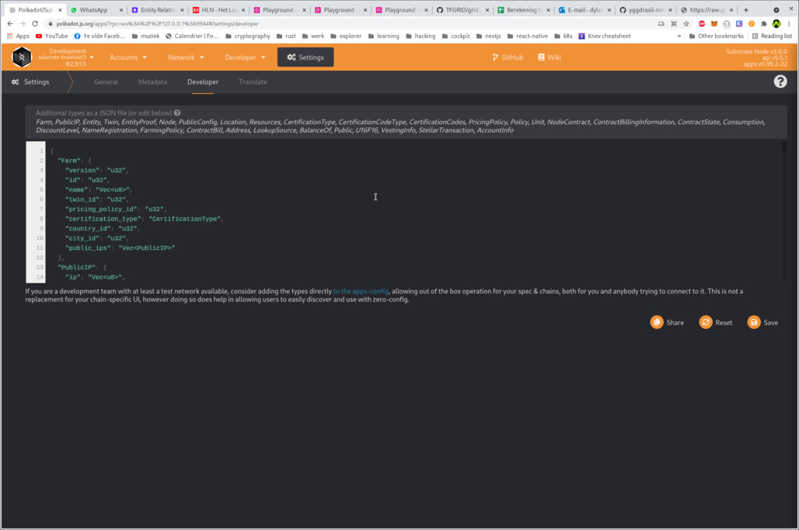
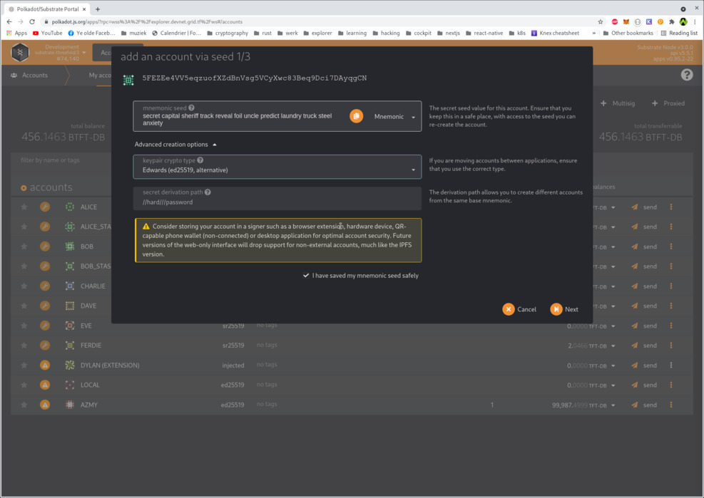
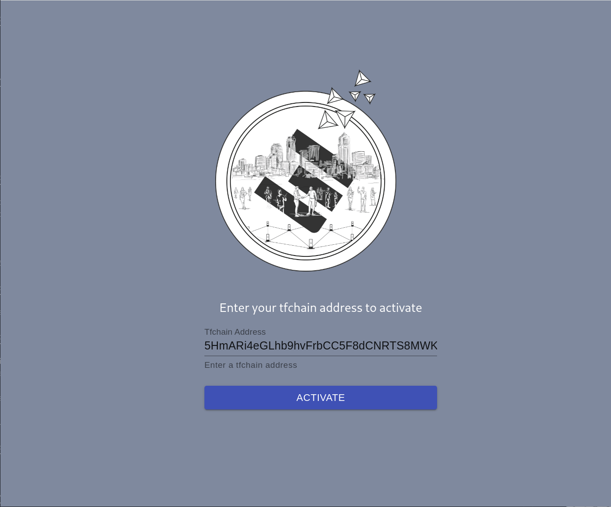
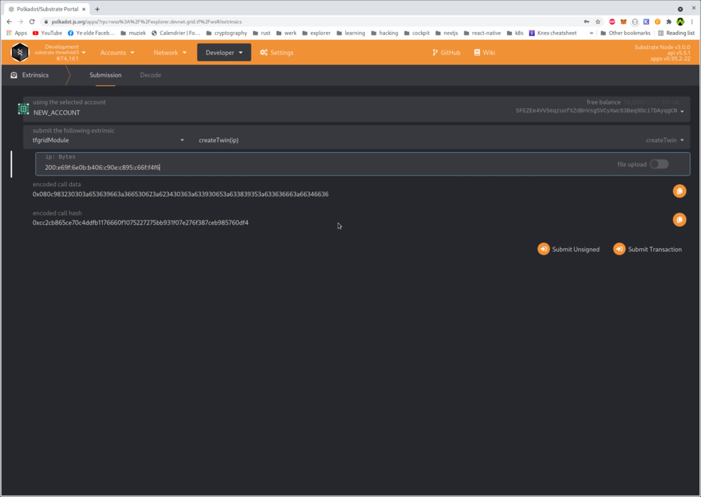
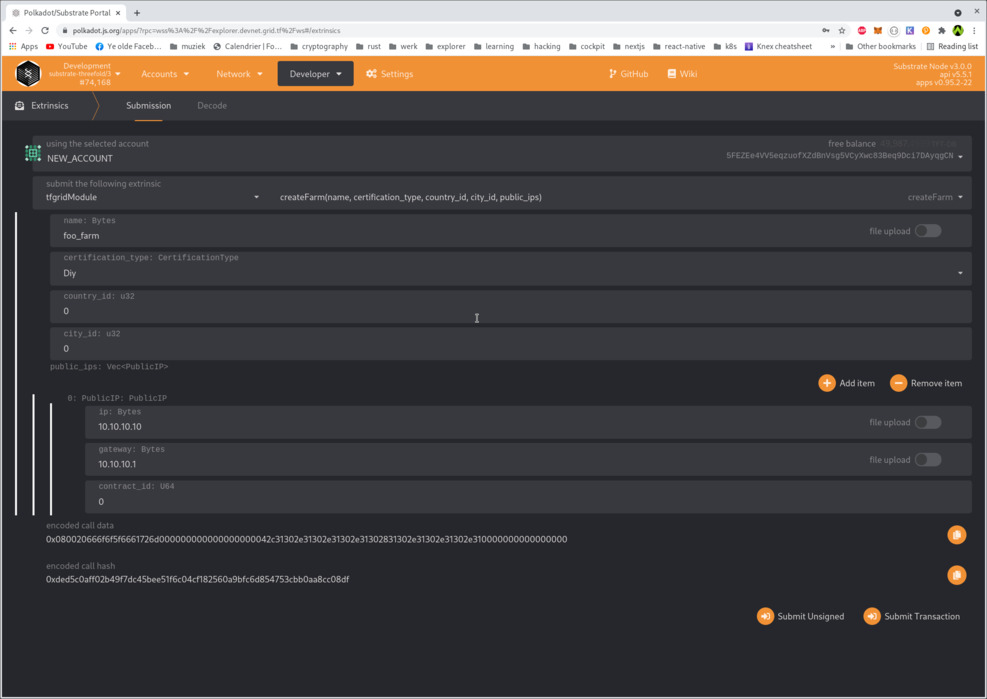
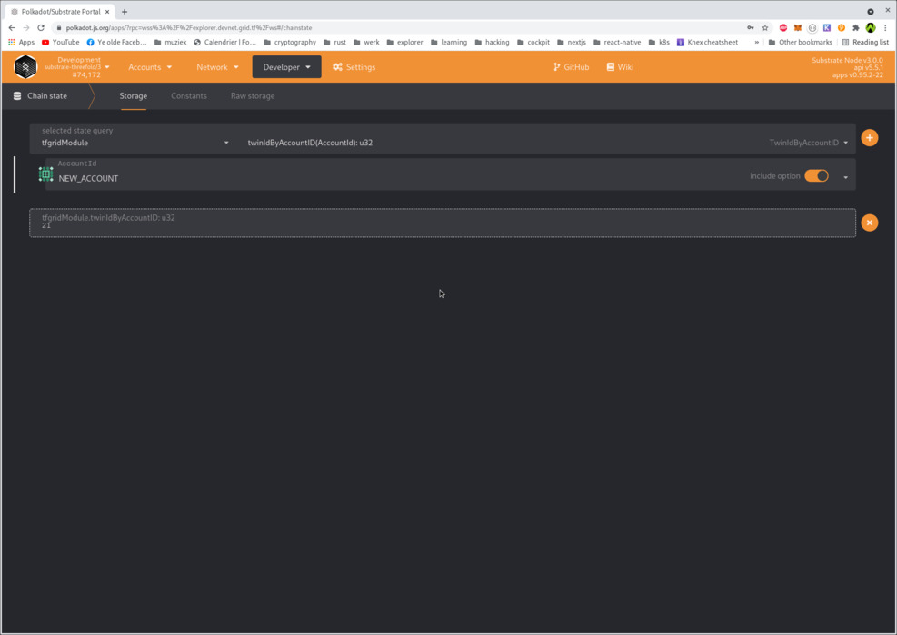
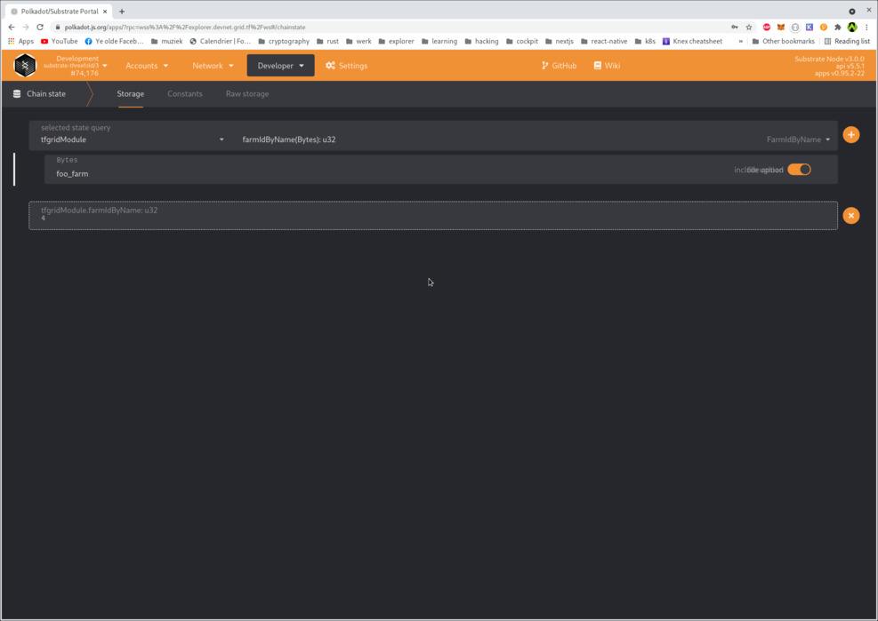
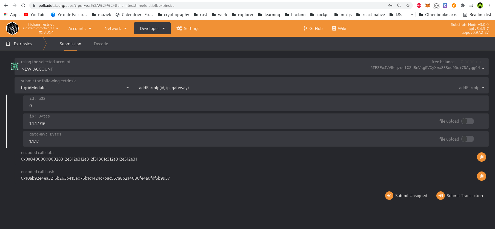
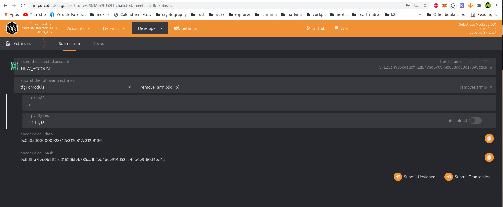

# Creating a Farm on TFChain Testnet

## Step 1: Copy types to clipboard

Open https://raw.githubusercontent.com/threefoldtech/tfgrid-api-client/master/types.json and copy the whole content to your clipboard.

## Step 2: browse to Polkadot UI

Open https://polkadot.js.org/apps/?rpc=wss%3A%2F%2Ftfchain.test.threefold.io#/settings/developer in your browser.

Paste the types in in the box and hit `save`

## Step 3: Create an account

- Open https://polkadot.js.org/apps/?rpc=wss%3A%2F%2Ftfchain.test.threefold.io#/accounts in your browser, 

- Click `Add account`, take note of the seed. Click on the `Advanced creation options` arrow, and select keypair crypto type: `Edwards(ed25519, alternative)`

- Click `I have saved my mnemonic seed safely` and click next and fill in the required fields.

- Save the JSON file somewhere safe.

### Step 3.b: Install PolkadotJS extension and import your newly created account

Go to: https://polkadot.js.org/extension/ and add this extension to your browser.

Open the extension, click the + sign (on the right top) and select `Restore account from backup JSON file`, drag the saved json file in there and proceed with setup.

Once completed, you can sign any extrinsic to create a twin / farm with your extension.

## Step 4: Fund your account through the Threefold activation service

On the accounts page, scroll down to your account and click on your name that you gave it. On the right, copy the address under your name.

Browse to https://tfchain.test.threefold.io/activation/ and input your account address.

## Step 4: Activate your account

!!!include:grid3_testnet_account_activation level:2

## Step 5: Create a Twin

Open https://polkadot.js.org/apps/?rpc=wss%3A%2F%2Ftfchain.test.threefold.io#/extrinsics in your browser 

and select your account from the list. Next, select `tfgridModule` -> `createTwin(ip)` from the list.

Fill in your [Yggdrasil](https://github.com/yggdrasil-network/yggdrasil-go) IPV6. And click on submit transaction and sign it with your account.

## Step 6: Create a Farm

Open https://polkadot.js.org/apps/?rpc=wss%3A%2F%2Ftfchain.test.threefold.io#/extrinsics in your browser

and select your account from the list. Next, select `tfgridModule` -> `createFarm(..)` from the list.

Fill in a name, select a certification type and leave `country_id` and `city_id` to 0. You can, if you want, set the country/city id values to a value from the https://tfchain.test.threefold.io/graphql/graphql explorer. 

To find a country or city you can query all the available countries and cities in graphql.

Optionally you can also provide public ips on your farm.

## Step 8: query twin ID and Farm ID

### Query twin

Open https://polkadot.js.org/apps/?rpc=wss%3A%2F%2Ftfchain.test.threefold.io#/chainstate

and select `tfgridModule` -> scroll all the way down to `twinIdByAccountID(accountID):u32` and select your account ID from the list. Hit the PLUS symbol and you should see your twin ID.

### Query farm:

Open https://polkadot.js.org/apps/?rpc=wss%3A%2F%2Ftfchain.test.threefold.io#/chainstate

and select `tfgridModule` -> scroll to `farmIdByName(bytes):u32` and search your farm ID based on your farm name. Hit the PLUS symbol and you should see your farm ID.

## Optional: Add public IP's to your farm

You can add public IP's to your farm as following:

Open https://polkadot.js.org/apps/?rpc=wss%3A%2F%2Ftfchain.test.threefold.io#/chainstate

and select your account from the list. Next, select `tfgridModule` -> `addFarmIp(..)` from the list.

As farm id you need to specify your farm id.

IP should be in CIDR format.

## Optional: Remove public IP's from your farm

You can remove public IP's from your farm as following:

Open https://polkadot.js.org/apps/?rpc=wss%3A%2F%2Ftfchain.test.threefold.io#/chainstate

and select your account from the list. Next, select `tfgridModule` -> `removeFarmIp(..)` from the list.

As farm id you need to specify your farm id.

IP should be in CIDR format.

## Step 8: Add payout address on Stellar network

The reward process for farming does the payout on the Stellar network. 
That is why a farmer needs to provide a Stellar wallet address, so the minting process can pay out the correct amount of TFT onto that Stellar wallet address. 

Open https://polkadot.js.org/apps/?rpc=wss%3A%2F%2Ftfchain.test.threefold.io#/extrinsics in your browser

and select your account from the list. Next, select `tfgridModule` -> `addStellarPayoutV2Address(..)` from the list.
Fill in the farmId you obtained in step 7. 
Fill in a Stellar account address (string in capital letters, starting with a G) you can find in your ThreeFold Connect app (or another Stellar wallet). 
