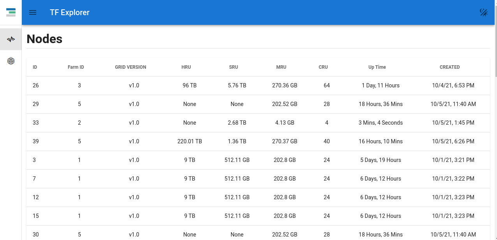
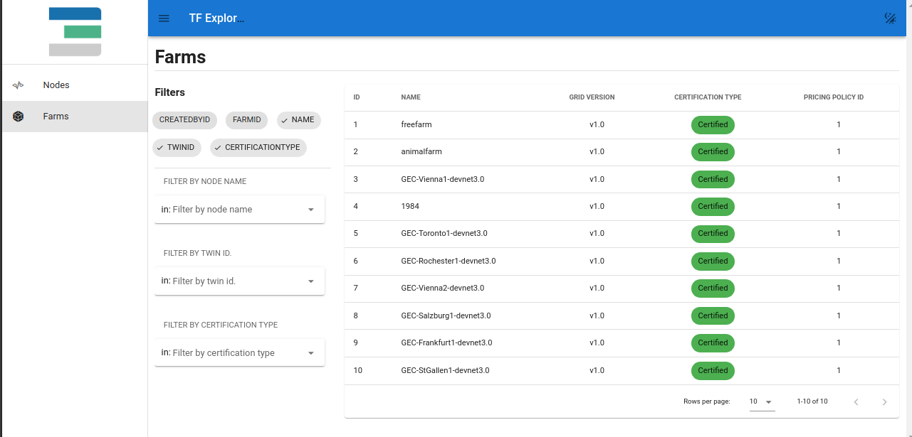
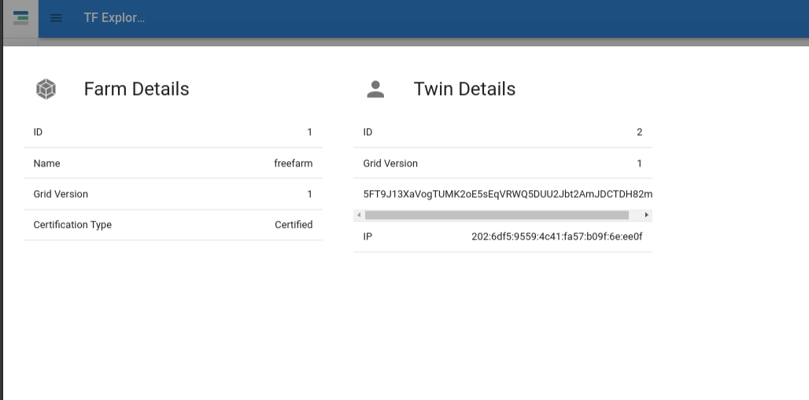
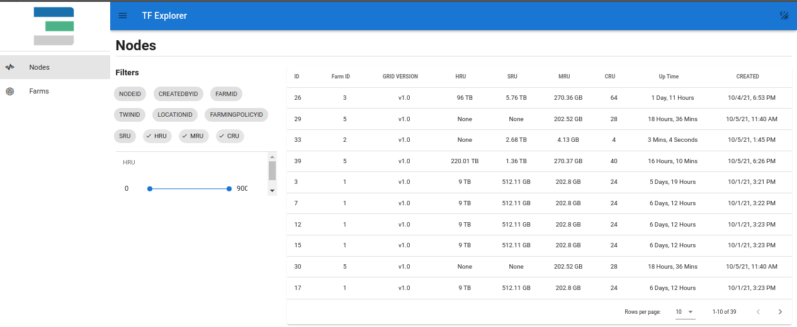
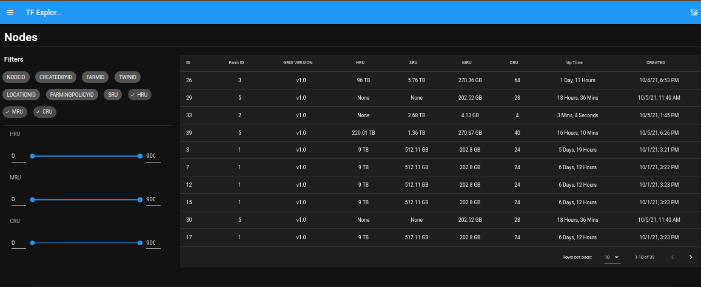
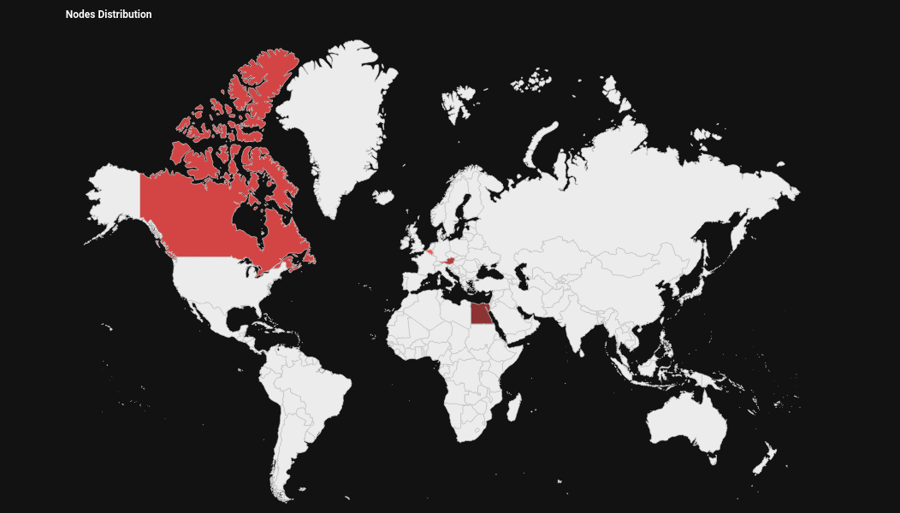

# Explorer UI

Explorer UI helps exploring the capacity connected to Threefold Grid. Searching for nodes, farms, gateways .. etc. It also supports Dark mode for more comfortable navigation.

## Statistics

Here you can see generic overview about 
- number of farms
- number of nodes
- number of gateways
- number of twins
- number of contracts
- the capacity CRU, SRU, HRU, MRU
- the number of public IPs available

## Exploring farms
You can see a list of all farms with filtering options

## Farm details
Click on a farm shows up the farm details information

## Exploring nodes
Explorer UI allows exploring the nodes and filtering them by many filtering option 

Explorer UI allows exploring the nodes and filtering them using many filtering options.
 

You can see all of the node details by clicking on a node record.

Darkmode is supported. Click on the icon in the upper right corner of the screen. 

Can also see a map of how the capacity is distributed

A map is available with a global overview, showing in which countries capacity is offered. 

## Available explorers
- [Devnet explorer](https://explorer.dev.grid.tf)
- [Testnet explorer](https://explorer.test.grid.tf)
- [Mainnet explorer -not live yet-](https://explorer.grid.tf)

> TODO: keep it in todo until all are alive

## GraphQL
Info on TFChain is indexed over GraphQL and is available for queries. 
- [Devnet GraphQL](https://graphql.dev.grid.tf/graphql)
- [Testnet GraphQL](https://graphql.test.grid.tf/graphql)
- Mainnet GraphQL - not yet live

## Reporting issues
Please open a github issue in [grid_explorer_ui repo](https://github.com/threefoldtech/grid_explorer_ui)

Also to plan your deployment beyond the explorer capabilities you can use these [graphql example queries](explorer_graphql_examples)