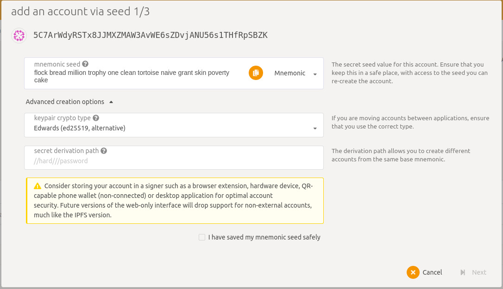
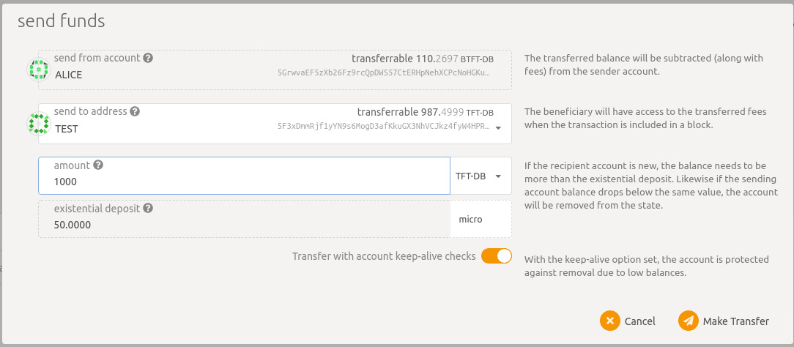

## TF-Chain on Devnet

!!!include grid3_portal_notice

For deployments, you'll need a TF-Chain account and a twin registered. You'll need both your mnemonic phrase and TwinID to pass to the Terraform plugin.

#### Important notes:

- You must choose `ed25519` as the "crypto type" when setting up your account
- When funding your wallet from the provided faucet accounts, you can transfer more than the shown balance of those accounts. Take a few thousand tokens to make sure you don't run out while testing
- The guide advises to find your twin ID by checking the `twinID()` method. However, this will only correspond to your ID until a new twin is created and the value is incremented. To make sure you're seeing the ID associated with your account, use `twinIdByAccountID(AccountId)` instead, and select your account name from the drop down.

## Create Twin

### Create account on Substrate using Polkadot

- Go to [Polkadot UI, TF-Chain-devnet](https://polkadot.js.org/apps/?rpc=wss%3A%2F%2Ftfchain.dev.grid.tf#/accounts)

- Click on `Add an account` in [Polkadot accounts](https://polkadot.js.org/apps/?rpc=wss%3A%2F%2Ftfchain.dev.grid.tf#/accounts)
- Save the mnemonic seed -needs to be ed25519- in a safe place
- Add a name and password for your account (remember the password for future usage)
- Fund the account with test funds (Click on send funds from the account of Alice to your account name)

### Add types in the UI

- Add types https://github.com/threefoldtech/tfgrid-api-client/blob/master/types.json in developer settings (do not forget to click `Save`)

### Create Twin on Substrate using Polkadot

- Click on `Add an account` in [polkadot accounts](https://polkadot.js.org/apps/?rpc=wss%3A%2F%2Ftfchain.dev.grid.tf#/accounts)
- Save the mnemonic seed in a safe place

- Click on `Advanced creation options` and select the keyword crypto type of **`Edwards (ed25519, alternative)`**
`

- Add a name and password for your account (remember the password for future usage)

- Fund the account with test funds (Click on send funds from the account of Alice to your account name)

- Select the options to create the twin in [polkadot developer extrinsics](https://polkadot.js.org/apps/?rpc=wss%3A%2F%2Ftfchain.dev.grid.tf#/extrinsics)

  - `Selected account` -> your Account name

  - `Extrinsic module to be submitted` (from drop down menu) -> tfgridModule

  - `Extrinsic method to be submitted` -> createTwin(ip)

  - `ip` -> Ipv6 obtained from your yggdrasil
- Submit transaction and enter password selected when creating the account

- To get your twin ID, select the options required in [Polkadot Developer Chainstate](https://polkadot.js.org/apps/?rpc=wss%3A%2F%2Ftfchain.dev.grid.tf#/chainstate) and click on the +
  - `Module` -> tfgridModule
  - `Method` -> twinID(): u32

