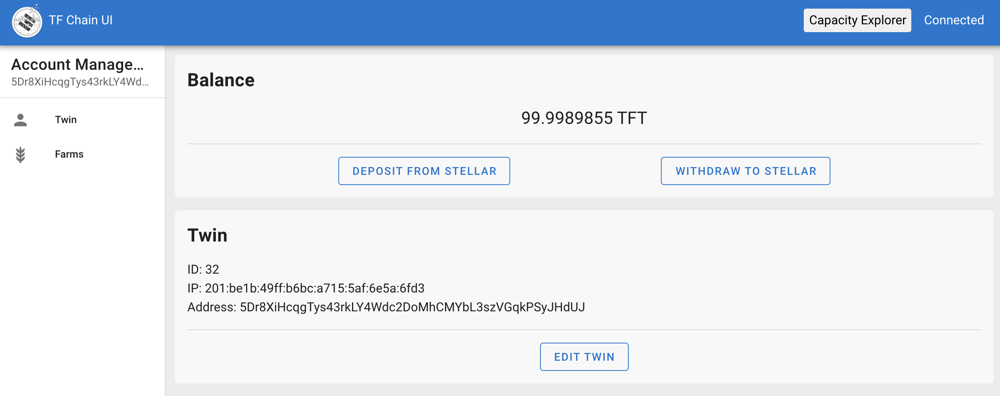
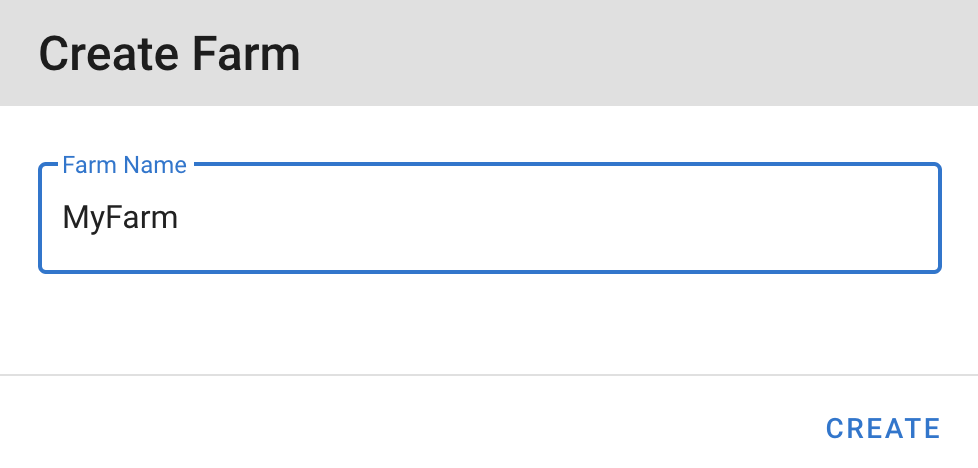
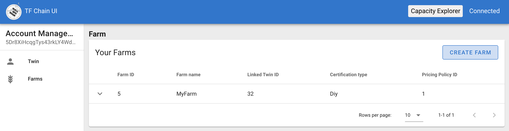
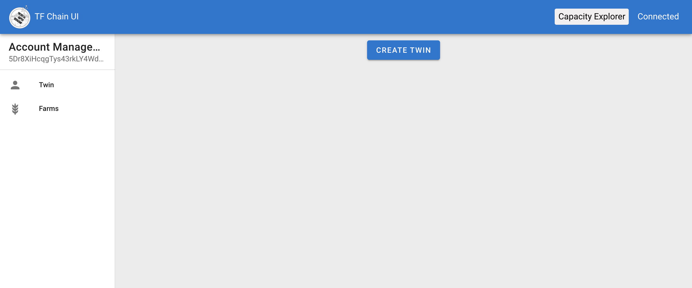
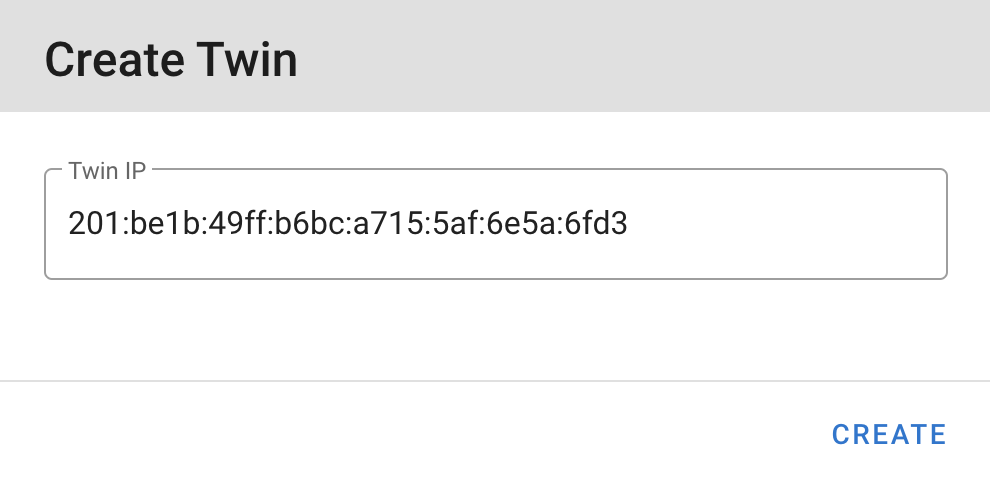
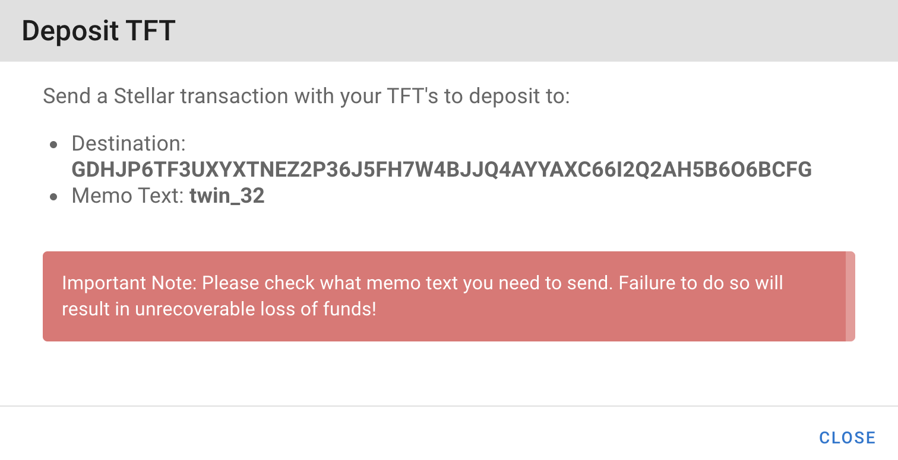
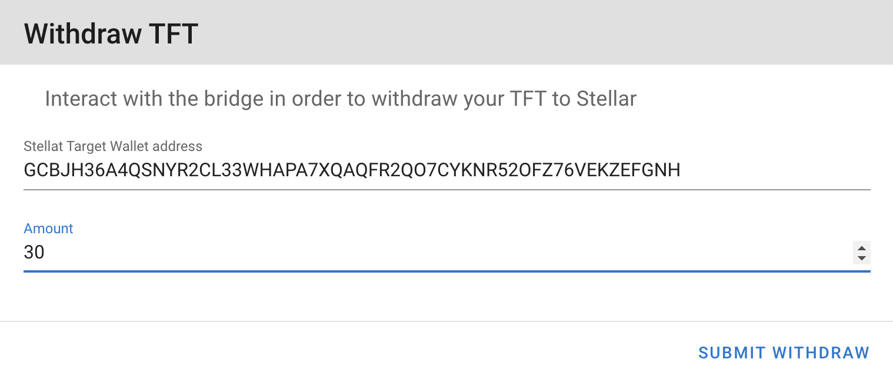

# TF-Chain Portal

The portal is an easy interface containing all elements needed to set up a farm, and can be found : 
- on [Devnet](https://portal.tfchain.dev.threefold.io/)
- on Testnet : under construction
- on Mainnet : under construction

## Install Polkadot extension

Before using the portal, you need to install a Polkadot extension. It can be installed from [here](https://polkadot.js.org/extension/).

## Features

### Create an Account

### Activate your Account 

### Create a Farm

### Add a public IP to your Farm

### Add a Twin

### Edit your Twin

### Transfer TFT between Stellar Network and TF-Chain

#### Deposit

#### Withdraw 

