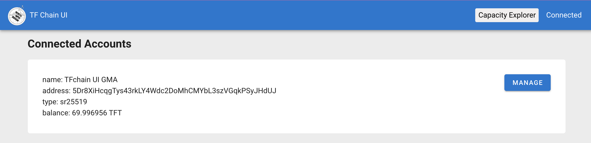
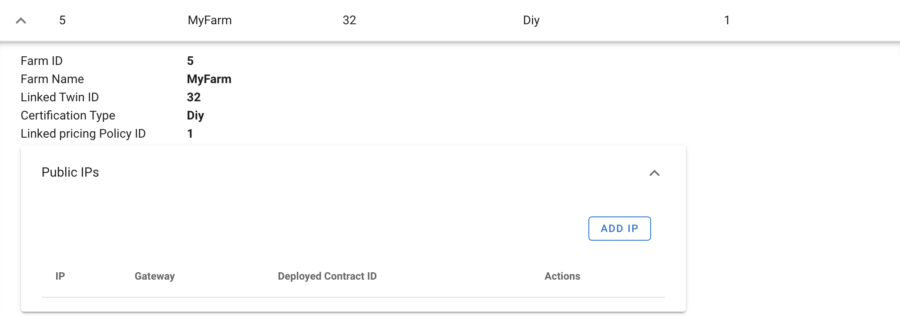
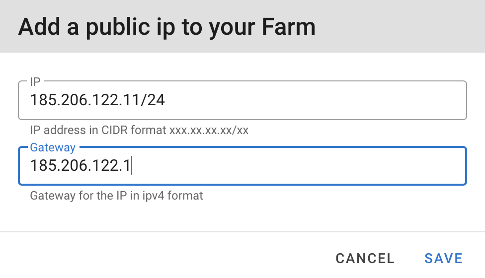
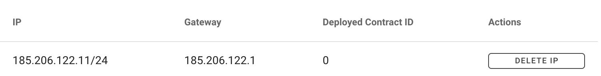

# TF-Chain Portal

The portal is an easy interface containing all elements needed to set up a farm, and can be found : 
- on [Devnet](https://portal.tfchain.dev.threefold.io/)
- on Testnet : under construction
- on Mainnet : under construction

## Install Polkadot extension

Before using the portal, you need to install a Polkadot extension. It can be installed from [here](https://polkadot.js.org/extension/). Extensions are available for the Google Chrome and Firefox browsers. 

## Create an Account

You will be asked to create a new account or to recover an existing account. 
When creating a new account, the mnemonic seed words will be shown, which can be used to recover your wallet. Keep them in a safe place, they give access to the TFTs that you will hold on the TFGrid. 

In the next screen, you can choose a network. Select `Allow use on any chain`. Give your account a name and a password for easy access from your local hardware. With this information, the account can be generated. 

Once the account is generated, you can see it in the portal. 

Click on `MANAGE` to continue. 

## Activate your Account 

You now have an account, but it's inactive and does not contain any TFT. Click on `ACTIVATE ACCOUNT`, this will result in TFT being known in your account. 

Every update on the blockchain requires a small amount of TFT. To get you started easily, 1 TFT is transferred to the account during activation. 

## Create a Twin

A twin is a unique identifier of where you can be found digitally. Click on `CREATE TWIN` to register your Twin on TF-Chain. 

In the future, there will be more automation to fill in the Twin IP with the IPv6 address from your local device. For now, please fill in the IPv6 address obtained during the setup of the [Planetary Network](grid3_planetary_network). 

Submit the transaction using the password selected when creating the account.

The TwinIP can be modified at any moment. 

## Create a Farm

If you want to start farming, you need a farmID, the ID of the farm that is owning the hardware node(s) you connect to the TFGrid. 

Click `CREATE FARM` and choose a name. 

Click `CREATE` and sign the action. 

## Add a public IP to your Farm

If you have public IPv4 addresses available that can be used for usage on the TFGrid, you can add them in your farm. 
Click `ADD IP`, specify the addresses, the gateway and click `CREATE`. 

Deleting IPv4 addresses is also possible here. The `Deployed Contract ID` gives an indication of whether an IP is currently used. If it is 0, it is safe to remove it. 

## Edit your Twin

## Transfer TFT between Stellar Network and TF-Chain

### Deposit

### Withdraw 

