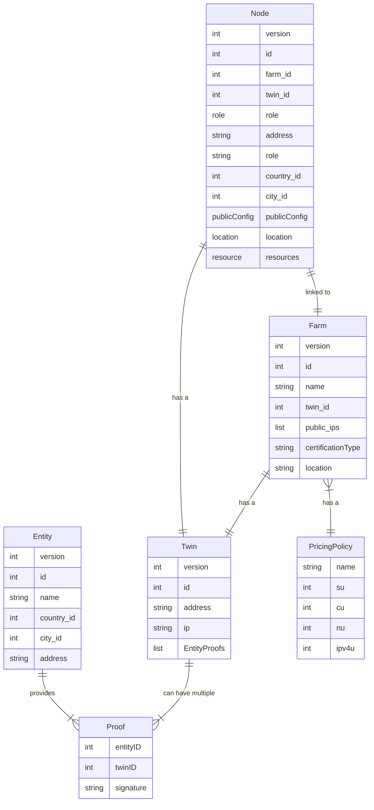

## TF GridDB Schema

- [Entity](griddb_entity)
- [Twin](griddb_twin)
- [Farm](griddb_farm)
- [Node](griddb_node)
- [PricingPolicy](griddb_pricingpolicy)

!!!def alias:tfgrid_db_schema,grid_db_schema

