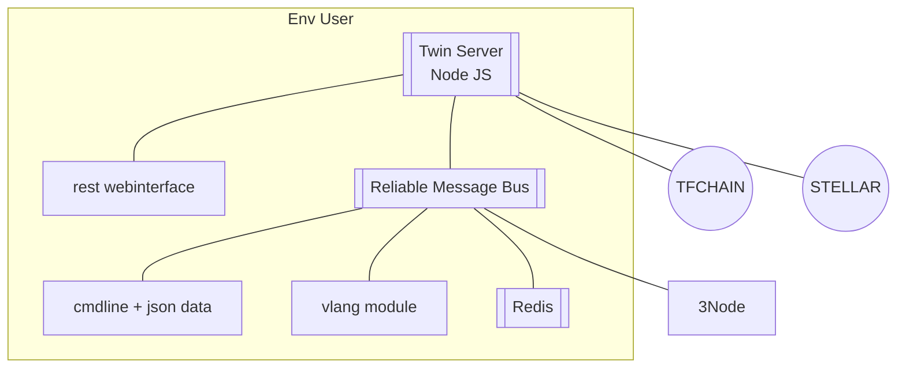

# Twin Server

- twin_server is implemented in nodejs

> TODO: use gitpod to run env as specified here, all need to run inside, easy to develop

## Functionality

- webserver
  - for 
    - wiki (flattened from publishing server)
    - website = gridsome or any other html website
    - proxy for running publishtools daemon who exposes wiki
  - features
    - virtual hosts
    - prefix on website
    - letsencrypt
    - authentication based on secret
    - authentication vs threefold connect
- webserver mgmt
  - add/delete/configure site
  - site has config like secret, authentication, domain, ...
- client for Stellar
  - RMB
  - REST (*)
- client for TFChain (RMB)
  - interfaces
    - RMB
    - REST (*)
  - features
    - tfgrid db
    - tfgrid explorer
    - tfgrid contracts (deployments)
- dns (*)
- hypercore/drive (*)
- twin experiences (*)
  - twin_aydo = alternative to zoom, whatsapp, gdocs (installable as plugin to the server)

> (*) phase 2

## More Info

- [twin_server_tech](twin_server_tech)
  

!!!def alias:twin_server,digital_twin_server,digital_self_server,self_server