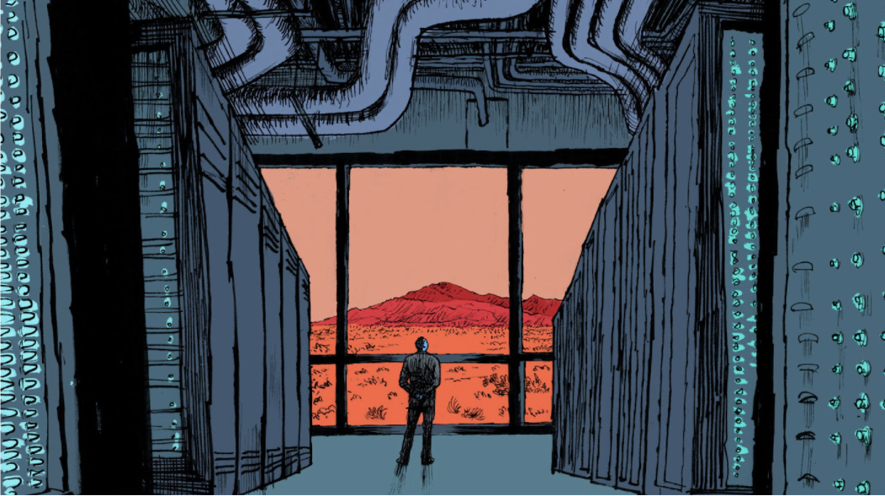

# Sustainability

There’s no question that climate change is one of the biggest, if not the biggest threats facing humanity today. If we care about future generations and the health of our planet we have no choice to address these threats and fast. Despite the super energy efficiency of our technology,  ThreeFold is taking not just a sustainable approach - we are setting the plan for a planet-positive internet. As a matter of fact, ThreeFold is working towards introducing the first and largest Peer-to-Peer Carbon Negative Internet Grid in the world - An Ethical Internet Grid that regenerates the earth, through a Voluntary Carbon Credit system. 

## For our Planet and Future Generations 

The increasing digitalization of the economy and society is leading to a dynamic increase in the amount of data that is processed and stored in centralized data centers. This growth will also lead to a significant increase in the energy consumption of those hyper-scale data centers worldwide. Video streaming, social media, big data, artificial intelligence and digitalization of business processes and production flows, Metaverse, edge computing, Virtual Reality, Internet of Things - these and other trends are leading to the need for data centers capacity to grow dynamically. 

If we meet the projected demand for 2022, more than 4,000 new data centers, costing an estimated $5 trillion, will be needed to build and consume an additional 400 GW/h. This is roughly equivalent to Japan’s energy consumption and would place an impossible strain on the global electricity grid. Already, demand for data center storage is causing memory shortages and price hikes. 

Interesting facts regarding climate change: 

- The concentration of carbon dioxide (CO2) in our atmosphere, as of July 2021, is the highest it has been in human history. 
- 11% of all global greenhouse gas emissions caused by humans are due to deforestation. 
- According to NOAA, global temperature in July 2021, were higher than any other July record - making it likely the hottest month the world has seen since records began in 1880. 
- 11% of the world’s population is currently vulnerable to climate change impacts such as droughts, floods, heatwaves, extreme weather events, and sea-level rise. 
- Tropical forests are incredibly effective at storing carbon, providing at least a third of the mitigation action needed to prevent the worst climate change scenarios.

We are already seeing the effects of climate change but there is a need to leverage the importance of nature in our daily lives to ensure a better planet for future generations. 

Please dive deeper into our different Sustainability sections: 
- [Sustainable Technology](sustainable_technology)
- [Voluntary Carbon Credit System](vcc.md)

See more on our Forum section dedicated for Carbon Double Win [here](https://forum.threefold.io/c/ecosystem-developments/sustainability/90).

