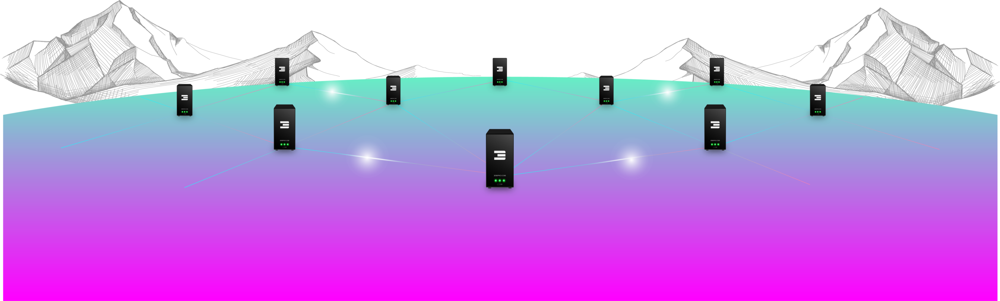

# Sustainable Technology 

## Decentralized infrastructure

ThreeFold decided to turn around the current digital miasma and create from scratch a new internet infrastructure that is decentralized, fully peer-to-peer, secured, and more sustainable - ThreeFold Grid. Not believing in the current centralized model with the use of hyper-scale and power-hungry data centers,  ThreeFold uses a decentralized model to spread internet access throughout the whole world by enabling anyone to participate in providing Internet Capacity (Compute, Storage, and Network) by connecting and running a 3Node - Computer (servers). ThreeFold reworked the whole approach to IT architectures and eliminated the layers of complexity. The result is a cloud stack that presents minimal overhead and that requires less hardware - reducing heat generation and eventually cooling requirements. By reducing the need for power, the net result is an energy-efficient Internet Grid. 

The Zero-OS is the operating system that allows the 3Nodes to be used to provide the IT capacity required by the solutions running on the ThreeFold Grid. From an energy efficiency perspective, the algorithm of Zero-OS maximizes utilization possibilities which enables greater performance and sustainability. Moreover, it uses minimal Linux Kernel that allows for a number of user spaces to co-exist. In these user spaces, containerized versions of software can be run, eliminating the need for hypervisors, virtual OS to fuel the virtual machines, and guest operating systems. 

## ThreeFold Storage System

### Avoiding Copies 

Most systems in the storage industry use replication of data as a main mechanism to ensure that the data will not be lost. 

Our [Quantum Safe Storage Algorithm](qss_algorithm) has only 20% overhead of additional storage, compared to an overhead of 400% for a replicated storage system. This allows us to lose any 4 nodes at the same time without losing the user’s data - Our margin of error. 

We believe that using our algorithm saves at least 3 times the net storage space compared to other storage systems. Therefore, this yields to energy savings coming from our storage system. 

### Multi-layer 

Our storage system is a multi-layered system. The encoding/front end system does a lot of caching and will make sure there is enough performance even for workloads where some random read/write is required. The backend uses slow nodes with slow energy-efficient disks. This allows better optimization of energy. 

### No fast disks 

In our storage system, we still use Hard Drives (“HD”) because they are still by far the most effective way of storing data. The issue with HD is the following: they spin around, and, as a result, become slow and even unreliable if the read/write behavior is too random.

Hard Disk Drives (“HDD”) use spinning disks. Imagine 20 users (can be software users) need to write/read data from 1 large disk at the same time. Now the read/write head needs to jump all over the disk at the same time, this leads to much more power usage, slower access times, and disks breaking down more quickly. Unfortunately, current storage systems do not take this behavior into consideration. There are many IT processes fighting for the resources of the same disk resulting in exactly this behavior.

In most storage systems, enterprise-capable disks need to be chosen because otherwise, they fail quickly, or otherwise become super slow. These disks tend to spin faster and are smaller. Large HDs are not usable for variable (random, faster) workloads as done in large storage clouds. A 14 TB disk on 7200 Revolution Per Minute (“RPM”) is not doable for changing data, the random access on the disk would make it too slow per GB stored, and the disk could become unreliable if used too much.

#### ThreeFold’s ZOS-DB

ThreeFold has developed the [ZOS-DB (“ZDB”)](zdb) technology which is a low-level key-value store that lives close by the HD. ZDB will only read and write on an HDD for one user at a time, it will not allow multiple users to read at the same time. ZDB writes and reads in an optimized way from the HDD. Larger chunks of data are nicely positioned on the spinning disk. Reads are queued one after the other and read in optimized ways. Writes are also queued (buffered) and will only be flushed when the reads are done. Large chunks of data are written as nicely as possible. This allows us to use larger disks which are more cost-effective and also spin slower and as such use less energy and are more reliable as a result. 

Our estimate is that we can save about 3 times in energy usage - thanks to these larger, slower, and greener disks. 

### Read/Write Caching

On the storage front end nodes, we do aggressive caching of read/write on Solid State Drives (“SSD”). SSD uses minimal energy and provides a fast layer for caching. For redundancy reasons, we can put a transactionlog (Write Ahead Log: “WAL”) on nearby secondary front-end nodes. These nodes will replay the WAL when the master front-end node would be lost or experiences downtime.

Because of this caching layer, large blocks of data are created - thanks to ZDB technology on the front layer - and are encoded using our Quantum-Safe Storage Algorithm. This results in large chunks being sent to the backend ZDB once required. Each ZDB will write a single writer to the HDD and only when required.

This results in the ability to use the backend HD’s much less and as such save energy.

### HDs and/or Storage Nodes are turned off

Our 3Nodes have the ability to turn off HDs when there are not needed - Thanks to our write caching layer where most of the disks are not active. In large ThreeFold Storage Systems, more than 90% of the disks are typically turned off. This leads to huge power savings and also improves considerably the lifetime of a HDD. 

This is possible because of ThreeFold’s caching method and our Quantum-Safe Storage Algorithm. 

## Digital Self 

Digital Self is a virtual system administrator that executes the commands (reservation of capacity, sending messages, storing files, build applications, etc.) directly on the Operating System level via a Smart Contract for IT. Moreover, it is your unique digital identity that allows you to access the ThreeFold Grid. 

Built on top of the Peer-to-Peer Network, all the Digital Self communicate directly to each other in a peer-to-peer way, leading to a tremendously efficient organic system.

### The actual problem with the centralized infrastructure 

If two persons in a village in Africa send a message to each other, the message is first routed to a distant centralized data center, for instance in the United States, where it will go to another location, before heading back to the recipient who fetches through their web-based email client. This is a waste of energy. 

How inefficient this is: 

- The message travels thousands of Kilometers (Km), instead of 2 km 
- The message needs to go over two centralized mail systems (sometimes over multiple hops) 
- The message is stored in large data centers 

### Digital Self to empower the peer-to-peer network 

With the ThreeFold solution, the sender communicates with his/her Digital Self which is close to him - hosted on one of the closest 3Node - and this Digital Self will find the receiver’s Digital Self through the shortest path possible and deliver the message. This leads to a much more efficient way to deal with data transport. Consequently, the developed IT structure of ThreeFold saves a lot of energy regarding Network power.