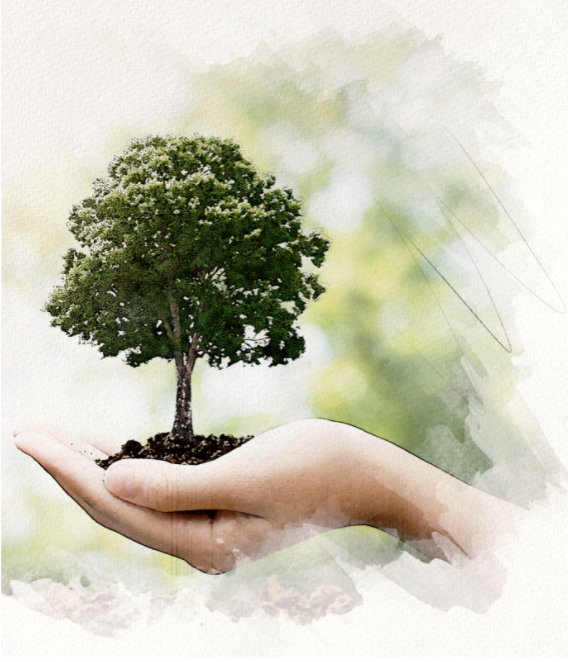
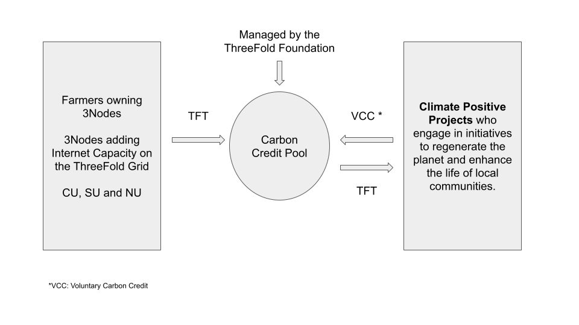
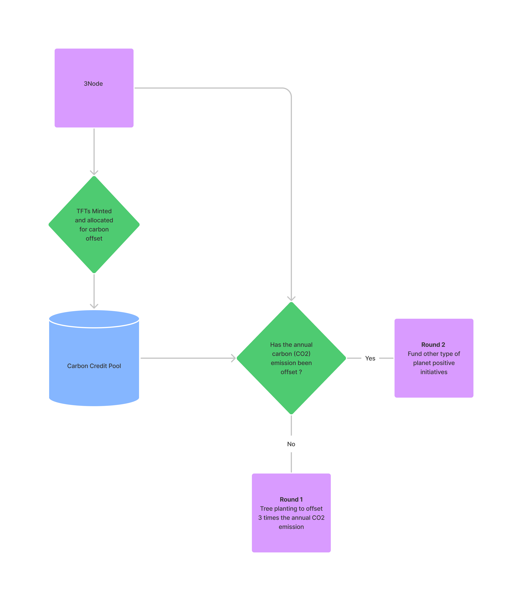

# Voluntary Carbon Credit System 

It is clear that simply being sustainable is not enough anymore. We’ve now entered a regenerative era where we must reverse the environmental harms of the past and stop biodiversity loss – something we can achieve through carbon credit systems.

In addition to the energy efficiency of ThreeFold Technology, ThreeFold is aiming to make the ThreeFold Grid a Carbon-Negative Internet Grid where it will offset 3 times its collective carbon emissions. This is undertaken through the creation and implementation of a Voluntary Carbon Offset System, i.e for every ton of carbon the Grid consumes, three tons of carbon are sequestrated through planet-positive initiatives. 

## What are Voluntary Carbon Credits (VCC)?

The [Voluntary Carbon Market](https://www.spglobal.com/platts/en/market-insights/blogs/energy-transition/061021-voluntary-carbon-markets-pricing-participants-trading-corsia-credits) (VCM) aims to finance regenerative activities that absorb carbon from the atmosphere (e.g. tree planting) or reduce greenhouse gas (GHG) emissions (e.g. renewable energy grid deployment). 

The VCM is pioneering new approaches to fight climate change, and allows ThreeFold to directly purchase carbon credits to offset the carbon emissions of the Grid without having to tap into centralized regulatory frameworks.

Carbon credits allow organizations to reduce the environmental footprint of their operations by funding planet-positive actions that either capture or reduce the emissions of carbon. According to [McKinsey Sustainability](https://www.mckinsey.com/business-functions/sustainability/our-insights/how-the-voluntary-carbon-market-can-help-address-climate-change), a carbon credit is “a certificate representing one metric ton of carbon dioxide equivalent that is either prevented from being emitted into the atmosphere (emissions avoidance/reduction) or removed from the atmosphere as the result of a carbon-reduction project.” In this context, “voluntary” means that we’re not obligated to offset our emissions, e.g. to comply with certain laws or regulations, but rather do so voluntarily.

## How does ThreeFold’s VCC system work?

**Step 1: Measuring carbon emissions**

In order to establish the VCC system that will offset the ThreeFold Grid emissions three times, the first step is to measure the carbon emissions produced by the ThreeFold Grid and the  3Nodes.

The power usage of a 3Node is defined by the amount of Compute Units (CUs) and Storage Units (SUs) it holds. A global average of carbon emissions per Kilowatt per hour (KwH) has been calculated as a first basis for this system.

_Please note that different types of 3Nodes such as DIY nodes have different amounts of CUs and SUs connected. Learn more [here](https://threefold.docsend.com/view/wsru3f9tmeaq62wq)._

**Step 2: Identifying planet-positive initiatives**

In December 2021, [Take Action Global](https://www.takeactionglobal.org) (TAG) started the first regenerative initiatives to produce VCC that will be used for offsetting the carbon emissions of the ThreeFold Grid. TAG will be responsible for monitoring and tracking the carbon sequestration across time and space.  

_We’ll soon share two follow-up posts with more information on these initiatives as well as our partnership with TAG._

**Step 3: Converting carbon capture into monetary value**

The total amount of carbon captured by TAG initiatives will be converted into monetary value in the form of US Dollars according to:

(1) the average value of 1 KwH in Kilograms (Kg) as per country,

(2) the multiplier for carbon double win*,

(3) the average price of 1 tonne of CO2 as per country.

_As we aim to offset ThreeFold carbon emissions three times, the multiplier for carbon double win is 3x._

_Check out [this spreadsheet](https://threefold.docsend.com/view/wsru3f9tmeaq62wq) to find out more about the power consumption of different 3Node setups and what it takes to achieve a carbon double win per month. Please note that this mechanism is the first version and will improve across future releases._

**Step 4: Issuing VCC for carbon offset**

Once the monetary costs associated with the carbon-capturing activities are determined, TAG turns the CO2 absorbed based on the corresponding value in USD into Voluntary Carbon Credits (VCC). The VCC are tied to the USD. 

**Step 5: Using TFT as a mechanism for carbon offset**

To pay for the carbon offset, VCC are bought from partners like TAG. Based on their USD value, the cost of VCC is translated into a corresponding amount of ThreeFold Tokens (TFT).  

**Step 6: Minting TFT for carbon offset**

Each 3Node mints additional TFT to offset its own carbon emissions based on the power utilization of the individual 3Node per month. At the end of every month, this specific amount of TFT is directly sent to the pool on a monthly basis. This process is fully automated.

_The TFT are minted based on the [Proof-of-Capacity](https://library.threefold.me/info/threefold#/tfgrid/farming/threefold__proof_of_capacity) algorithm. Please note that the amount of TFT allocated to the VCC pool will depend on TFT’s market price at the moment of when a 3Node gets connected to the ThreeFold Grid v3._

**Step 7: The Carbon Credit Pool**

The Carbon Credit Pool is a dedicated wallet for the carbon offset initiatives. In this pool managed by the ThreeFold Foundation, the TFT minted for carbon offset as well as the VCC issued based on carbon sequestration are exchanged. ThreeFold buys the total amount of VCC required with TFT from the pool and our partners like TAG receive these TFTs in exchange for providing the VCC.

_Please note that the amount of TFT allocated to the VCC pool will depend on TFT’s market price at the moment of when a 3Node gets connected to the ThreeFold Grid v3._

**Step 8: Funding planet-positive initiatives**

After receiving TFT from the Carbon Credit Pool, projects like TAG will use these funds to empower on-the-ground initiatives. The amount of TFT shared with each initiative depends on the number of VCC produced.

[TAG](https://threefold.io/partners/take_action_global) organizes and engages in planet-positive initiatives such as tree planting, providing renewable energy to villages, 3D coral reefs, waste reduction, and more to regenerate our planet.

We’re well set to reach our “double carbon win” objective by the end of Q2 2022 and are very excited to become the first carbon-negative Internet infrastructure in the world!

## How do farmers benefit from planet-positive farming?

The TFT required to offset carbon emissions will not impact farmers’ revenues. Instead, the required amount of TFT will be minted in addition to the initial farming rewards and will be directly sent to the Carbon Credit Pool. 

The carbon offset system will be added to the Proof-of-Capacity (PoC) algorithm. As the amount of Compute Units (CUs) and Storage Units (SUs) connected by a 3Node are calculated, verified, and registered on the ThreeFold Blockchain, the PoC algorithm now also takes the 3Node’s estimated carbon emissions into account. You can find the details in this [spreadsheet](https://threefold.docsend.com/view/wsru3f9tmeaq62wq).

Farmers do not have to change anything or forgo revenue to start planet-positive farming. All Farmers have to do is to keep on connecting capacity to the Grid and effortlessly contributing to the regeneration of our planet, as this model will allow all farms to become planet-positive by default. 

## The High-level process for Carbon Offset (Long-run) 

In order to provide the adequate structure/process to create a Carbon-Negative Internet Grid while enhancing the life of local communities by engaging ourselves in a diversified portfolio of Planet-Positive initiatives, ThreeFold and TAG have elaborated the following: 

### Round 1: 

**Timeline:** 1 year

The first round will be dedicated to planting the trees. The trees planted will have an average amount of carbon absorption rate per year and this will keep on absorbing continuously. Please note that an annual audit will be conducted and recorded on-chain to make sure that trees are still present. The first round has been elaborated to set the foundation for the farmers to provide carbon-negative internet capacity. 

### Round 2: 

**Timeline:** > 1 year 

For the second round, which is unlocked just after the first round, the amount of TFTs allocated for carbon offset will be used to fund other planet-positive initiatives which will contribute in additionally regenerating the planet earth and enhancing the life of local communities. This enables a solid and fair structure to create real wealth for communities throughout the world. 

Learn more about planet-positive initiatives [here](https://forum.threefold.io/t/supporting-initiatives-to-regenerate-the-planet/2110). 

