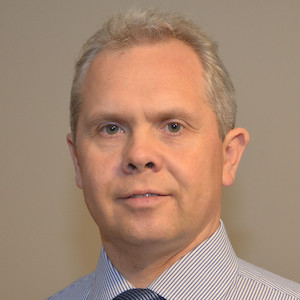

## Iouri Belooussov

- 3Node partner management, webshop coordination and data management
- [LinkedIn](https://www.linkedin.com/in/ibelooussov/)

I do like to challenge myself personally and professionally. My persistence and pro-activeness resulted in numerous important contract wins. My networking skills have provided vital client leads, and my ability to develop client relationships has resulted in a substantial increase in business. While on the job I continually try to educate and grow my skills and talents to help increase my performance.

I'm currently enjoying working for Threefold Tech - an innovative company that aims at revolutionizing the internet cloud with highly scalable decentralization technology.

Prior to joining Threefold Tech, I've been a part of the great team - Newtec, which is a global industry leader, offering state-of-the-art products and scalable, integrated solutions for satellite communications.
I have reliably served one of the largest Telecom equipment vendors – Alcatel-Lucent (former Alcatel) in Russia and Belgium, for more than 10 years. And I have been working for ANDROME, a small innovative ICT company in Belgium too.