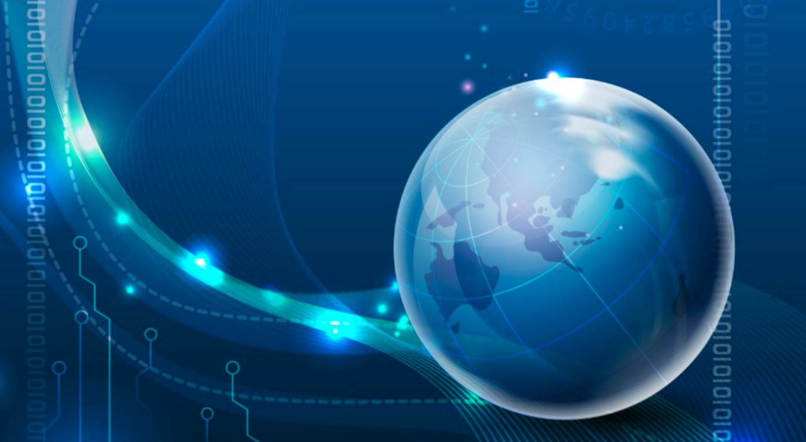

# Why

- dangers
  - [big tech is hacked, protect our social life](twin:bigtechhack)
  - [there is not enough bandwidth](why_bandwidth_savings)
- requirements
  - [requirement for more decentralized infrastructure](why_infrastructure)
  - [everyone needs ownership and privacy of information](why_sovereign_internet).
  - [need for digital identity](twin:one_digital_identity)