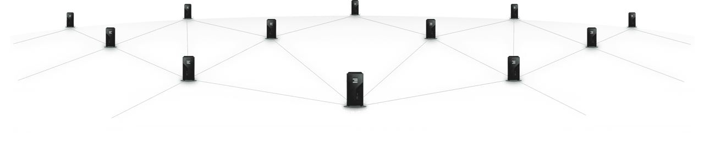

## Certified Farming Requirements 

### Certified Nodes

- Certified Farms are made up of certified_nodes
- you need have to have more than 5 certified nodes. 

### Uptime and Network

- 97% uptime is accepted in home farming situations
- 1 IP feed (consumer provider)
- 1 public IP address and NAT allowed
- enough bandwidth to allow the utilization of the storage/archive (see below)
- good enough latency (low latency = performance of network)

#### Terms and Conditions need to be signed

!!!include:farming_certification_terms_conditions

#### Network

- 99.5% uptime
- minimal bandwidth as required for the workloads as hosted on the farm
- maximum network latency
- more than 1 internet connection (multiple IP feeds)
- enough IPv4 addresses
- at least 1 class C ipv4 addr for network farmers.
- enough bandwidth to allow the utilization of the storage/archive (see below)
- good enough latency (low latency = performance of network)
- [install your network in line with Threefold Requirements](tfgrid_networking)

(*) = in case of datacenter or commercial deployment

#### Uptime & Redundancy

- protection for fire & water damage
- enough access to power
- redundant power systems

#### Bandwidth Requirement for archive/storage usecase.

A storage usecase needs a lot of bandwidth to allow the storage nodes to be fillend and also to allow its customers to download the information.

Its the obligation of the farmer to make sure that enough bandwidth is available. We will measure this by doing random upload & download tests to the storage systems. 

It should always be possible to have at least 1 mbit/sec per Zero_DB (which is a storage container running on 1 harddisk or ssd).

#### Reputation & Monitoring Engine

The TFGrid has a reputation engine and a monitoring engine to measure uptime & other SLA requirements, see consensus3.

Factors the TFGrid Reputation_engine will look at (Q4 2021, latest Q1 2022) 

- Available Bandwidth
- Latency
- Utilization
- Uptime (nodes & network)

The monitoring engine could require farmers to execute on certain actions.

