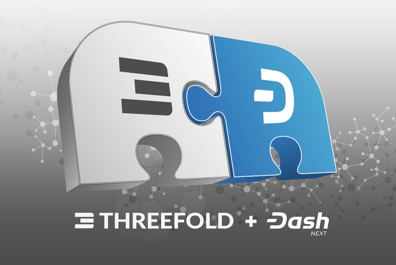

# July 3: Announcing Dash + Dash NEXT!

ThreeFold is pleased to announce [our partnerships with Dash & Dash NEXT](https://blog.threefold.io/blog/tfblog/posts/dash--dash-next-partner-with-threefold), effective end of June 2020.

From ThreeFold co-founder Adnan Fatayerji, "We are extremely excited about our collaboration with Dash [and Dash NEXT], a global name in decentralized transactions. We look forward to empowering their developer community with access to a global substrate of peer-to-peer storage and compute. Together we will drive financial and Internet inclusion to the edge of the network!”

You can learn more about Dash and Dash NEXT below:

- [Website | Dash](https://www.dash.org/)
- [Website | Dash NEXT](https://dashnext.org/)
