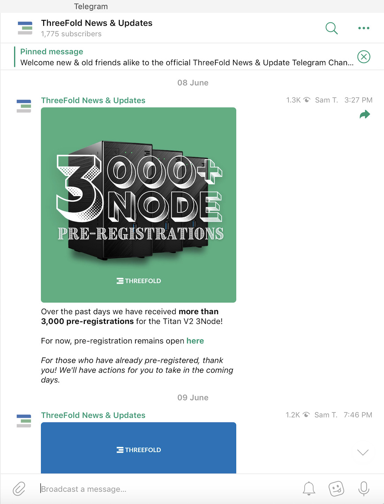

# Announcements & Updates

All ThreeFold announcements and updates can be found on the Newsroom on our website as well as on our Telegram News & Updates Telegram Channel:

- [ThreeFold Newsroom](https://threefold.io/news)
- [ThreeFold News and Updates Telegram Channel](https://t.me/threefoldnews)

## ThreeFold Newsroom

## ThreeFold News & Updates Telegram Channel

<!--

## 2021

### July

- [July 7: Introducing New Farming Rewards](new_farming_rewards)

### June

- [June 2: Q2 3Node Batch is Closing Soon](q2_closing_soon)
- [June 4: Q2 3Node Batch is Sold Out! Q3 Pre-Registration is Open!](q2_sold_out)
- [June 8: 3,000+ 3Node Orders Over the Weekend!](3k3nodes)
- [June 9: Titan V2.1 is Almost Ready for Pre-Order](titanv21soon)
- [June 10: ThreeFold Coverage in CoinTelegraph!](tfcointelegraph0621)
- [June 11: ThreeFold and Dfinity News Coverage](tfdfinity0621)
- [June 11: Pre-Order a Titan v2.1](preordertitan)
- [June 14: Satoshi Street Bets AMA Recording](satoshirecording)
- [June 15: Zetako and ThreeFold Join Forces](zetakothreefold)
- [June 16: ThreeFold Coverage in BanklessTimes](tfbanklesstimes)
- [June 24: How to Decentralize the DigiByte Network](digibytenodedeploy)
- [June 26: ThreeFold Coverage in Yahoo! News](tfyahoonews)
- [June 30: ThreeFold Coverage in Smartereum](tfsmartereum)

### May

- [May 4: ThreeFold Partners with Dragonchain](threefold_dragonchain)
- [May 5: Binance Smart Chain Update](bsc_update)
- [May 12: TFT Becomes More Accessible](tft_more_accessible)
- [May 20: ThreeFold Two-Way Chat Update](how_to_use_chat_note)
- [May 21: Products & Services Update](products_services_may_21)
- [May 24: ThreeFold at AIBC Summit in Dubai](aibc_summit)
- [May 28: The Grid is Growing](grid_growth_28_may)

### April
- [April 1: ThreeFold Q1 2021 Recap](q12021recap)
- [April 5: Grid 2.6 is Live on Testnet](grid26testnet)
- [April 8: ThreeFold Partners With CasperLabs](threefoldcasperlabs)
- [April 10: Dive Into the ThreeFold Universe](tfuniverseintro)
- [April 12: Grid 2.7 is Live on Testnet](grid27testnet)
- [April 13: ThreeFold Joins CasperLabs Community Call](tfcaspercommunitycall1)
- [April 14: Join the ThreeFold Two-Way Chat](threefoldtwoway)
- [April 16: ThreeFold x CasperLabs Community Call Recording](tfcasperrecording1)
- [April 18: Be the Internet – Become a Farmer!](becomeafarmer1)
- [April 20: Say Hello to Dispersed Storage](dispersed_storage_hello)
- [April 23: Building a Better Solution](building_a_better_solution)
- [April 29: ThreeFold Goes Multichain](threefold_goes_multichain)

### March

- [March 3: The Quantum Safe Filesystem](qsfshello)
- [March 5: Who Uses the ThreeFold Cloud](whousestfcloud)
- [March 9: Join  Our Forum!](joinourforum)
- [March 14: We're Tackling Internet Inequality](internetinequality)
- [March 16: ThreeFold on Corporate Unplugged Podcast](tfcorporateunplugged)

### February

- [February 2: Grid 2.4 is Coming to Mainnet](grid24mainnetsoon)
- [February 3: Seeking Participation: Token Plan](tokenplanguidance)
- [February 10: Grid 2.4 (& Grid 2.5) Update](grid242530update)
- [February 12: ThreeFold x Conscious Communities](tfcommunities)
- [February 19: Digital Twin is Weeks Away](digitaltwincoming)
- [February 24: What's New With VDC](whatsnewvdc)

### January

<!-- - **2020 Update:** [ThreeFold End 2020 Update](threefold_update_jan2021) >> non existent update document --> 
<!--
- [January 12: 2020 Highlights & Grid 2.4 Live on Testnet!](grid24_and_2020)
- [January 13: Discussion With the Global Impact Alliance](globalimpactalliance)
- [January 28: The Cyber Pandemic is Here, But it's Not Too Late](cyberpandemicconvo)

## 2020

### December

- [December 4: Global Reset Summit](globalreset)
- [December 9: Sneak Peek: Artheon VR Museum](artheonupdatedec2020)
- [December 11: ThreeFold Product Demos!](tfproductdemosdec2020)
- [December 17: ThreeFold Meet is P2P Video Chat](tfmeetintro)
- [December 24: Happy Holidays!](happyholidays2020)

### November

- [November 3: November Community Call Recording](novcommcallrecording)
- [November 4: AMA Invitation & Details](novamaannouncement)
- [November 10: Recent Product Management Highlights](novprodmgmt)
- [November 12: November AMA Recording](novamarecording)
- [November 12: ThreeFold Tech Recognized by Deloitte Belgium](tftechfinalist)
- [November 13: ThreeFold @ Odyssey Momentum 2020](tfodyssey2020)
- [November 17/18: 3Bot Connect Now ThreeFold Connect](threefold_connect)
- [November 18: Liquid Breach, Actions Suggested](liquidbreach)
- [November 20: ThreeFold_Grid 2.3 is Live!](tfgrid23)
- [November 27: ThreeFold Partners With Presearch](threefoldpresearch)

### October

- [October 2: Is Your Data Really Yours?](isyourdata)
- [October 2: TF Tech Looking for Lead Engineer](tftechengineer)
- [October 5: Barcelona Blockchain Week Panel](barcelonapanel)
- [October 6: Less is More](lessismore)
- [October 9: Is DeFi Actually Decentralized?](defidecentralized)
- [October 13: Digital Week Online Panel](dwopanel)
- [October 16: Thank You, Partners!](typartners)
- [October 22: ThreeFold Now Coming Soon](tfnowsoon)
- [October 26: Community Call Announcement](novcallannouncement)

### September

- [September 1: ThreeFold Webinar](threefoldwebinar0920)
- [September 2: Searching for Visionary Developers](searchingdevs)
- [September 3: ThreeFold Defined](threefolddefined)
- [September 8: #TechTuesday: Smart Contract for IT](ttsmartcontract)
- [September 9: Dear Elon Musk 2](dearelonmusk2)
- [September 11: Become an Early Adopter](earlyadopter)
- [September 13: End User Solutions](endusersolutions)
- [September 15: #TechTuesday: Zero OS](ttzero0s)
- [September 16: P2P Solutions](p2psolutions)
- [September 17: TF Grid 2.2 Upgrade Announcement](tfgrid22_announcement)
- [September 22: TF Grid 2.2 is Live!](tfgrid22_live)
- [September 25: Conversation About The Social Dilemma](socialdilemmaconvo)
- [September 29: Kristof on Block Speak](kristofblockspeak)

### August

- [August 6: July & August Summary](julyandaugust)
- [August 10: AMA Announcement](amaannouncement)
- [August 10: Web Presence Update](webpresence)
- [August 11: Whitepaper Update](whitepaper_update)
- [August 13: New Explainer Video](newexplainer)
- [August 13: SKALE + ThreeFold](skalethreefold)
- [August 14: News Coverage – Internet Blockages](belarusthreefold)
- [August 15: AMA Recording](amarecording)
- [August 19: Defining ThreeFold](tfdefined)
- [August 24: Community Webinars](tfwebinars)
- [August 28: Telegram Group to Telegram Channel](groupchannel)

### July

- [July 3: Dash + Dash NEXT](dashannouncement)
- [July 6: EU Data Infrastructure Panel](eudata)
- [July 9: July Update & Decentralization Manifesto 2.0](majorjulyupdate)
- [July 28: New Bettertoken Website](bettertokenwebsite)
- [July 29: Testers Needed](testersneeded)

### June

- [June 1: Live on Liquid and BTC Alpha](liquidbtcalphalive)
- [June 3: Tokyo FinTech Podcast](tokyofintech)
- [June 4: Cointelegraph Coverage](cointelegraph)
- [June 5: Recapping a Few Big Weeks](recap1)
- [June 9: Blockchain Updates](blockchainupdates1)
- [June 12: I Am A Crystal Twin](crystaltwinintro)
- [June 15: Dinis Guarda Interview](kristofdinis)
- [June 17: Dear Elon Musk](dearelonmusk)
- [June 21: ThreeFold on Forbes](forbescoverage)
- [June 27: ThreeFold Tech MOU](june27update)

### April / May

- [May 5: Conscious Internet Alliance Launch](conscious_internet_alliance)
- [May 6: ThreeFold Demo's For WeWork FinTech Community](weworkfintech)
- [May 7: ThreeFold Co-Founder on Leading Russian Blockchain Media](nickolayforklog)
- [May 8: Introducing Artheon VR Museum!](artheonintro)
- [May 8: ThreeFold on Product Hunt](tfproducthunt)
- [May 11: Introducing SEEDS!](seedsintro)
- [May 12: Introducing Green Edge!](greenedgeintro)
- [May 13: Introducing Solidaridad!](solidaridadintro)
- [May 15: SelfKey + ThreeFold](selfkeyintro)
- [May 19: Introducing PlanED by TAG!](planedintro)
- [May 20: TomoChain Partnership](tomochainintro)
- [May 21: Stellar Migration](stellarmigration)
- [May 22: DigiByte Collaboration](digibyteintro)
- [May 25: Ivan on Tech + ThreeFold](ivanontech)
- [May 26: Hello, WaykiChain!](waykichainintro)
- [May 27: TFT on Liquid & BTC Alpha](liquidbtcalpha)
- [May 29: Harmony (Protocol) Partnership!](harmonyintro)

-->