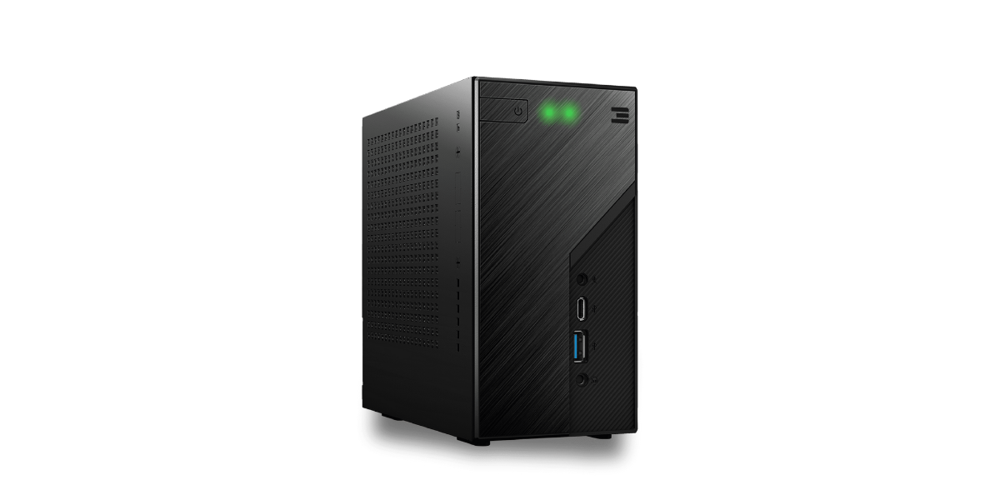

# Farming Hardware Guide

ThreeFold's operating system Zero-OS was designed to run on any kind of hardware to match the vision of a limitlessly scaleable Internet infrastructure. Any Intel or AMD chip server-like hardware that meets the minimum computing power and storage requirements can be turned into 3Node to farm TFT.

## Different farming set-ups

The form factor, size, and hardware specification can vary from small (like a modem) to large (like a data center rack) 3Nodes. The compute and storage capacity made available will define how much TFT is farmed by the 3Node. 

1. Plug and Farm 3Nodes: come with Zero-OS already installed for non-technical people. 
2. Pre-configured 3Nodes: offer high performance configurations for bigger farms. 
3. Do-it-Yourself: any compatible server-like hardware can be purchased, refurbished or assembled by a farmer.

Plug and Farm and pre-configured 3Nodes are certified meaning they went through a secure boot process to guarantee increased security on a heardware level. Certified hardware provides 25% more yields than DIY 3Nodes. 

> Note: The ThreeFold Farming team is looking into expanding hardware options. We're in discussions with HPE, Intel, AMD and Rasberry Pi to expand the spectrum of 3Node form factors and increase accessibility to ThreeFold farming. 

### Plug and Farm 3Nodes 

Plug and Farm 3Nodes are pre-configured medium size servers that provide optimized compute and storage capacity. They have been designed for non-technical people to start farming easily as they are delivered with Zero-OS already installed with the farm details of the farmer. 

Specifications:
- AMD CPU 
- 4 Core / 8 thread CPU
- 32 GB of RAM
- 1TB of nVME SSD 

> Note: ThreeFold is not a hardware vendor. The sales and distribution of 3Nodes is not part of the ThreeFold business model and is meant only to support the growth of the farmer community. Some details are required from farmers such as their ThreeFold Connect wallet to create the farm ID on their behalf.

Plug and farm 3Nodes do not require any technical knowledge on how to set-up a hardware or boot an operating system. When delivered, all the farmer has to do is to do is:
1. Plug an Ethernet cable into the 3Node and a router.
2. Plug a power supply cable into the 3Node and a power outlet.
3. Switch on the 3Node and search for the Farm ID on the [explorer](https://explorer.threefold.io/) to verify that the 3Node is online. 

Anyone can buy a Titan v2.1 in the [ThreeFold node shop](https://shop.threefold.tech) and calculate potential farming rewards with the [farming reward calculator](https://simulator.grid.tf/).  

!!!include:farming_reward_disclaimer

### Pre-configured 3Nodes 

Pre-configured 3Nodes come with industry leading efficiency and performance to optimize farming rewards. They are assembled by accredited hardware partners to provide different sizes and form factors to fit large farming set-ups such as data centers. While they are already pre-configured, farmers will have to provide their own hosting and a farming set-up able to accomodate these powerful 3Nodes.  

The current official pre-configured 3Node partner is Hewlett Packard Enterprises (HPE). The European region is currently being serviced by the [4IG Node Shop](https://threefold.4ig.hu/).If you wish to setup a certified farming operation please reach out to farming@threefold.tech to connect with our certified farming specialists.

> Note: HPE also services other regions. If you are interested in pre-configured 3Nodes outside of Europe, please contact vlaho.jemin@hpe.com.

### Do-It-Yourself (DIY)

DIY 3Nodes open possibilities for farmers to assemble or refurbish hardware of their choice. It doens't require any contractual relationship with the ThreeFold Ecosystem and it's hardware distributors, allowing anyone to farm TFT on the ThreeFold Grid from anywhere across the world. Over time, a DIY 3Node can build reputation on the ThreeFoldGrid Reputation_Engine.

> Note: The Reputation_Engine aims to showcase the service level of every 3Node connected to the ThreeFold Grid on the Internet capacity [explorer](https://explorer.threefold.io/) for a transparant overview of where the best infrastructure services are present on the ThreeFold Grid.

Any 64-bit hardware with an Intel or AMD processor chip can run Zero-OS and become a 3Node. The following configurations provide guidelines on compatible and recommended setups:

- Servers, desktops and mini computers type hardware are compatible. 
- USB based external drives are not supported.
- A ratio of 1:4 between vCPU and RAM (e.g. 8vCPU and 32 GB of RAM)
- The recommended upper limit is 8 GB of RAM per vCPU as farming rewards do not increase beyond that ratio. 
- A minimum of 500 GB of SSD for storage is required. 
- A wired ethernet connection is highly recommended to maximize reliability and the ability to farm TFT. 
- No graphics or display is required, although it may be helpful during the boot configuration or troubleshooting if necessary.

You can find more information about DIY requirements and hardware configurations on the ThreeFold Forum:
- [DIY Guide](https://forum.threefold.io/t/diy-nodes-guide/837) 
- [Farming setup examples](https://forum.threefold.io/t/lets-share-our-farming-setup/286). 

> Note: Zero-OS was also successfully booted on ARM powered hardware previously but is not yet compatible with Grid 3.0. 

