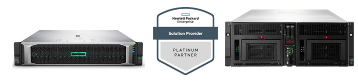

## TF Farming Hardware Overview

The form factor, size, and hardware specs can vary from very large (data center type) nodes to very small (no bigger than a modern modem) ones. 

The hardware specifications (compute & storage) of a 3Node determines the amount of ThreeFold Tokens that the device will farm.  

You'll find below different options to start farming according to how technical you are.

## Non-technical farming set-up

### Plug & Farm 3Nodes 

To help our community, ThreeFold is organizing a sale of 3Nodes. Please note we are not a hardware vendor, we do this to help our community to get started.

**Titan V2.1:** The Titan v2 3Node is a medium sized 3Node that already comes with great hardware specifications.

Plug & farm nodes have already been installed and configured to farm for the customer upon delivery. 

They require little to no technical knowledge to set-up. All you need is an electricity outlet, internet connection and the TF Connect app on your smartphone to start farming and receive your tokens! All 3Nodes can be hosted using normal DSL connectivity.

#### [You can buy the Titan v2.1 in the ThreeFold Node Shop](https://shop.threefold.tech).

[More info about Titan v2.1 Farming](titan_v2_1)

!!!include:farming_reward_disclaimer

## Technical farming set-up

### Pre-configured Nodes 

ThreeFold planet positive certified hardware designed and built by HPE – these pre-configured servers are optimized for maximum token earnings. There are different sizes in various price points available. These nodes are mainly for professional usage in data centers.

You will be required to provide your own hosting as well as set-up and administer your own farm.

If you want to purchase an HPE node for delivery in European countries visit **[4IG Node Shop](https://threefold.4ig.hu/)**.

For any other countries please contact vlaho.jemin@hpe.com.

### Do It Yourself

Create your own 3Node by installing Zero-OS on your own standard server/hardware. This option does not provide any contractual relationship with anyone in the ThreeFold_Grid Ecosystem, but enables anyone to become a farmer. You can purchase a server/hardware from any supplier or use your existing server/hardware. It must have an Intel or AMD CPU and can have any kind of hard drives (HDD/SSD). Over time, a DIY farmer can build reputation, measured by the Grid Reputation_Engine.

It is recommended to have the following hardware configuration:

- A ratio of 1:4 between vCPU and GB memory.
- At least 1 SSD for storage.
- If you add HDDs, please check if there is enough bandwidth available to have enough performance for storage capacity usage.

You will be required to provide your own hosting as well as setup and administer your own farm.

!!!include:farming_toc
