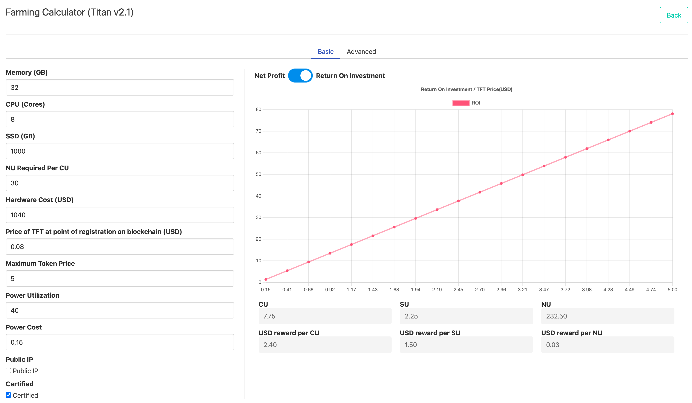

## Titan Node V2.1

The Titan Node V2.1 packs quite a punch and will be able to run heavier workloads.

### Specifications

|         |              |      |               |
| ------- | ------------ | ---- | ------------- |
| CPU     | AMD          | 8    | logical cores |
| Memory  |              | 32   | GB            |
| Storage | SSD Capacity | 1000 | GB            |

- CU = 7.75
- SU = 4.17

## ONLINE SIMULATOR

> https://simulator.grid.tf/

You can see a whatif simulation, the X axes shows return in line to TFT price of the future.

### Specific Simulation

- Simulation parameters
  - Price of TFT after 5 years =  1 USD
  - Starting price of TFT in this simulation = 0.08USD
- investment cost = 1040 USD

- Simulator here: https://simulator.grid.tf
- This potentially can **deliver a return of 1482%** in line with these simulation parameters.

!!!include:farming_calc_remarks

!!!include:simulation_note

### Order A Titan V2.1

Titan v2.1 Nodes are now available in ThreeFold Tech shop.

[shop.threefold.tech](https://shop.threefold.tech)

!!!include:certified_node_services
