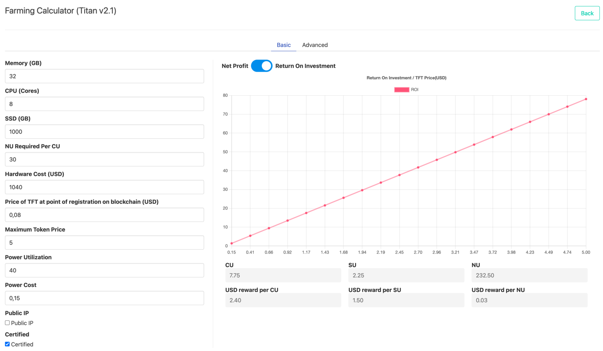
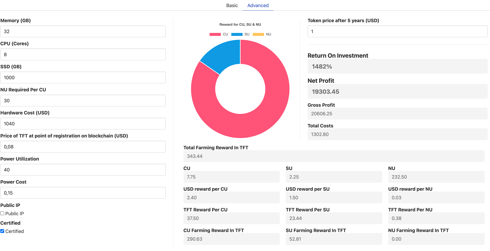

### Titan V2.1 Simulation

> Do it yourself on: https://simulator.grid.tf/

You can see a whatif simulation, the X axes shows return in line to TFT price of the future.

### Specific Simulation

- Simulation parameters
  - Price of TFT after 5 years =  1 USD
  - Starting price of TFT in this simulation = 0.08USD
- investment cost = 1040 USD

- Simulator here: https://simulator.grid.tf
- This potentially can **deliver a return of 1482%** in line with these simulation parameters.

!!!include:simulation_note

