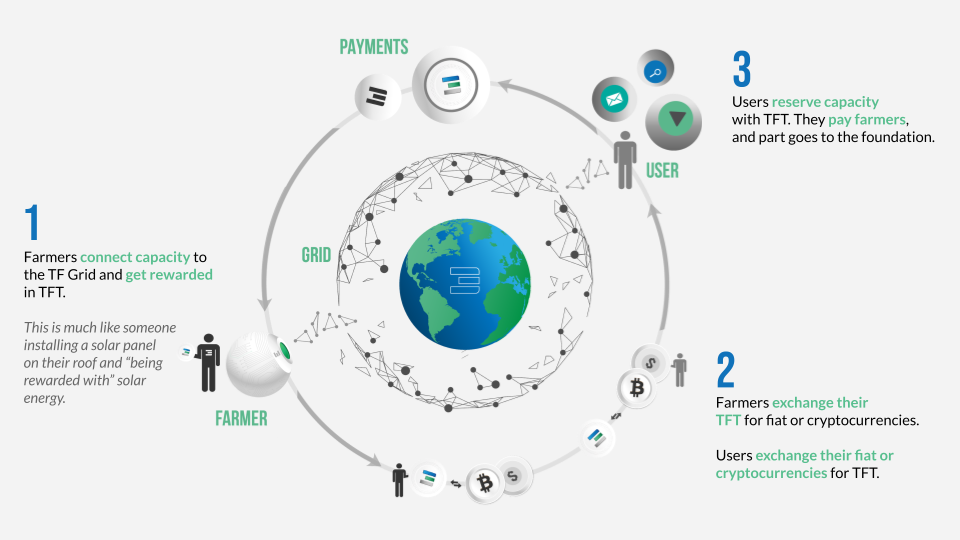

# Proof Of Capacity

TFT is an Utility token and gets generated by ThreeFold Farmers, we call this process farming.

- Each day (later even faster) Zero-OS together with TFChain (our blockchain) registers the capacity as being made available by the farmer.
- The blockchain will calculate the reward per farmer. **Calculation and modalities for farming rewards [can be found here](farming_reward).**
- The farmer wallet is registered in the TFChain and can be modified by the farmer.
- TBD time TFT are minted by the TFChain in accordance to the farming rewards and distributed to the farmer wallet.

| Percentage | Description    | Remark                           |
| ---------- | -------------- | -------------------------------- |
| 100%       | goes to farmer | Allows for a pure Utility Token. |

- Example of farming reward see [here](farming_calculator)

### Link To Proof Of Utilization.

Each TFGrid user can use the farmed capacity, the [TFChain](tfchain), will track the utilization of this capacity. We call this **Proof of Utilization**. See [Proof Of Utilization](proof_of_utilization).

!!!def