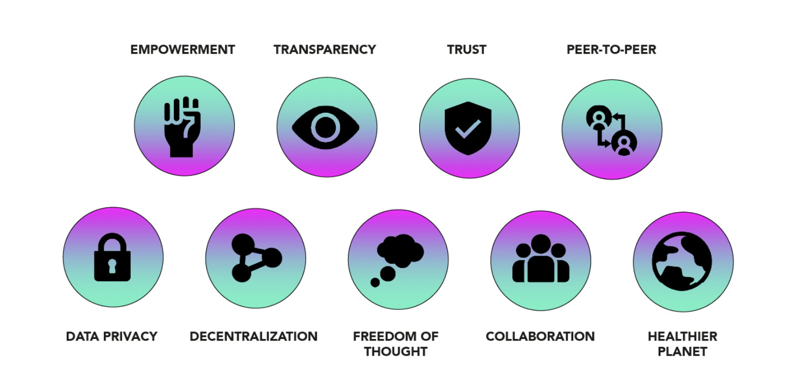

# ThreeFold Grid

## Our Values 

## ThreeFold Grid Description

 The ThreeFold Grid is a Peer To Peer and autonomous Internet Grid that provides game-changing performance and empowers new possibilities. With +500 servers delivering +80,000,000 GB of online storage across 110+ locations in 21+countries, the ThreeFold Grid is the largest Peer To Peer Internet in the world. TCP/IP isn’t used on the ThreeFold Grid which makes it completely private and secure for the users. All the applications an serves are completely decentralized

The ThreeFold Grid is made up of many servers we call 3Nodes that are distributed around the world by independent people and organizations we call Farmers. 3Nodes run a unique operating system called Zero-OS, a lightweight and ultra-efficient open source operating system. All 3Nodes connected to the ThreeFold Grid are registered in a database called the ThreeFold Directory, that registers the capacity available on the ThreeFold Grid Explorer. We call this Proof Of Capacity.

Users can then access the ThreeFold Grid with 3Bot, a virtual system administrator that executes the commands (reservation of capacity, sending messages, store files, build applications, etc.) directly on the operating system level via a smart contract for IT.

This model permits anyone to participate in the Internet economy and removes all centralization from the model as users can operate their digital lives directly on the operating system level.

The ThreeFold Grid is approaching it’s 3rd major release and many things are already possible on top of it. ThreeFold didn’t stop at only building the Peer To Peer communications infrastructure. In parallel, Peer To Peer applications and services are also being built such as a Peer To Peer cloud, Peer To Peer marketplace, and a Peer To Peer software development kit amongst others. Any application which can run on Linux can run on top of the ThreeFold Grid with many advantages.

## ThreeFold Grid Participants 

<!-- 

Note: This image is stored as a slide in case the text needs to be edited. You can find it here: https://docs.google.com/presentation/d/1SoC_5qdbv31DccCEWnytsH7dUkGaR8UH0Va0cMVUJXY/edit?usp=sharing.

-->

### Farmers produce the Internet Capacity.

- Farmers purchase and operate servers that they connect on the TF Grid by downloading and installing ThreeFold's software. By connecting capacity, a farmer mints the ThreeFold_Token(s).
- Farmers come in many different sizes and shapes.
- Farmers can be individuals that have a spare hardware or some spare cash.
- Farmers can also be companies that actively go out and find people to invest in their business of building farming sites. An example of a Farmer is [Green Edge Cloud](https://www.greenedgecloud.com/).

## Grid Users

### Developers use the Internet Capacity

- Anyone can build applications and services on the ThreeFold Grid as an alternative to doing it on centralized cloud like Google Cloud or Amazon Web Services.

### A limitless environment for experts

- A software development kit (SDK) is available and provides expert developers with great automation tools to scale their applications and services limitlessly.  

### A platform for communities to thrive

- ThreeFold created a marketplace of peer-to-peer applications that can be hosted by any community around the world to benefit from real privacy and freedom on the Internet.

### End Users

- End-users use decentralized applications and consume resources on the ThreeFold Grid for which they pay in ThreeFold Tokens.