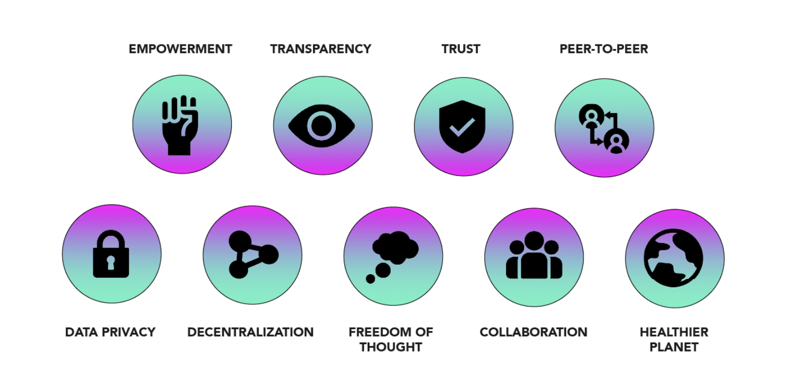

# Introduction 

## What is the ThreeFold Grid?

The Threefold Grid is an open-source Internet infrastructure that leverages autonomous cloud and high-performance, permissionless blockchain technology. It represents the first full-stack, decentralized, peer-to-peer Internet infrastructure in the world that connects compute (in the form of highly-optimized containers), storage and network (to run network services) capacity all-in-one.

## Our Values 

## Why the ThreeFold Grid? 

The centralized Internet and cloud infrastructure is limited in scope and cannot scale with emerging data demands. While a centralized model can replicate itself and maintain high availability without compromising trasaction rates using distributed system techniques, it is bound to limitations. The ThreeFold Grid demonstrates that the same theroetical limitations apply just as well to blockchains. The solution is to find a way to distribute the Internet infrastructure in such a way that nodes do not rely on one-another. Once nodes can become indepedent from one another, decentralized and distributed systems becomes applicable to Internet infrastructure and blockchains. 

The main difference between how the ThreeFold Grid operates compared to other systems is that it represents an indepedent full-stack Internet infrastructure comprising of:

- A **decentralized operating system** that decentralized the Internet infrastructure.
- **New compute primitives** to run virtual machines and containers in a decentralized way.
- **New storage primitives** that allow (almost) any storage tool or protocol to run in a distributed way.
- **A secure peer-to-peer overlay network** that by-passes TCP/IP significantly improves network routing and privacy.

  
The ThreeFold Grid produces a globally decentralized and synchronous Internet infrastructure that can run and store workloads indepedent from centralized APIs and networks. By leveraging blockchain technology, it removes all forms of intermediaries such as a centralized cloud service provider from the model and allows for users and developers to directly interact with off-chain  compute, storage and network features via smart contracts. 

With TF Chain, ThreeFold's blockchain on Parity substrate, people can deploy and operate private and sovereign development environments via smart contract and coordinate consensus indpendently from the network itself. And with the ThreeFold Grid's private overaly network, the infrastructure will be able to a limitless amount of transactions simultaneously, representing a major breakthrough over most blockchain-based cloud projects. 

The ThreeFold Grid is powered by ThreeFold's unique operating system, Zero-OS to secure the network and meet the efficiency and privacy requirements of emerging technologies such as the metaverse, blockchain, web 3.0 and alternative clouds. Any application which can run on Linux can run on top of the ThreeFold Grid with many advantages.

Learn more about smart contract for IT [here](smartcontract_it).

## What is Zero-OS?

Zero-OS is a new operating system that was built from scratch on the Linux kernal to eliminate all inefficiencies and backdoors present in contemporary operating systems. Most centralized operating systems rely on human management and intervention, which opens a door into the system. Also since the creation of the Internet, the development of operating systems mostly arised through the addition of further layers of code to improve capabilities and functionalities of software. To build a truly scalable, private and efficient Internet infrastructure, we had to start from scratch to ensure a minimal hacking surface, improve efficiency, and ensure that anyone who connects a hardware to the ThreeFold Grid wouldn't be able to access user data. 

The result is game-changing as Zero-OS is able to provide the follwoing benefits:
- **Stateless**: Without shell, local or remote, it does not allow for inbound network connections to happen nor can data be fetched by node operators.
- **Lightweight**: Zero-OS can save up-to 10X energy on storage workloads.
- **Autonomous**: It runs by itself and doesn't require humans to maintain it, removing human error and considerably reducing the hacking surface. 
- **Decentralized**: Deploy IT workloads and infrastructures in a private and neutral environment. 
- **Secure**: Store workloads in a quantum safe (future proof) way. 
- **Private**: Communicate end-to-end without centralized servers or APIs in the middle. 
- **Compatible**: Run anything that can run on Linux but in a decentralized environment. 

Learn more about Zero-OS [here](zos).

## What is a 3Node?

The ThreeFold Grid consists of many 3Nodes distributed around the world by independent people and organizations called Farmers ("Farmers"). An example of a Farmer is [Green Edge Cloud](https://www.greenedgecloud.com/). A 3Node is a computer or server that runs Zero-OS connects compute, storage and network capacity to the ThreeFold Grid. 3Nodes work together to create an indepedent peer-to-peer Internet infrastructure that can be used by anyone to run applications or store data. A 3Node can be utilized by anyone who wants to use a private Internet infrastructure with an immutable record of events in time. 3Nodes provide the following benefits:

- **Compatible**: Any Intel or AMD chip server hardware can be used to create a 3Node.
-  **Efficient**: By distributing the Internet infrastructure across different locations, 3Nodes require less bandwidth and less maintenance than the data center model.
- **Scaleable**: 3Nodes can be deployed anywhere electricity and connectivity is present, including remote areas. 
- **Secure**: Once booted by Zero-OS, 3Nodes are locked by the system preventing data access on a hardware level. 
- **Sustainable**: 3Nodes require less energy to run than data center racks as they do not require cooling power. 

Anyone can use 3Nodes to build software and IT infrastructures, as well as store anything from pictures to archives on the ThreeFold Grid using TF Chain and Zero-OS. 3Nodes. All 3Nodes connected to the ThreeFold Grid are registered in a database called the ThreeFold Directory (“TF Directory”), which registers the internet capacity available on the ThreeFold Grid Explorer. This process is called Proof-of-Capacity. 

Learn more about [3Node](3node).
Learn more about [Farming](farming_intro).

## What is a TFT? 
 
A TFT is the name of ThreeFold's utility token, which represents a unit of compute, storage and network capacity on the ThreeFold Grid. It can be used by anyone to reserve decentralized Internet capacity on the ThreeFold Grid.

Learn more about ThreeFold Token [here](token_what).

## A Decentralized and Circular Internet Ecosystem 

<!-- 

Note: This image is stored as a slide in case the text needs to be edited. You can find it here: https://docs.google.com/presentation/d/1SoC_5qdbv31DccCEWnytsH7dUkGaR8UH0Va0cMVUJXY/edit?usp=sharing.

-->

<!-- 

NOTE: Would remove the below section as it created expectations. Would keep it short. 

## Grid Users

### Developers use the Internet Capacity

Anyone can build applications and services on the ThreeFold Grid as an alternative to doing it on centralized cloud like Google Cloud or Amazon Web Services.

### A limitless environment for experts

A software development kit (SDK) is available and provides expert developers with great automation tools to scale their applications and services limitlessly.  

### A platform for communities to thrive

ThreeFold created a marketplace of peer-to-peer applications that can be hosted by any community around the world to benefit from real privacy and freedom on the Internet.

### End Users

End-users use decentralized applications and consume resources on the ThreeFold Grid for which they pay in ThreeFold Tokens. -->