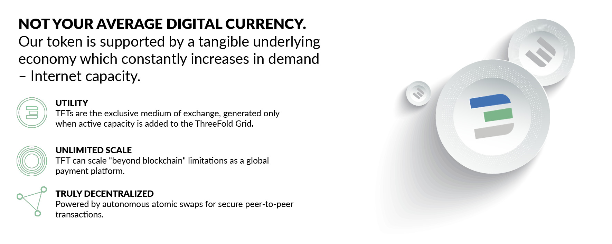

 
 

# TF Grid and its corresponding token TFT are valuable.

Demand for decentralized capacity is exploding with increasing data demands and trends such as the MetaVerse, Web3, Web2, Edge Computing, 5G, AI, VR, IoT and more. 

A TFT represents Internet_Capacity (compute, storage & network) on the TF Grid and as such will grow with the expansion of the Grid.

> This is a + Trillions USD Market.

## ThreeFold aims to connect the unconnected

Despite the fast-growing global cloud market, the distribution of data centers is still mostly concentrated on the western world (mainly Northern America) and certain parts of Asia.

- This [source](https://wikileaks.org/amazon-atlas/map/) lists the data centers of the current market leader in Internet Capacity
- Other major market players follow the same patterns: 
  - [Oracle](https://blogs.oracle.com/cloud-infrastructure/oracle-launches-four-new-cloud-regions-across-four-continents)
  - [Cloudwirx](https://www.cloudwirx.com/datacenters)
  - [Microsoft](https://yellowduckguy.wordpress.com/2018/03/15/microsoft-worldwide-data-center-locations/)

This unequal distribution of capacity can be explained by the high requirements in infrastructure, electricity, and security to operate large scale data centers that often require an investment of USD 1bn+ for setup.

With the [TF Grid](grid_home) and TF Ecosystem, ThreeFold can also tap into the areas of our world where big cloud providers can't, thanks to its decentralized and autonomous nature. Also, this represents an opportunity for locals to boost their digital economies.

## The potential of the ThreeFold Grid

The TF Grid is a peer-to-peer Internet/Cloud grid that provides more efficient solutions than centralized alternatives.

Considering the current global market growth, let's assume that the TF Grid achieves a 10% share of the 1000 billion public cloud market by 2025.

This would translate to a 100 billion USD (10% market share) demand to utilize the capacity of the TF Grid through TFT as the medium of exchange for capacity. 

## The ThreeFold Token (TFT)

The TF Grid can be expanded indefinitely and independent farmers are incentivized to contribute to this expansion according to market demand.

The amount of TFT in circulation in the market is, however, limited and will go down over time, see [Tokens Limited](tft_limited_supply)

In alignment with the above assumptions, 100 billion USD (10% market share) would meet a [limited supply of TFT](tft_limited_supply).

## Burning & Staking lead to limited Supply of TFT

see [Token Limited Supply](tft_limited_supply)

## Disclaimer

> Disclaimer: Please note that we can't and won't make price predictions on TFT valuation and that all calculations made here are purely hypothetical. Use the simulator to make your own estimations.

!!!alias tft_valuation,token_valuation

