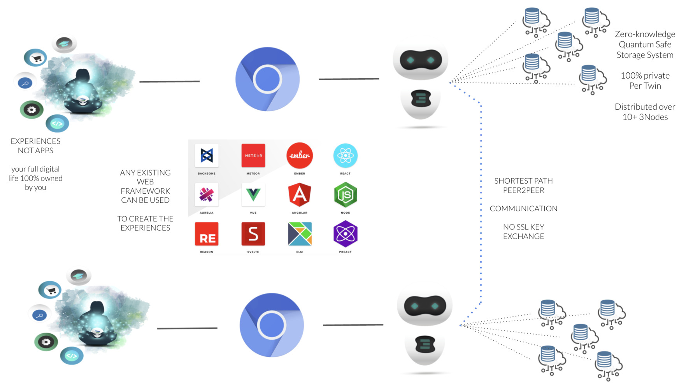
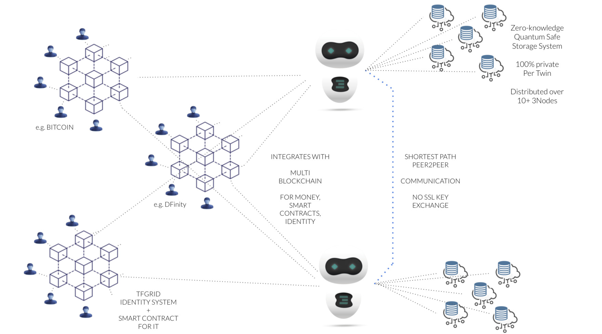
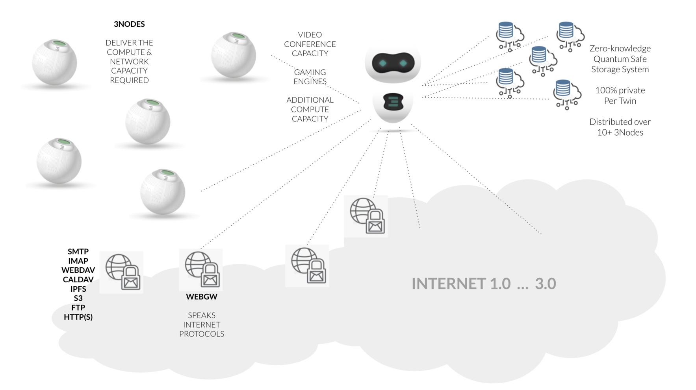

# Web 4.0 architecture

Every user uses any browser to access their digital_twin. The TFCONNECT makes sure that the connection is secure.

The secure browser engine runs on the TFGrid close to where your Twin is.

This takes care of a very secure approach and unlimited scalability.

Developers can program anything on top of the digital twin. Any javascript framework can be used.

This allows ANYONE to create ANY experience.

The twin has basic capabilities which are strongly version controlled but contributions from the global community are more than welcome.

The idea is to create a system which is simply good enough for any possible experience.

Rather than survival of the fittest we believe in a system of collaboration, where we invite everyone to make a system better so it fits us all. We don't need 3 chat systems, we need one which is usable by thousands of experiences.

Developers create Experiences on top, not apps. Experiences re-use the same capabilities.

This has huge benefits

- 10x less engineering effort needed per experience
- more sustainable (less energy loss)
- easier for user, no duplication
- more simplicy
- more powerful

## Link to blockchain

While the twin is a better alternative than the blockchain for many protocols, certain tasks still require a blockchain like

- money
- smart contract between people
- consensus between lots of people around info
- proof of authority, authentication, ...
- reputation system

Each twin can talk to any required blockchain in a way how its 100% transparent for the user.

The Twin can also talk to the classic internet.

Each Twin knows how to talk legacy protocols like SMTP, POP3, DNS, ... (in development) to allow seamless integration.

In case more compute is required for a specific usecase like gaming, AI, data processing the twin can spin up compute & storage requirements on the TFGrid and as such become way more powerful for the time required.

This leads to huge flexibility and efficiency.

!!!alias i4_architecture,web4_architecture