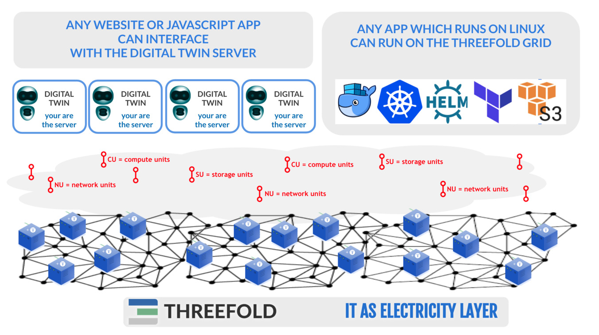

### ThreeFold grid inspired by nature.

- Just like we have trillions of cells in our body, so can billions of twins live next to each other.
- Each twin has memory, knows how to communicate, has knowledge, history, ...
- Twins like cells cannot live without a body = TFGrid.

### ThreeFold is compatible with current IT world.

We do realize that making our current vision reality will take some time.

That is why we have made our infrastructure compatible with the exiting IT and internet ecosystem.

- any workload which can run inside linux can run on top of our TFGrid.
- any web developer can create apps (experiences) on top of the Digital Twin.
- just like kwatth is used as a measurement of capacity for solar panels we have [CU](cloudunits), [SU](cloudunits) and [NU](cloudunits).
- TFT is required to buy CU,SU,NU.