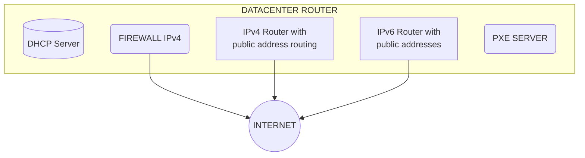
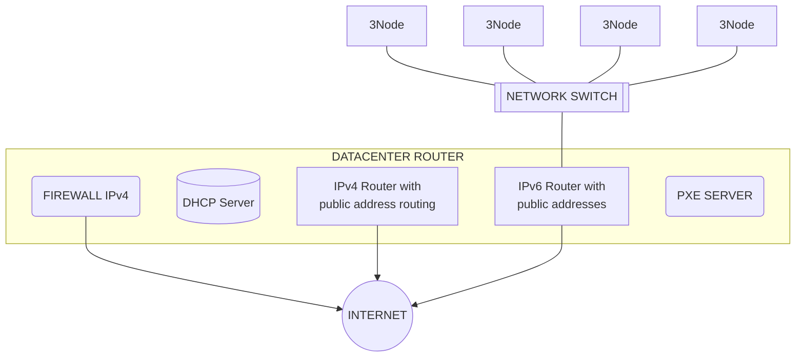
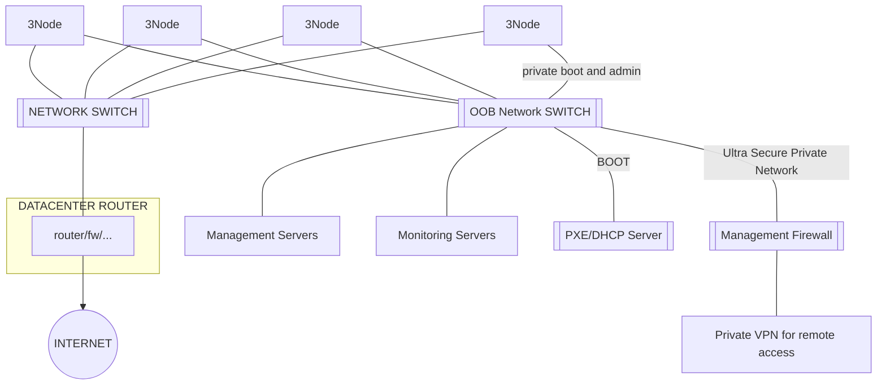
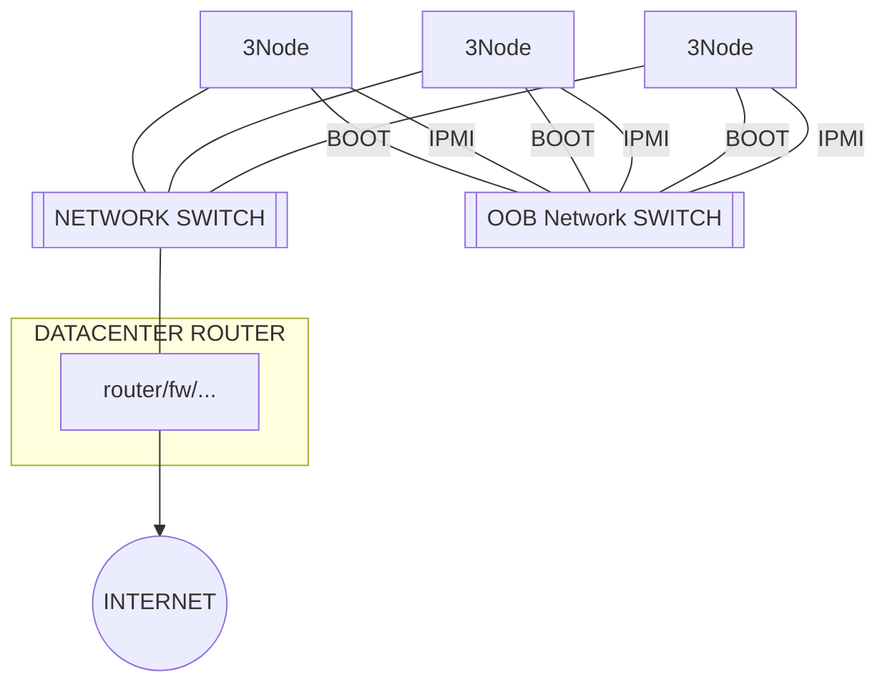
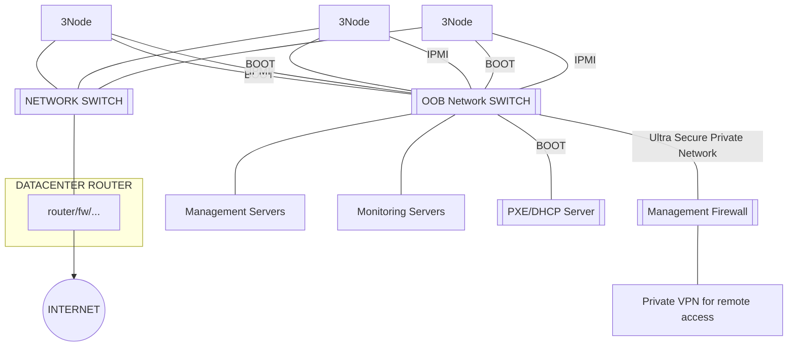

## Network Datacenter

a 3Node needs to be connected to a wired network, providing a dhcp server and a default gateway to the Internet, be it NATed or plainly on the public network, where any route to the Internet, ipv4 and ipv6 is recommended

### Datacenter Router

#### Requirements

- [ ] +10 mbit/sec throughput
- [ ] denial of service protection (keep hackers out)
- [ ] routing of IPv4 & IPv6 addresses
- [ ] masquerading/nat for IPv4 internal address space 
- [ ] 3Node gets ip address from DHCP server which has access to internet)
- [ ] public ip address in case you also want to be a network farmer (recommended)

#### Recommended Requirements

- [ ] connect router to 2 internet providers
- [ ] BGP or other routing support (to allow failover)

### Single Switch Layout (not recommended)

above is the most simple layout how to connect multiple 3Nodes to the internet from out of a dacenter.

Its a super simple layout.

- Its a flat network, all 3nodes are connected using IPv6 to the datacenter router.
- Optional: public IPv4 address are made available on the network switch, so the 3Nodes can acquire IPv4 addresses when available and needed for workloads.
- DHCP/PXE server (can be on firewall or separate) is used to boot the 3Nodes.

### OOB = Out Of Band Connections (recommended)

Its recommended to install an OOB network.

- OOB = Out Of Band
- used for management and monitoring to the 3Nodes.
- the OOB network is not connected to the internet.

- each 3Node has optional IPMI cards (for reboot, remote management), these IPMI cards can be accessed from management server
    - IPMI is super handy for monitoring of hardware & power on/off of nodes
- the OOB Network switch is private, cannot be accessed from Internet
- the management firwall is used to allow administrators to get secure access to the OOB network.
- Management & Monitoring servers are used to communicate over OOB to the 3Nodes and IPMI connection.

### Requirements

- [ ] private ipv4 or ipv6 for OOB
- [ ] dhcp for OOB
- [ ] vpn connection to OOB
- [ ] OOB no access to internet
- [ ] 3Nodes connected to network switch as flat layout, all 1 OSI2 level, no routing if network < 100 nodes , see [on this link for large network support](network_datacenter_large).
- [ ] ipv4 addresses are routed to 3Nodes over Datacenter Router
- [ ] no redundancy on switch level, NOTE: we have seen over years that often networks with single switch have better uptime compared to redundant setups because they are more simple and network switches are super reliable devices no matter what.

## IPMI

IPMI are management hardware cards, most server vendors have them by default in the server.

3Nodes have 3 network connections

- once to network switch for public internet access
- once from IPMI card to OOB
- once from other NIC to OOB for monitoring & boot of Zero-OS

## OUR RECOMMENDED LAYOUT

This is the most simple layout with good reliability.

3Nodes have 3 network connections

- once to network switch for public internet access
- once from IPMI card to OOB
- once from other NIC to OOB for monitoring & boot of Zero-OS

Is combination of above IPMI, Firewall, Router, ...
