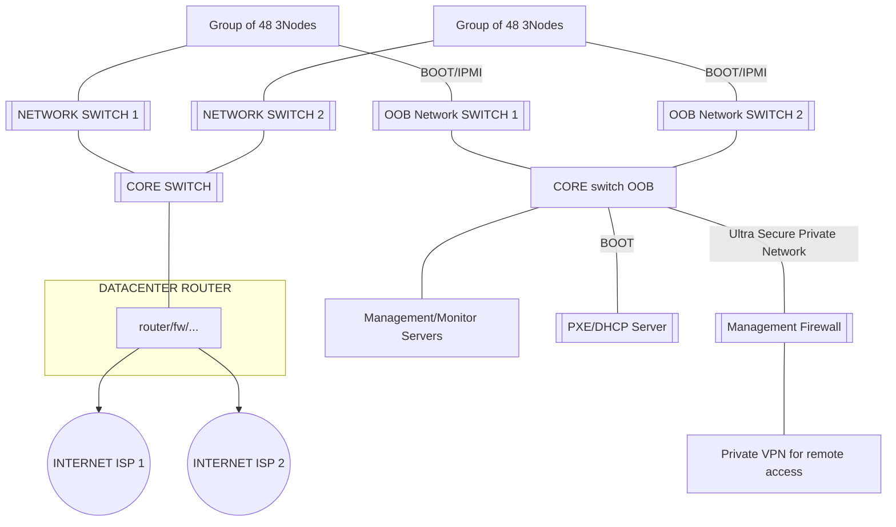
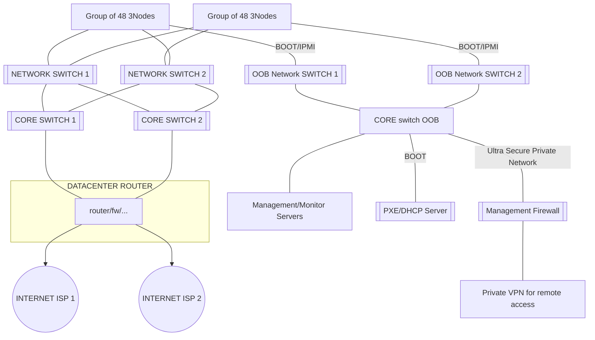
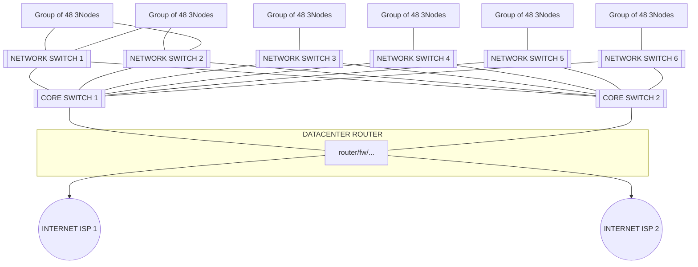

# Large Scale Setup

## Switched

Upto 2-400 nodes doing this purely switched is possible.

Pro

- super simple
- almost no management
- super flexible for people to use

Con

- there will be more broadcast traffic but should be ok

Just keep on adding 48 port switches and more clusters of nodes.

This should scale to many hundreds of nodes.

## Switched Core Redundant

Pro

- super simple
- almost no management
- super flexible for people to use

Con

- there will be more broadcast traffic but should be ok

Just keep on adding 48 port switches and more clusters of nodes.

This should scale to many hundreds of nodes.

> IMPORTANT: proper configuration of OSI L2 traffic needs to be done, spanning tree protection, make sure the switches are configured properly to be able to work with a redundant config like this. 

> ISSUES here will quickly create network issues, timeout and can be hard to troubleshoot.

## Routed

Alternative to above use separate network ranges per e.g. 96 servers (2 switches).

Means work with multiple smaller networks as described in [network_datacenter](network_datacenter) and connect them all to core router.

Pro

- simple
- almost no management
- very reliable, cannot have spanning tree problems
- no broadcasts

Con

- public IP address management done per cluster !!! Need more IP addresses.

!!!include:networking_toc