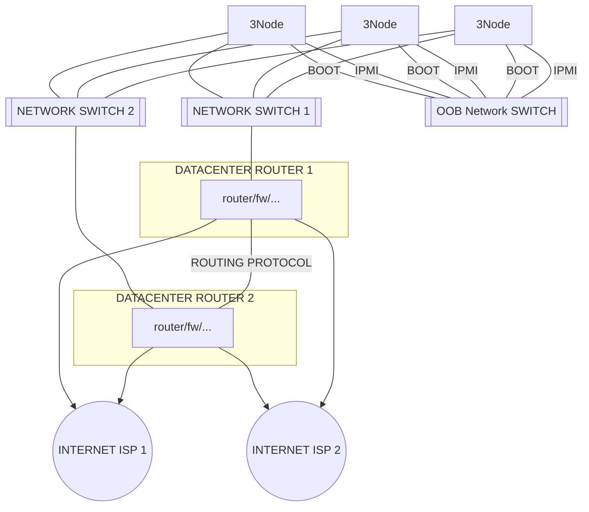

## REDUNDANT NETWORK 2 ISP, ROUTED

This is not supported yet but H1 2022 we will allow upgrade from previous situation to this one. It will be a simple reconfiguration of the 2 main routers to both ISP.

- this is the most complicates setup but most flexible, for future
- 4 network connections per 3Node now
  - once to network switch 1 for public internet access 1
  - once to network switch 2 for public internet access 2
  - once from IPMI card to OOB
  - once from other NIC to OOB for monitoring & boot of Zero-OS

!!!include:networking_toc