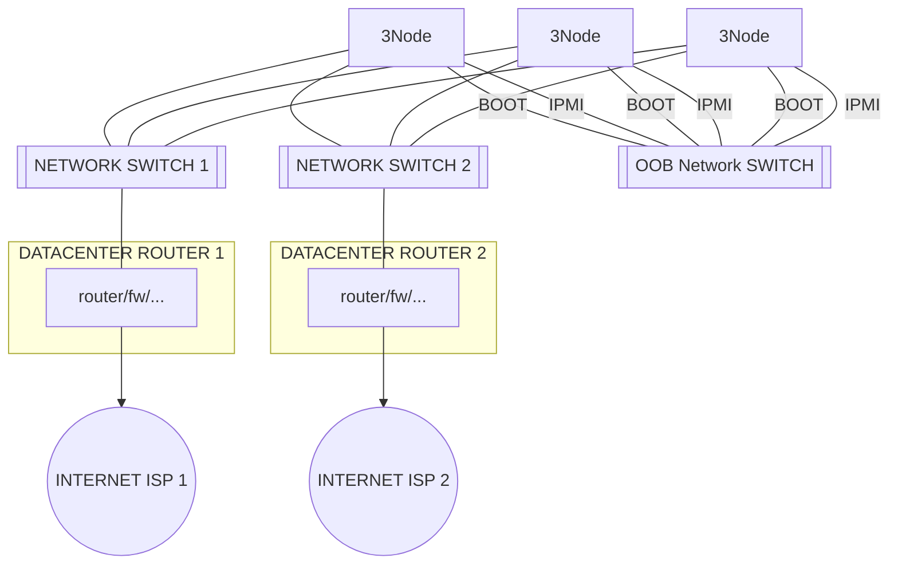

## Certified/Commercial Setup 2 ISP feed 

We are working on support for this layout, as a farmer it can be handy to already prepare for this layout.

- this is still fairly straight forward layout and provides super good redundancy (reliablity)
- configuration is simple & reliable !!!
    - switch 1 and switch 2 have separate network ranges
    - switch 1 and switch 2 have separate firewall, router, pxe, dhcp
    - all is double now, router can stop, dhcp, internet, ...
- 4 network connections per 3Node now
  - once to network switch 1 for public internet access 1
  - once to network switch 2 for public internet access 2
  - once from IPMI card to OOB
  - once from other NIC to OOB for monitoring & boot of Zero-OS

### remarks

- ISP = Internet Service Provider
- 2 public ip address ranges are now available to the 3Nodes
- there is no auto failover for both networks, its just 2 separate paths for both ISP.s

We really like this layout because its super simple and the more easy things are the more the uptime will be good.

Yet still it can be made 100% redundant, customers have to buy 2 ip addresses though.

!!!include:networking_toc